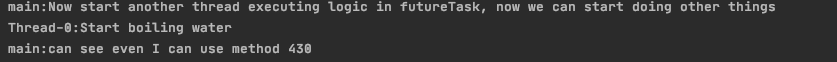
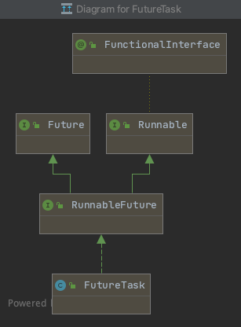

在Java之中，多线程的调用方式主要是两个，一个是`Future`，一个是`Thread`。当然，在多线程的情况下建议使用的是`ThreadPool`，但是本文为了突出原理，直接手动开多线程！今天就主要来学习一下`Future`相关的知识。

警告：本篇有些硬核，如果想看相关的总结简析可以直接看开始的重点！

简略版：

**1. 是什么？**

Future实际上是我们想让其他线程执行耗时任务时候的一个”收货凭证“。

**2. 有什么特点？**

	1. 可异步执行任务，只能有一个线程执行，但是可以有多个线程收到结果
	2. 内部的状态转换比较复杂且全面，在正常执行时候收到结果，异常的时候收到Exception消息

**3. 怎么用？**

1. 新建一个`Callable`匿名函数实现类对象，将业务逻辑放在`call()`之中，同时将``Callable`的泛型设置成我们想要的返回结果类型
2. 将`Callable`匿名函数对象作为`FutureTask`的构造参数传入，创建一个`futureTask`对象
3. 再将`futureTask`作为`Thread`的构造参数传入，开启另一线程执行逻辑
4. 在需要得到结果时候调用`futureTask`的`get()`方法。

**4. 如何实现？**

下面是FutureTask的实现简介：

	1. 其是`RunnableFuture`的实现，而`RunnableFuture`本身是extend了`Future`和`Runnable`。我个人的理解，这个接口的意思实际是”可以被线程执行的异步有结果的任务“
 	2. 其内部的成员变量主要有``Thread runner`——用来执行任务的worker，`WaitNode waiters`——线程等待节点和`int state`——线程执行状态。通过状态的变化来标识不同的阶段，同时对worker和waiter做相应的操作：执行或者返回

**本篇重点：**

1. Future模型之中的状态定义和转换方式
2. Future对于`run()`, `get()` 和 `cancel(boolean)` 的实现，以及各种状态机

[参考](https://mp.weixin.qq.com/s/NEWzco3AHx5XLP72M54hIQ)

# 0. 个人Q&A

在一开始的案例演示之中，我对这个结果有了一些疑惑：

按理来讲，多线程之中的线程彼此之间是互不干扰的，也没有一个规定的顺序。但是实际在测试之中，发现main的语句总能在最前面。难不成总是先执行几句main的函数再执行新的线程？

实则不然。是因为main总是一开始就开启了的线程，所以在main线程调用其他线程的时候，实际上已经执行了一阵，也就是已经跑了一些语句了。那么一个先跑，一个后跑，总会让人觉得main跑的快不是么？多线程之间，在没有加入外界限制的情况下，彼此实际上并没有什么约束。

# 1. 什么是Future

Future可以当成是我们收货的凭证，当某些任务非常耗时的时候，我们可以先另起一个线程异步执行这个耗时的任务，同时拿到这个Future凭证。当我们这个线程结束相关的任务，想要获得

