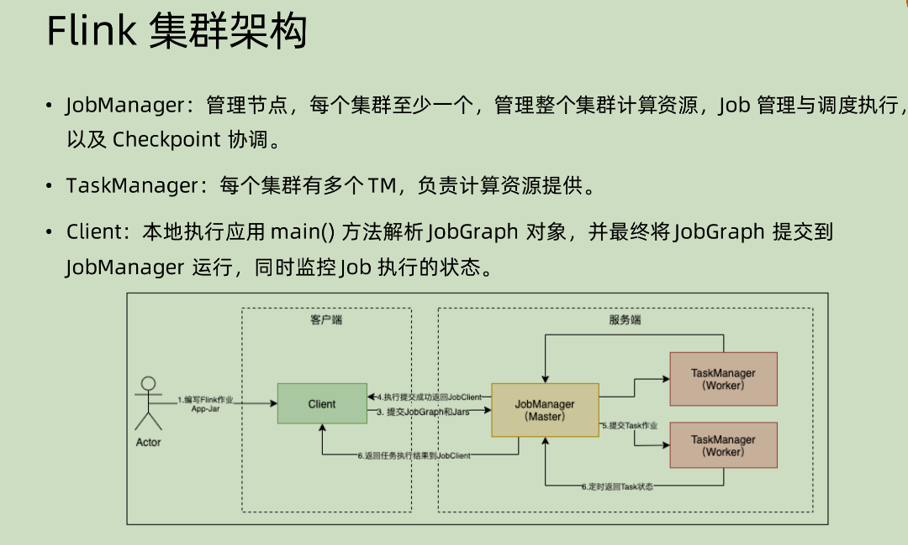
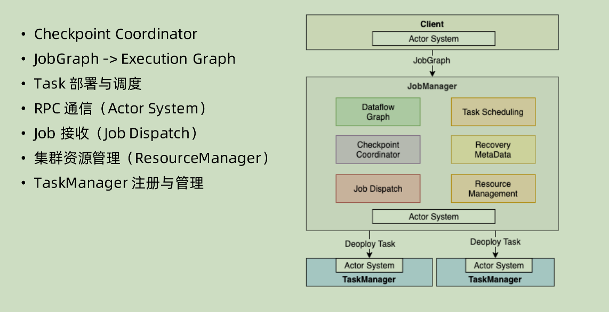
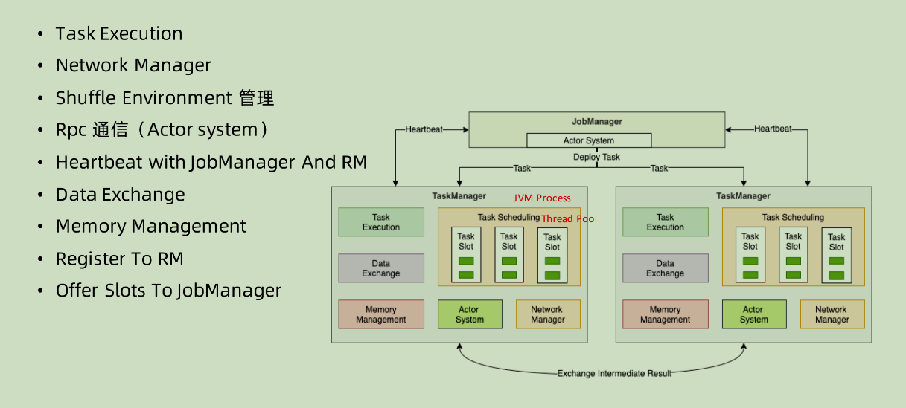

本文之中会先将对应的执行步骤做一个梳理，然后对每一个模块之中的大致功能做一个介绍。

参考：https://time.geekbang.org/course/detail/100058801-278257

# Flink 集群架构

其中需要注意的点是：

1. 和 Spark 不同，这里面的 Client 只是用来做一个解析生成的工作，本身不需要和 taskManager 通信来获得相应信息，管理全程是 JobManager 来执行的

# JobManager

我们一点一点讲：

1. CheckPoint Coordinator: 在 Flink 之中，是用 checkpoint 来做相关的管理的，比如如何保证 exactly once。 那么这里面就需要 JobManager 对当前的 Job 做相应管理。
2. JobGraph -> Execution Graph: Execution Graph 本身是一个物理层面的逻辑执行图。JobGraph 是Client 将对应的 JAR 包进行解析之后生成的，但是 JobGraph 之中仅仅是对于整个流程的一个比较粗略的概括，对于最后的执行，比如并行度，数据之间的 shuffle 传输，这些都是由 Execution Graph 进行解析得出来的。
3. Task 的部署和调度：显然 Task Scheduling 这个部分是 JobManager 所必须的，因为其要将任务具体分配到对应的执行节点。
4. RPC 通信：这部分是通过 Actor System 进行处理的，Actor System 基于 Akka 实现的，这部分 RPC 通信主要是用来对 TaskManager 本身的状态信息和某些指令，比如启停这种做传输，

5. Job 接收：很多时候一个 Job Manager 要接受很多 Job，那么对于这种多个 Job 之间的协调统筹，就是需要 Job DisPatcher 进行相关的操作，比如拿到 JobGraph 之后拆分并且分发。
6. 集群资源管理：这部分针对于不同的模式有不同的实现，比如 standalone,yarn 和 k8s 其实现的方式就不同
7. TaskManager 的注册和管理：这也应该是基本的 JobManager 所具有的功能了，毕竟要为下游进行一个任务的分配。

# TaskManager

1. 作为整个系统之内的 worker 节点，其本身肯定要具备任务执行的功能
2. 