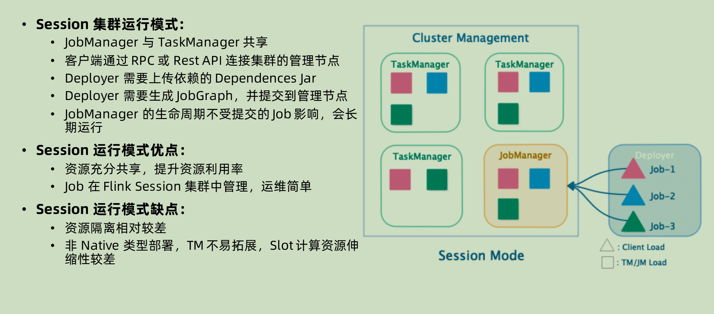
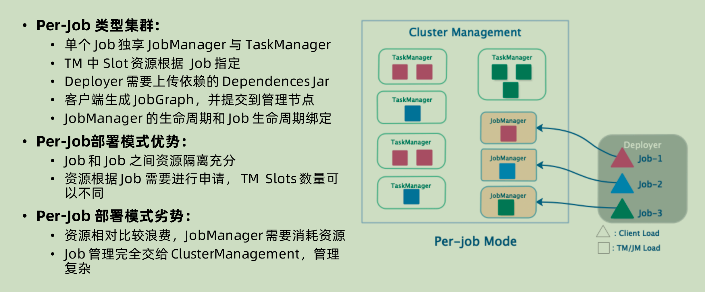
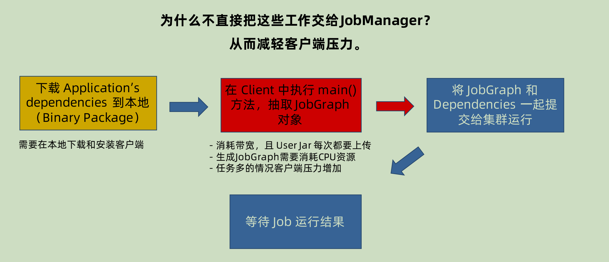
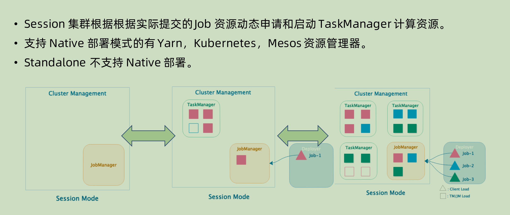
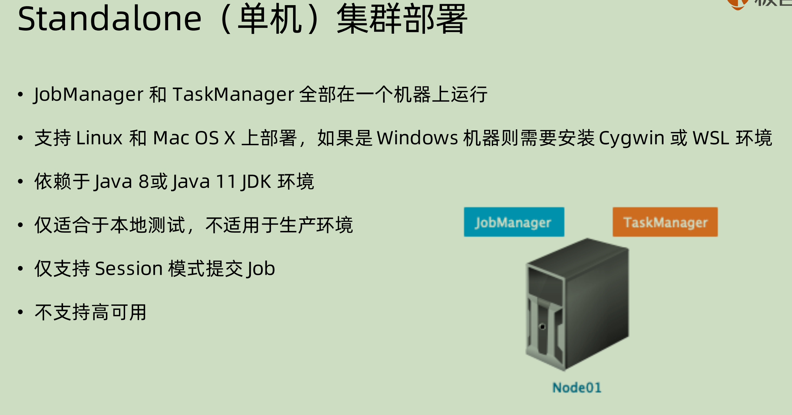
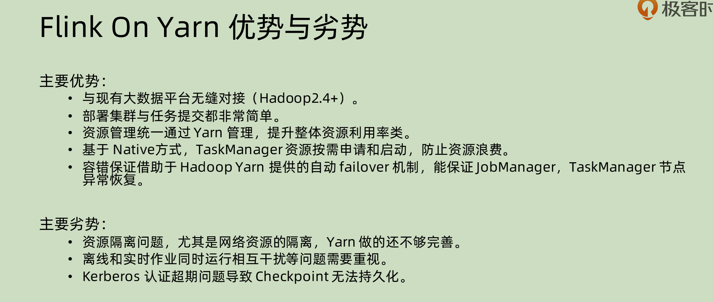

集群的部署模式，主要是以下两种条件来将其分成三种类型：

1. 集群的生命周期和资源隔离：
   1. 生命周期：也就是整个 Runtime 是否随着 job 的结束而销毁
   2. 资源隔离：多个 job 共享一个 jobManager 还是为每一个 job 提供一个 jobManager
2. 根据程序的main()方法是在 client 上面执行还是在 jobManager 上面执行：
   1. 在 client 上面：由 client 来生成 jobGraph，并且传到 JobManager 上面去
   2. 在 jobManager上面：application mode，整个 application 的 main()在 cluster 上面运行，jar 包可以放在比如 hadoop 的地方，这样

# Session 集群模式

session 集群模式之中，整个 flink cluster 只有一个 JobManager，所有的 job 都先由对应的 client 进行解析生成 JobGraph 之后，和相关的depandency jar 一起再去提交到 JobManager 上面。整个 JobManager 不会受到不同的 Job 周期的影响。

注意其中的每一个 TaskManager 可以**有不同的 job 在运行**

**优点：**

1. 运行的 taskManager 本身的资源是充分共享的，资源利用率可以提高
2. Job 的管理是在 session 集群之中的，运维相对来说不是在resource management，比如 yarn 那边，所以更简单一些。

**缺点：**

1. 既然共享，就会有资源隔离相对比较差的问题。
2. 如果在非 native 模式下面进行部署，会在部署的时候就已经将 taskManager 固定好了，无法再进行资源的扩展。但是如果是native 模式下面进行部署，那么就没有这个问题。

# Per-job 运行模式

Per-job 模式下面就是对于每一个job，都临时创建 jobManager，启动 taskManager 和生成对应的 runtime。

**优点：**

既然彼此隔离，那么对于每个 job 的灵活度就更高，比如其中的 taskManager 之中的 slot 个数就可以随着 job 本身来进行定义。相对之下，就是 job 之间彼此的资源隔离非常充分。

**缺点：**

1. JobManager 本身也需要消耗资源，为每一个 job 单独启动一个 JobManager，很大概率上面资源会被浪费。
2. 彼此隔离，就只能将管理交给 Cluster Management。相对就会提高管理的难度。

# Application mode

## 为什么要将 Jar 的解析从 client 转到 cluster？

Session 和 per-job 模式下面，都是先将对应的 jar 在 client 进行解析，然后提交到 JobManager 上面。

生成 JobGraph 的过程很消耗 CPU 资源，而且在多个 JAR 进行排队提交的时候，有可能会造成 blocking（排队等待解析和上传 dependency JAR）。dependency jar 也可能很大，造成 cluster 和 client 之间的网络堵塞。所以就有一种想法——为什么不把这些交给 JobManager？

## Application mode

在这个 mode 下面，client 只是负责命令和接收结果，从解析过程开始之后就是放在 JobManager 上面运行。可以自己去指定划分 application，每一个 application 之中都有很多 job。dependency jar 可以由 jobManager 上传到 hdfs（yarn mode），或者是打包镜像（k8s mode)。

# Native 集群部署

在部署的时候只是生成并且启动 JobManager 实例，不启动 taskManager。当 job进来的时候，再去对应的申请 taskManager 并且相应的分配其中的 slot。

# Standalone 部署

standalone 部署分为两种，一种 standalone 集群部署，一种 standalone单机部署。

## standalone 集群

1. 虽说是 standalone，但是也是集群模式，只是其部署是直接在**物理主机**上面。
2. 依赖 JDK，需要在每一台机器上面都有对应的 JDK，目前支持的是 Java8和 Java11
3.  只支持 session 模式提交（个人推测是因为资源隔离在 standalone 模式下面意义不大，所以不如就一个 jobManager 算了）
4. 支持高可用，是通过 standby master process 来实现的，如果当前的 flink master process 挂掉那么就换成 standby 的。

## standalone 单机部署

都单机了还要啥高可用啊……肯定不支持了。

# Yarn 集群架构原理

之前自己有疑问，为什么在 node manager 看起来既是 application master 又是 resource manager的 slave 呢？

问了柳源哥之后才明白：

两套是两个层面：

1. resource manager 和 node manager 层面，这一套是资源角度进行分配的，也就是只要集群启动之后，他们就会启动。
2. application master 和 container 两者是在应用层面的，逻辑是当 application 到来的时候，会启动一个 application master（实际上也是在一个 container 里面启动），然后 application master 向 resource manager 申请资源，再去对应分配的 node manager 上面真正索取对应的 container。

## Flink on yarn 集群部署-session 模式

在 session 模式下面，job 是先通过 dispatcher 来进行分配到 jobmanager 上面的。

我们之前有看到过 session 模式下面只有一个 jobManager 进行 jar 包的分配，但是实际上对于这种 flink on yarn 的部署，还是会启动多个 jobManager 来进行对应的处理，每一个 jobManager 单独去管理某些 taskManager，这也是负载均衡的一种体现。

如果是 native 模式，那么也可以在一开始只启动对应的 jobManager，之后再去按照需求来申请资源，这个过程也可以实现动态分配。

## Flink On Yarn集群部署 - per job 模式

相对于上面的 session 模式，不是省略了 dispatcher，而是独享了 dispatcher。

## Flink On Yarn的优势和劣势

**优势：**

除了和现有的资源管理栈相匹配之外，yarn 本身拥有 failover 机制，那么就能保证 jobManager 和 TaskManager 的异常恢复。

**劣势：**

1. 资源隔离和运行干扰问题：yarn 对网络资源隔离做的不是很好，如果在半夜需要去做一个 batch job 的运行，可能会非常耗费网络资源，那么同时7*24的 streaming job 就可能会有网络堵塞。

