# 20 | DataStream API 实践原理

Flink Datastream 程序一般分为五个部分：

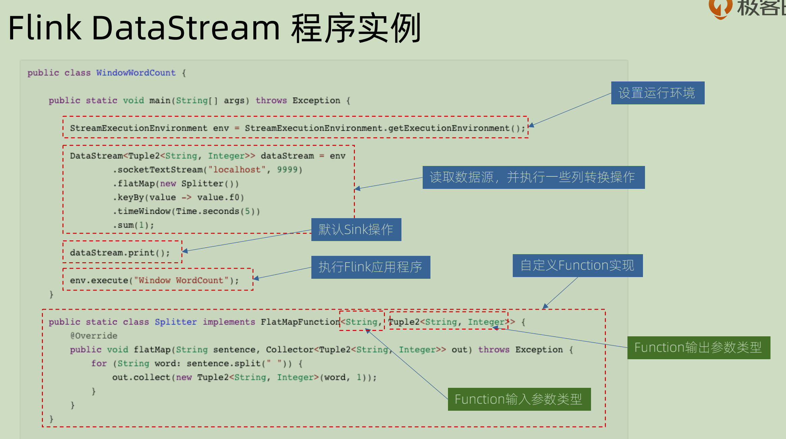

1. 设置运行环境： StreamExecutionEnvironment.

   管理相关运行时候的参数，加上一些比如 checkPoint 这些的管理。

2. 配置数据源来读取数据：env.readXXX()

3. 进行一系列的转换和process： DataStream wordCounts

4. 配置数据源来写出数据： wordCounts.writeAsXXX

5. 提交执行：env.execute()


StreamExecutionEnvironment 本身具有很多功能，我们先单独说其中的数据源管理部分：

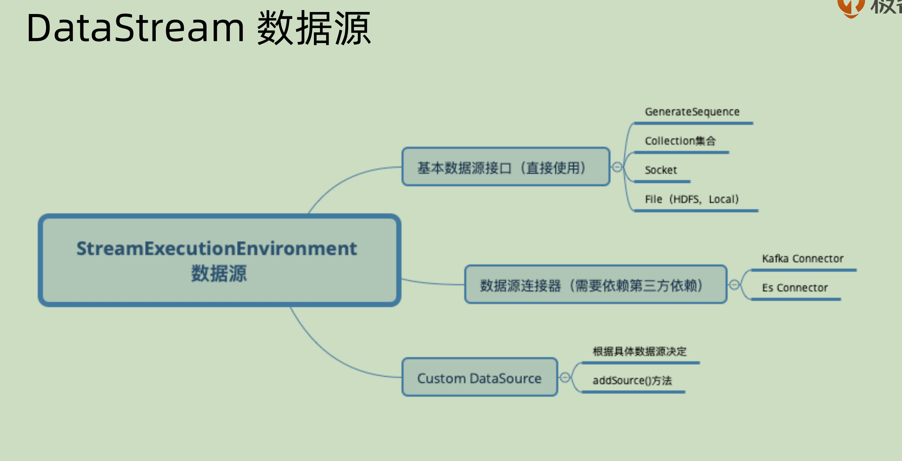

可以看到主要分为三个部分：

1. 可以*直接使用*的**基本数据接口：** 比如从 socket 之中直接读取数据，从某个集合（List，Map）之中读取数据，从 HDFS 之中读取数据等等，这些都是 Flink 自带的部分，不需要再引入任何的包。
2. 需要*第三方依赖*的**数据源连接器：** 比如需要 Kafka 之中的 consumer来完成数据的对接
3. Custom DataSource：是用户自己定制化的，根据具体的数据来决定，自己实现` addSource()`方法

下面是一些基本数据源：

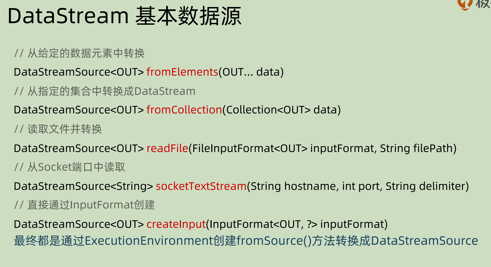

DataStreamSource,本身也具有所有的 DataStream 相关的属性和方法，可以一样操作。除此之外还具有Source 相关的方法。

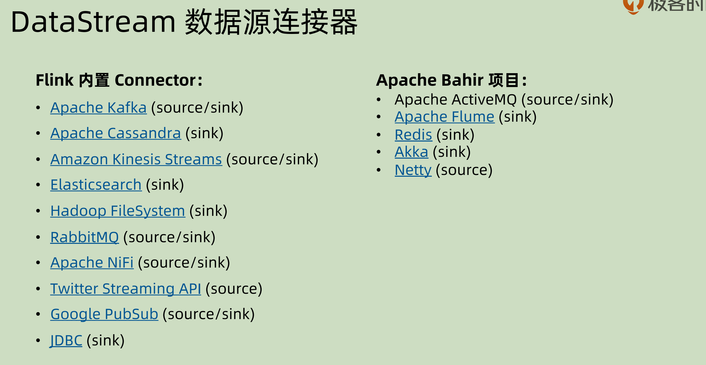

之前讲过程序分为五个部分，而 source 和 sink 是分开的。图中就说明了各个数据源可以用来做sink 还是 source。有些只具有一个功能，就不要用错。

下面用 kafkaConnector 来做相应的source 的例子：

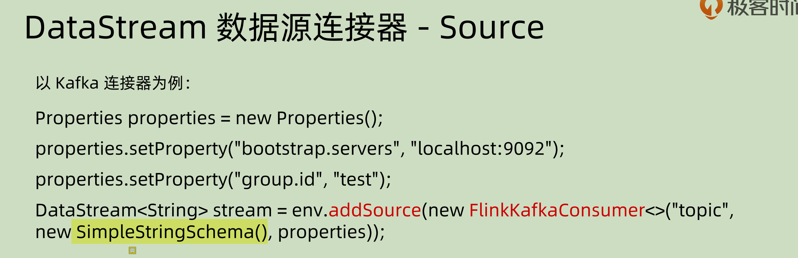

先是对 kafka 相关的属性进行设置，然后将对应的 source 加入其中，注意中间标黄的部分，是设置其 schema 序列化时候的相关属性。

在使用 kafkaConnector 作为 source 的时候，还可以分别指定其中的 offset，对于同一个topic 之中的不同 partition 还可以分别指定：

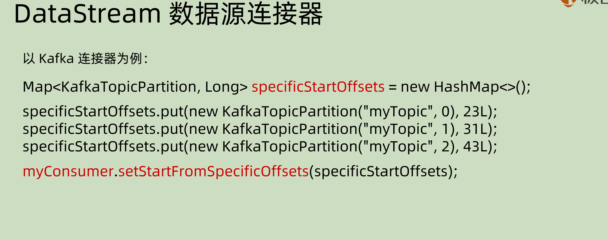

如果使用 kafka 作为 producer，那么下面的示例代码之中已经写出了相关属性的用法：

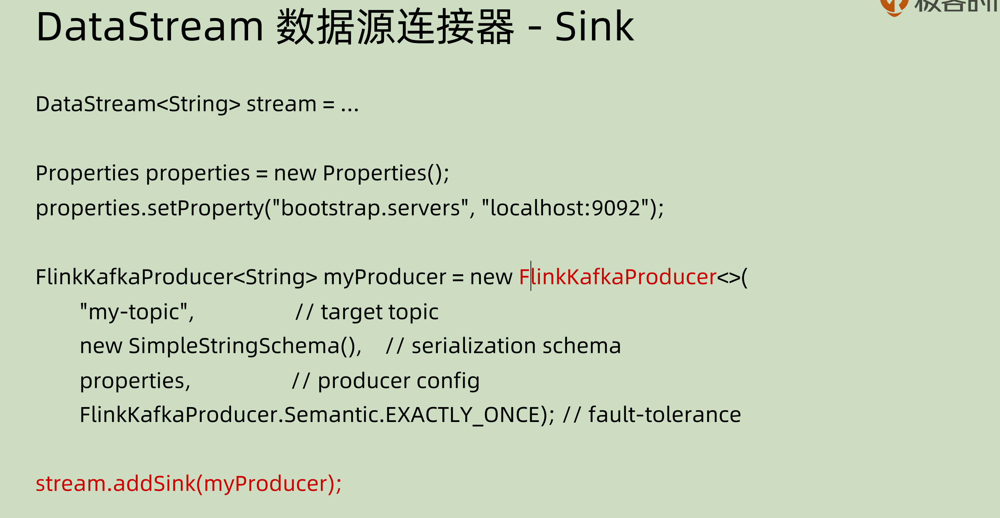

## DataStream 主要转换操作

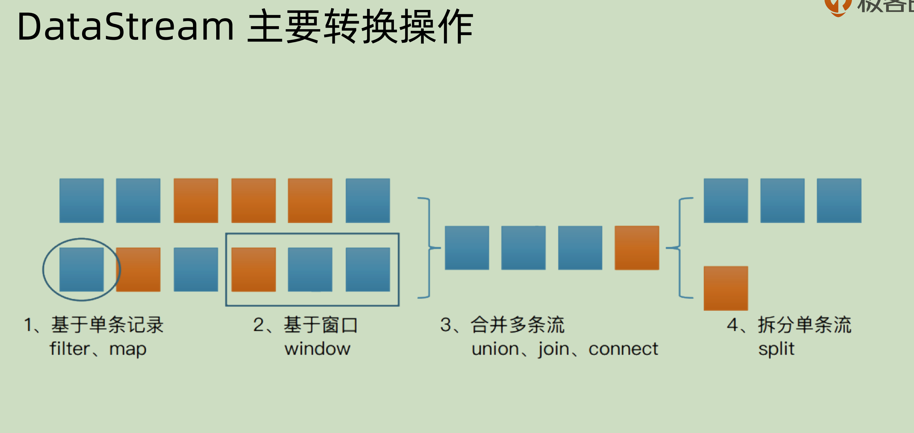

主要分为4类：

1. 基于单条记录的操作： 对于单条记录进行 filter 和 map。
2. 基于窗口window 的操作：对于某一段时间之内的数据，可以用一个窗口将其囊括进来。那么基于窗口可以做对于某一段的数据进行操作。
3. 合并多条流：将相同或者不同数据源的数据流合并并且输出。比如 union。join 和 connect

这部分参考：https://blog.csdn.net/u010002184/article/details/106800819

>  下面辨析一些 union，join 和 connect 三者之间的区别：
>
>  其实主要是 union 和 connect 相似，join 和二者之间的差别还是比较大的。
>
>  1. join： join 类似数据库操作之中的 inner join，其是在两个流之中分别寻找符合条件的数据，并且将其进行笛卡尔积的 pair 操作。
>
>  2. union：union 可以用于**多条**而**相同类型**的数据流，其是将多个 DataStream 合并形成一个 DataStream，按照 FIFO 的原则，且并不去重。
>
>    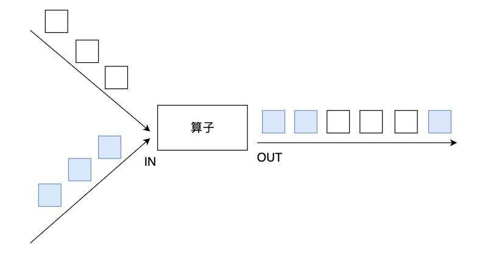
>
>    比如合并多个交易所的数据，其来源于多个数据源且类型完全相同：
>
>    ```scala
>    val shenzhenStockStream: DataStream[StockPrice] = ...
>    val hongkongStockStream: DataStream[StockPrice] = ...
>    val shanghaiStockStream: DataStream[StockPrice] = ...
>    val unionStockStream: DataStream[StockPrice] = shenzhenStockStream.union(hongkongStockStream, shanghaiStockStream)
>    ```
>
>  3. Connect: connect 只可以用于两个数据源相关的操作，但是两个数据源的类型可以**不同**。两个 DataStream 在 connect 之后可以形成ConnectedStreams， 在其中可以分别对两个数据源进行不同的操作，但是二者之间也可以共享状态，比如可以一起 count 数量。
>
>  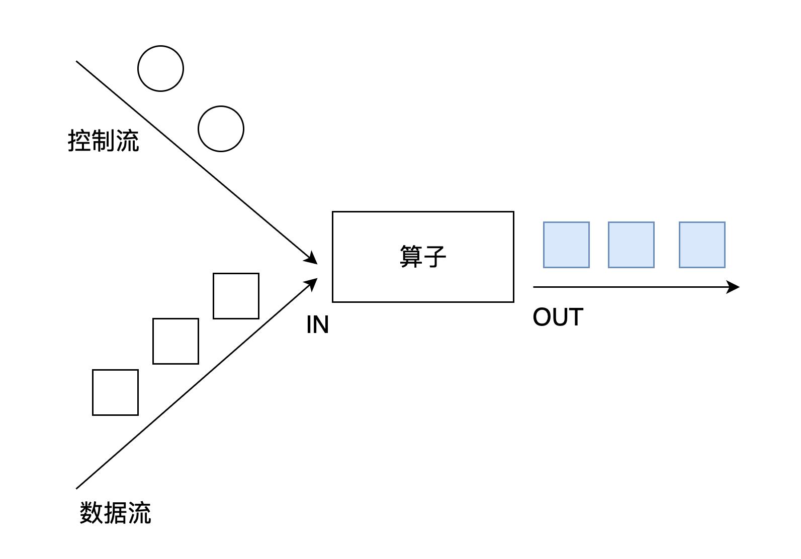
>
>  `connect`经常被应用在对一个数据流使用另外一个流进行控制处理的场景上，如图所示。控制流可以是阈值、规则、机器学习模型或其他参数。
>
>  4. 拆分单条流：按照某种规则进行拆分，还有下面会涉及到的 side output 也可以做相似的功能。

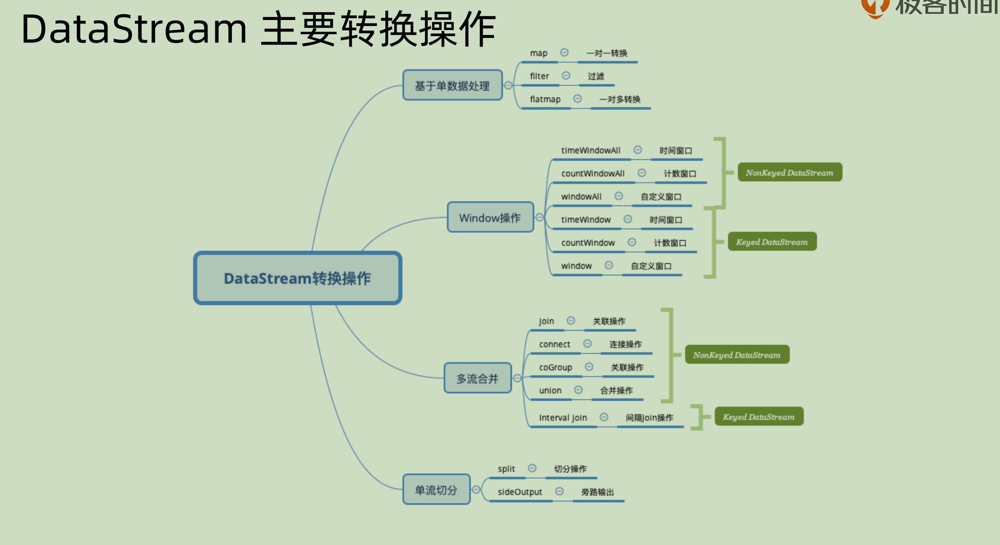

附一张 dataStream 的转换图：

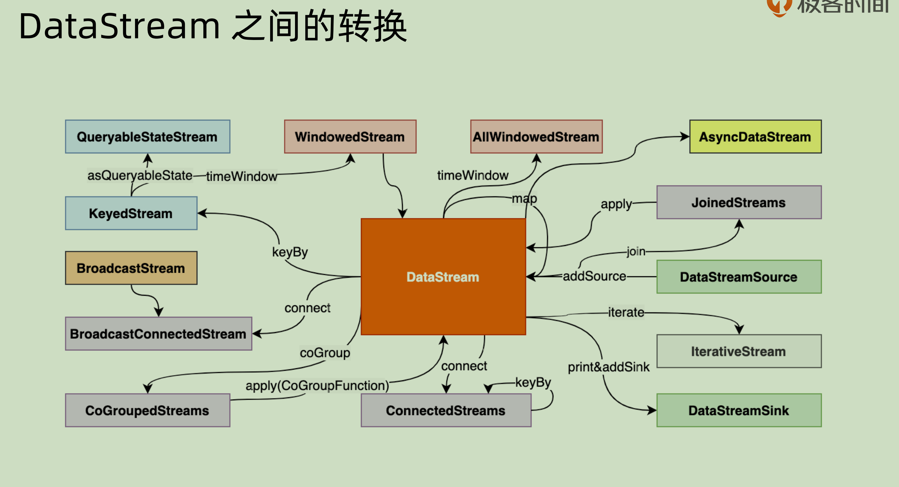

# 21 | Flink 时间概念

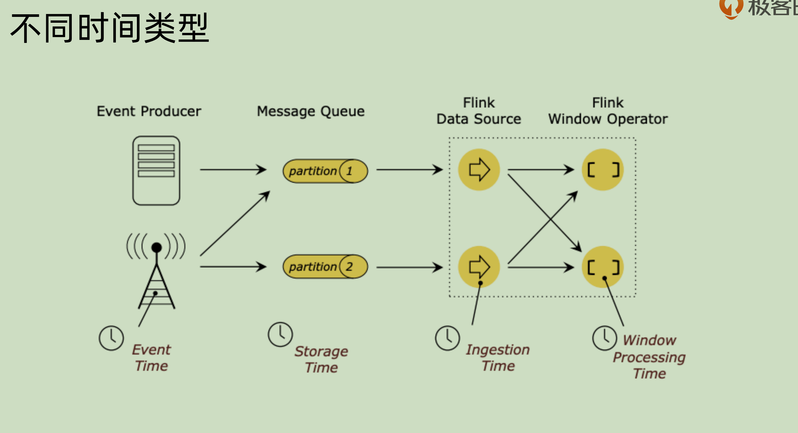

上面这张图之中就是对于一个事件的各种各样的时间。

Event time 是事件发生的真实时间，用它的话，好处在于其可以复现。

Processing time 是事件在处理的时候的时间，是和本地环境相关的，这个无法复现。但是对于我们的大数据系统而言，其本身就是**异步和分布式**的，那么这个 processing time 其实并不能很好的提供一种保障。

# 22 | Watermark实践原理

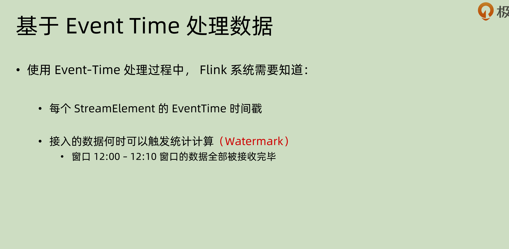

之前我们讲过了，最好使用 event time 来进行事件处理。那么整个系统需要两点信息来使用 event time 做处理：

1. 对于每一个元素：streamElement, 都需要知道其自带的时间戳。
2. 知道**啥时候可以触发统计计算**

> 第二点为什么必须呢？之前我们提到了，整个系统是**异步和分布式的**， 那也就是说并不能保证事件的到达先后，这种情况下必须有个”指标“来表明——现在已经满足某些条件了，可以处理了，系统才会知道何时处理会带来”正确“的结果、

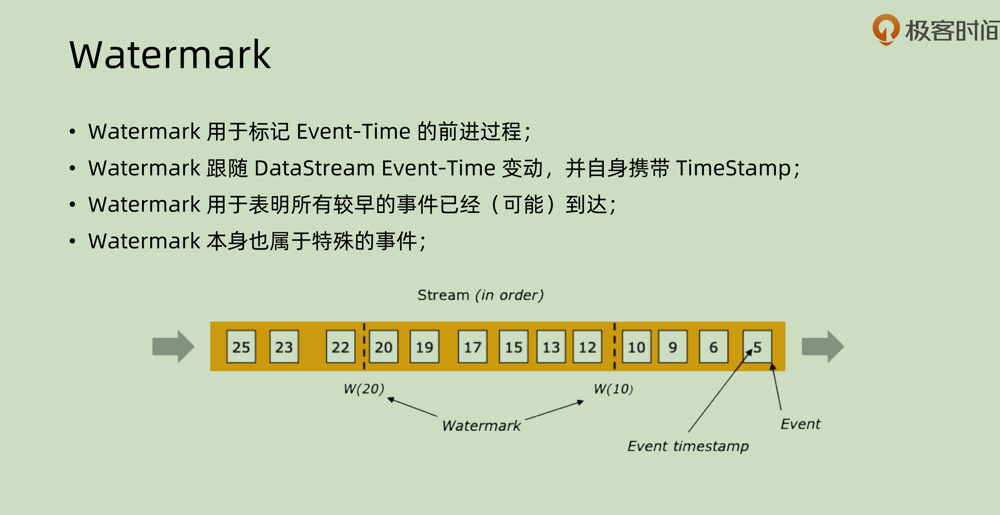

这个时候，就是我们讲到 Watermark 这个点的时候了。其用于表达：

**在某个时间点之前的数据都已经到达系统之中了**。

watermark 本身也有自己的时间戳，所以可以当做是一种特殊的事件。

在完美情况，也就是信息流有序的情况之下，其实是不需要 watermark 的，因为数据本身就保证顺序，watermark多此一举。但是在信息流”有界乱序“的情况下，（指的是其本身在一定可容忍的范围内乱序），就需要 watermark 这种事件来对其做一定的标记了。

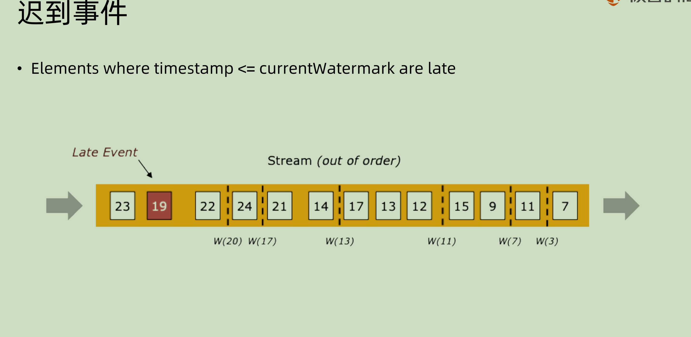

上面是对于这种”有界乱序“的情况的图示处理，上图之中`maxOutOfOrderness = 4 `。这就意味着可以容忍事件晚来4个 slot。那么每次得到最新的时间戳的时候，都将其减去4来作为 watermark 的时间戳。比如最新的是7，那就7-4=3. 到最后可以看到，19那个 event 到达的时候，最后容忍的 watermark 是20，这也就意味着这个事件会被记为 Late event，后面我们会涉及到 window 的概念，那么其就不会被计入到 window 之中或者是触发相应的window处理。

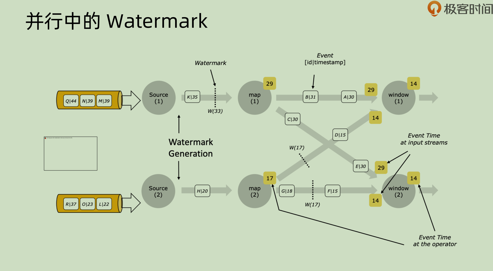

这张图之中是并行之中的 watermark。每一个 event，比如 Q|44， 意味着其 key 是 Q，timestamp 是44. 一个新的 event 过来的时候，source 会产生相应的 watermark 并且随着正常的事件流一起向下游传递，下游，比如 map(1)，会使用相应的 event 来对其本身的 timestamp 进行更新操作。

# 23 | Watermark与Window的关系

**Append mode，图中的容忍时间为10min:**

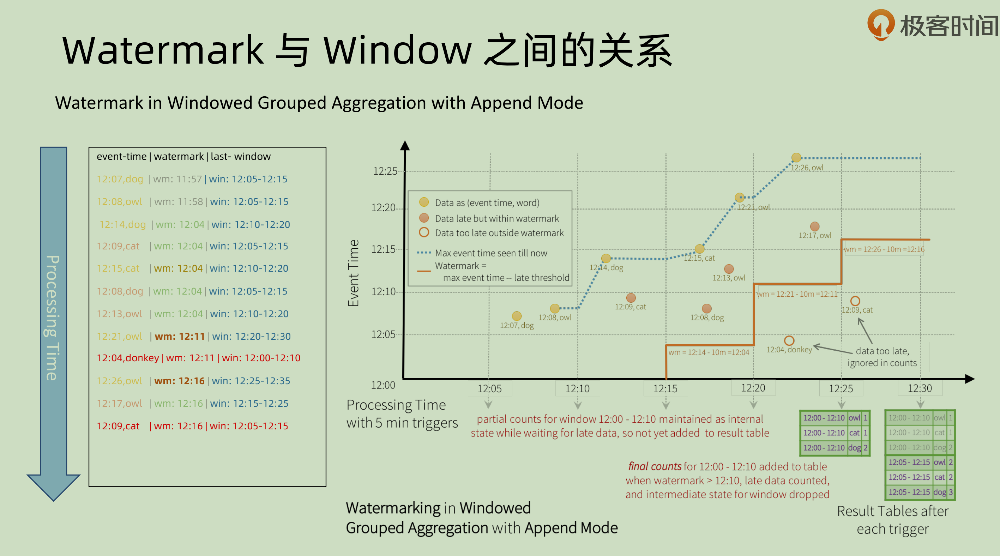

watermark 是用来确定**一个window 已经结束，可以开始 process **的标志。 第一个事件到来，event time 是12：07，那么容忍时间是10分钟，就会确定其 watermark是11：57。 比如一个window 是12：05-12：15， 那么当一个事件的 event time 是12：26的时候，其减去10会编程12：16，已经大于当前的 window 了，那么就会将12:05-12:15的这个 window 触发。在这个 window 被触发之后，再在这个 window 之中的 event 会被标记成 late event，不会触发 window 或者任何 process 操作。

**Update mode, 图中容忍时间为10min：**

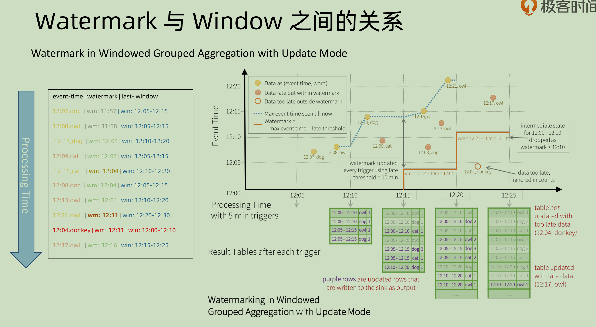

和上图不同的地方在于，同一时刻其可能有多个窗口的数据，比如第一个12：10的时候 ，实际上会处理12:00-12:10和12:05-12:15的数据，因为其是 append mode，可以在之后再对结果进行更新处理，所以其才会将可以处理的数据进行提前的处理。如果是 append mode 则不可（因为一旦处理了就无法进行更新）。

# 24 | Watermark Generator

