《快学 Scala》个人学习笔记。

# 第一章 基础

## 1.2 声明值和变量

1. 在 scala 之中，声明值或者变量但是不做初始化赋值，会直接报错

## 1.3 常用类型

1. Scala 之中，不区分基本类型和引用类型，所有的类型都是**类**。基本类型和包装类型之间的转换，是 Scala 编译器的工作，如果需要，包装器会直接对包装类型进行拆包

2. 在

   ```scala
   "hello".intersect("World")
   ```

   之中，虽然'hello'是一个String，但是实际上是被隐式的转换成了一个 StringOps 对象，接着用这个对象之中的 intersect 方法。同样的还给 Int，Double，Char 等等提供了 RichInt，RichDouble 和 RichChar 等等类，来提供很多的便携方法。

## 1.4 算术和操作符重载

1. 在 Scala 里面，算术符号本身也都是方法，比如 a+b，其实也可以写成 `a.+(b)`。

   > 这个实际上是可以理解的，因为运算符本身也就是对某些数值进行计算，那么本身被当做一种方法是完全 ok 的

## 1.5 调用函数和方法

一般来说，没有参数而且不改变当前对象的方法是不带圆括号的。

> 没参数不带圆括号很正常，因为本身圆括号就是用来放置参数的。但是为什么还要加上一个不改变当前对象呢？此处存疑，书中说第五章会探讨。
>
> ？？？？？？？？？

## 1.6 apply 方法

按照我的理解，apply 方法，实际上就是对于每种类型最常用的方法，从而可以在对象的后面直接加上括号来使用。

# 第二章 控制结构和函数

在 Scala 之中，几乎所有构造出来的语法结构都有值。表达式（比如3+4）和语句（比如 if 语句）都是有值的。

## 2.1 条件表达式

scala 的 if/else 语句是有值的，其是表达式后面的值。比如：

```scala
if(x>0) 1 else -1
```

这句话里面的表达式的值是 1或-1。 而且这里面的值，可以直接赋给一个 val。

```scala
val s = if (x>0) 1 else -1
```

**如果其两个分支的类型不同怎么办**

会去扎两个分支类型的公共超类型。比如 String 和 Int 的公共超类型就是 Any。

**如果一个分支没有值怎么办**

没有值的话，就引入一个 Unit 类，写作()。一般 Unit 被当做 Java 之中的 void来使用。

## 2.3 块表达式和赋值

{ }块包含一系列表达式，并且其结果也是一个表达式。 `{}`的值就是其中最后一个表达式的值

scala 之中赋值语句的返回类型是 Unit，所以不要写比如 `x = y = 1`这种，这样会让 x 被赋给 Unit 类型

## 2.5 循环

scala 之中没有传统的 java 里面的 for 循环，比如`for(初始化变量；检查变量是否满足；对变量更新)`

一般都是这样的循环：

```scala
for ( i <-1 to n)
	r = r * i
```

**scala 之中并没有提供 break 或者 continue，那么如何跳出循环呢？**

1. 使用 Boolean 类型 的循环变量
2. 使用嵌套函数之中的 return
3. 使用 Breaks 对象之中的 break方法， **但是这里面的控制权的转移是通过抛出异常和捕获异常完成，效率比较低**

## 2.6 高级 for 循环和 for 推导式

1. 可以用 ` 变量 <- 表达式`来提供多个**生成器**，用分号隔开。

```scala
for ( i <- 1 to 9; j <- 2 to 5) print( i * j)
```

2. 每个生成器都可以带一个**守卫**，其返回的是一个 Boolean 类型

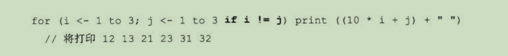

3. 如果 for 循环的循环体是以 yield 开始，那么循环会构造出一个集合，每次迭代都会生成循环之中的一个值。这种叫做 for 推导式。for 推导式生成的集合和第一个生成器是类型兼容的。

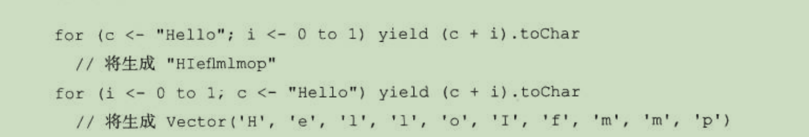

上面这张图之中就是顺序不同导致 yield 生成的类型不同。

## 2.7 函数

scala 之中支持方法和函数。方法是对某个对象进行操作，但是函数不是。

不是递归的函数都可以直接省略返回值，但是递归函数必须明确给出返回值的类型，比如：

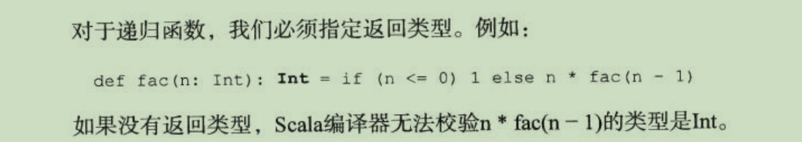

因为在函数代码块之中的最后一个表达式的值就是整个函数的返回值，所以一般情况下我们不需要使用 return。

## 2.8 默认参数和带名参数

如果带有默认参数的情况下，我们提供的参数个数不够，那么剩下的空位会默认去填补默认参数。

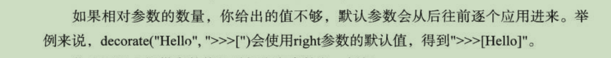

在调用函数的时候当然也可以将其参数的名称带上，但是大部分时候没必要。

## 2.9 变长参数

当调用变长参数，而且参数类型是 Object 的 java 方法时候，需要手动对基本类型进行转换，比如：

```java
    public static String format(String pattern, Object ... arguments) {
        MessageFormat temp = new MessageFormat(pattern);
        return temp.format(arguments);
    }
```

就可以这样使用：

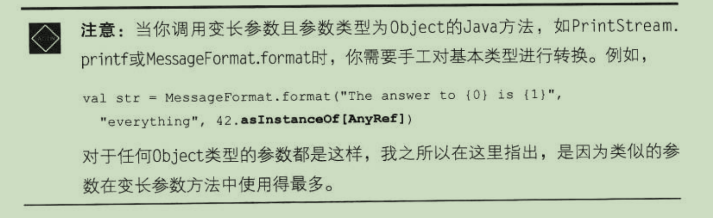

## 2.12 异常

1. Scala 并没有受检异常，不需要将这个函数或者方法所有可能的异常在签名处就全部写出。

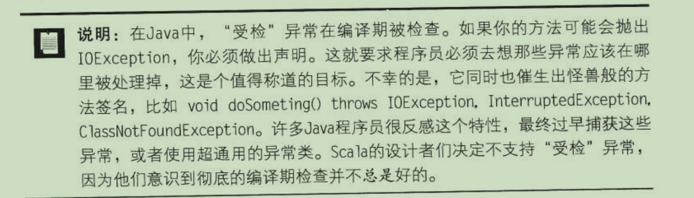

2. throw 表达式的类型是 Nothing, 这个在 if/else 表达式之中常用。如果一个分支的类型是 Nothing，那么 if/else 的表达式的类型就是另外一个分支（未抛出异常的分支）的类型。

3. 在 try/catch 里面，如果不需要使用捕获的异常对象，可以使用`_`来代替变量名。

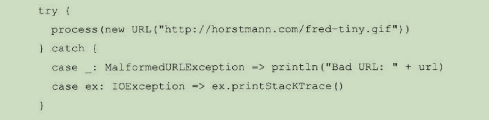

4. 如果在 try/finally 语句的 finally 之中再次抛出异常，会怎么办？在 finally 之中抛出的异常会跳出当前语句，而且废弃并且代替之前所有抛出的异常。

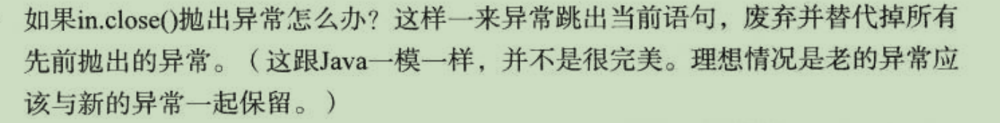

## 练习

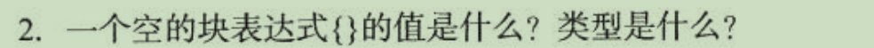

```scala
scala> {}.getClass
val res5: Class[Unit] = void
其没有值
类型：Unit
```

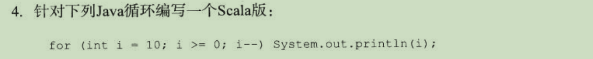

这个地方需要用到一个 `.to(end, step)`函数，最后会返回一个 Range。其文档：

```scala

  /**
    * @param end The final bound of the range to make.
    * @param step The number to increase by for each step of the range.
    * @return A [[scala.collection.immutable.Range]] from `'''this'''` up to
    *         and including `end`.
    */
  def to(end: Int, step: Int): Range.Inclusive = Range.inclusive(self, end, step)
```

所以应该是：

```scala
  def forTest(x: Int) = {
    for (i <- x.to(0, -1)) println(i)
  }
```

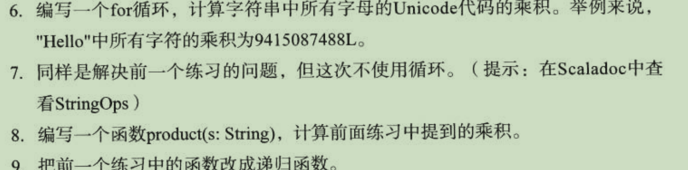

```scala
  def que6(str: String) = {
    var res = 1
    str.foreach(res *= _.toInt)
    res
  }

  def que9(str: String): Int = {
    if (str.length == 1) str(0).toInt
    else str(0).toInt * que9(str.substring(1))
  }
```

# 第三章 数组相关操作

## 3.2 变长数字：数组缓冲

定长直接使用 Array，变长使用 ArrayBuffer

二者之间转换：

Array.toBuffer()

Buffer.toArray()

## 3.4 数组转换

数组转换之中是产生一个新的数组，不会修改原始数组

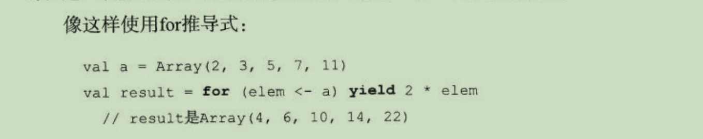

最后得到的会是相同类型，Array 的 yield 产生 Array，而 ArrayBuffer yield 产生的是 ArrayBuffer

当然可以不使用if 守卫来做条件，而是使用 filter 和 map。这都是看个人的编程喜好

# 第四章 映射和元组

map 不过就是元组在 n=2时候的特殊情况

## 4.1 构造映射

直接调用 Map 来形成的是一个不可变的 Map，比如：

```scala
scala> val score = Map(1->"a", 2->"b")
val score: scala.collection.immutable.Map[Int,String] = Map(1 -> a, 2 -> b)
```

不可变的意思是其中的值是不可以被改变的。

## 4.2 获取映射之中的值

一般都会用`getOrElse()`这种来获取，如果有那么就返回值，没有的话就返回默认值。

映射.get() 这样的调用会返回一个 Option 对象，要不是 Some，要不是 None。

## 4.4 迭代映射

想要交换 k 和 v 的位置，可以直接用 yield

```scala
scala>  for((k,v) <- score) yield (v,k)
val res9: scala.collection.immutable.Map[String,Int] = Map(a -> 1, b -> 2)
```

## 4.5 已排序映射

可以直接使用 SortedMap 来做排序，其底层会使用 TreeMap

```scala
val s1 = SortedMap(1->"a", 2->"b")
import scala.collection.SortedMap

scala> 
scala> val s1: scala.collection.SortedMap[Int,String] = TreeMap(1 -> a, 2 -> b)
```

如果想**按照插入顺序访问所有键**，要使用 LinkedHashMap

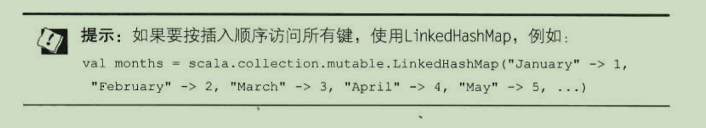

# 第五章 类

## 5.1 简单类和无参方法

方法什么时候带括号？

一般认为，在*改值器*之后要带括号，而在*取值器*之中不需要。

可以在定义的时候就强化其中的区别：

```scala
package org.example

class Counter {
  private var v = 0

  def increment() = v += 1

  def current = v
}
```

## 5.2 带 getter 和 setter 的属性

scala 之中对每个字段都提供 getter 和 setter 方法，如果这个字段是私有的，那么其 getter 和 setter 方法也是私有的。

比如对一个 class:

```scala
class Person {
  var age = 0
}
```

首先可以看到其本身不是 private 的，所以 getter 和 setter 分别为 age 和 `age_=`

将其按照下面的步骤进行编译之后得到：

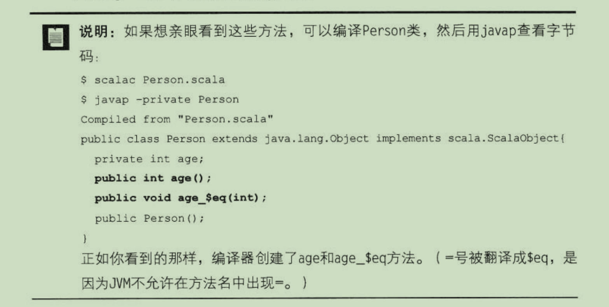

```scala
-> javap -private Person
Warning: Binary file Person contains org.example.Person
Compiled from "Person.scala"
public class org.example.Person {
  private int age;
  public int age();
  public void age_$eq(int);
  public org.example.Person();
}

```

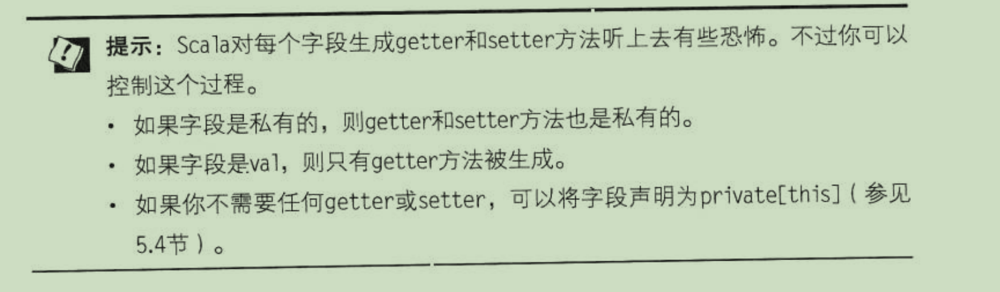

## 5.3 只带 getter 的属性

Scala 之中，一个字段可以：

1. 拥有 getter 和 setter 属性：用 var 修饰
2. 拥有 getter属性：用 val 修饰

如果只用 val 修饰的话，实际上 Scala 会生成一个 *final 字段*和一个 *getter 方法*。

**但是如果想实现一个只能通过某些方法来修改的字段怎么办？**

那么就不能用自动生成的方法了。分析一下：

1. 需要修改：肯定只能用 var 来修饰，但是不可以是直接 var。那我们就可以使用`private var`
2. 需要访问：定义另外一个属性来获得值。

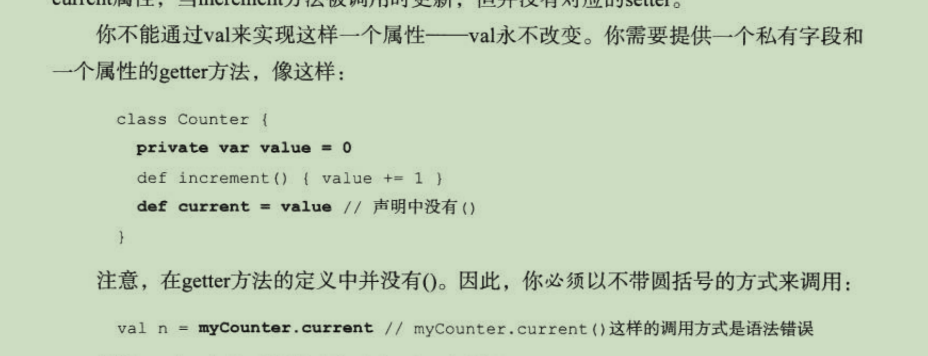

## 5.4 对象私有字段

Scala(Java 和C++也一样)，方法可以访问该类型**所有对象**的私有字段。

> 不是本对象，但是一个类的都可以。

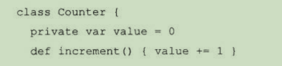

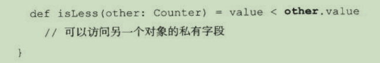

注意 other 这个对象的 value 也可以被访问到。

如果想要让这个属性只被**当前对象**之中的方法所访问到，要使用`private[this]`

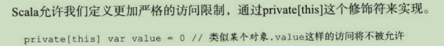

这种叫做对象私有字段。对象私有字段在 Scala 之中不会自动生成 getter 和 setter 方法。

Scala 还允许将访问权限赋予指定的类型，但是类必须是当前定义的类或者是包含该类的外部类：

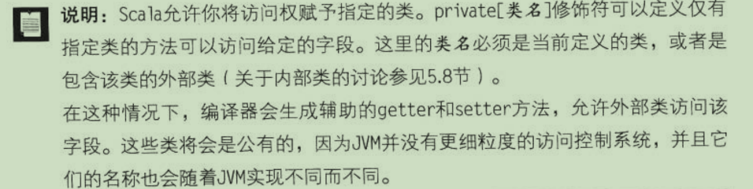

## 5.5 Bean 属性

Scala 之中的实现方式是对于 var 来生成 foo 和 foo_方法作为 getter 和 setter，但是在 JavaBeans 规范里面规定Java 属性是一对 getFoo/setFoo 方法，许多 java 工具依赖于这种方法。

如果想要兼容这种方法， 可以直接使用`@BeanProperty`。

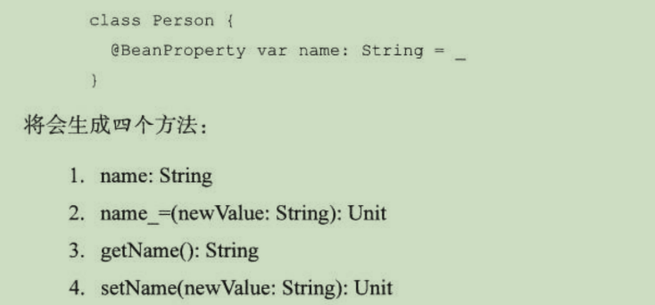

如果在 constructor 之中定一个某个字段，而且想要 JavaBeans 版本的方法，也可以在参数之中加入注解：

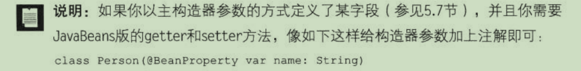

下面是一个针对字段生成的方法的表格总结：

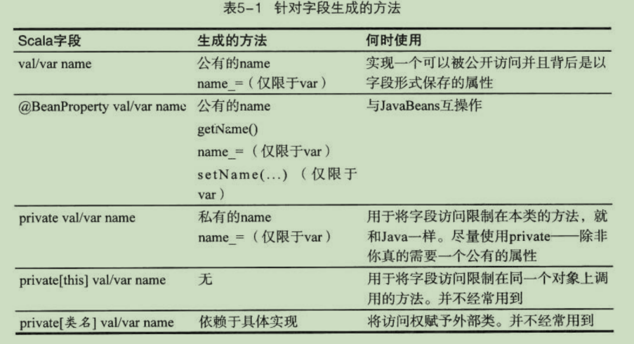

## 5.6 辅助构造器

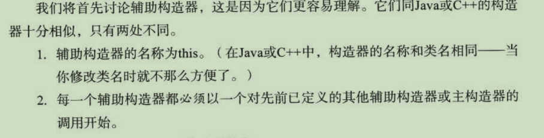

1. 为了修改类名方便，将辅助构造器的名字统一为 this()
2. 那么追溯到源头，一定会有主构造器被调用的时候

## 5.7 主构造器

scala 之中，主构造器的定义是和类交织在一起，直接放在类名之后。

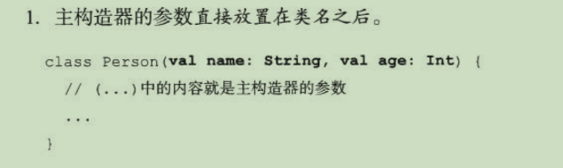

这些参数会被编译成字段，值会初始化成构造时候传入的参数，当然也可以直接给默认值。

主构造器会执行类定义之中的所有语句，哪怕语句本身和赋值没关系也会调用：

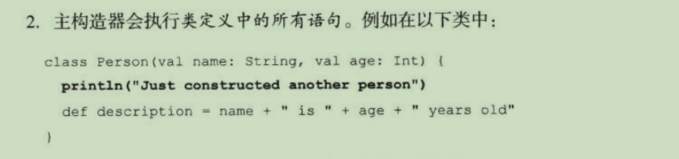

这种特性在需要在构造过程之中配置某些字段或者配置文件时候特别起作用（读取配置文件之中的某些属性并且进行初始化）

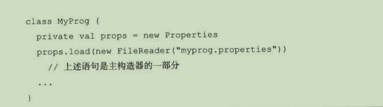

构造参数可以是所有我们上面表格之中提到过的前缀，比如：

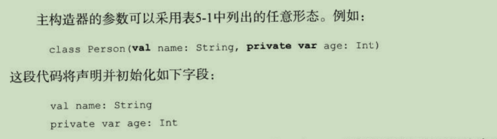

当然也可以是普通的方法参数（没有任何前缀），这个时候会使用下面的方式进行判断如何处理：

1. 如果不带 val 或者 var 的参数至少被一个方法使用，那么就会升格成为字段，大部分情况是对象私有字段：

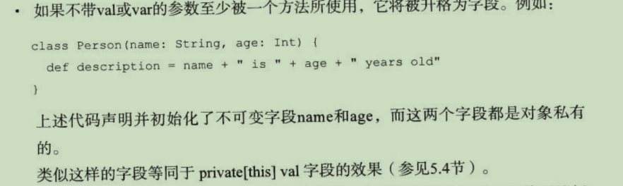

2. 如果没有被任何方法使用，那么其就仅仅会是一个普通字段。

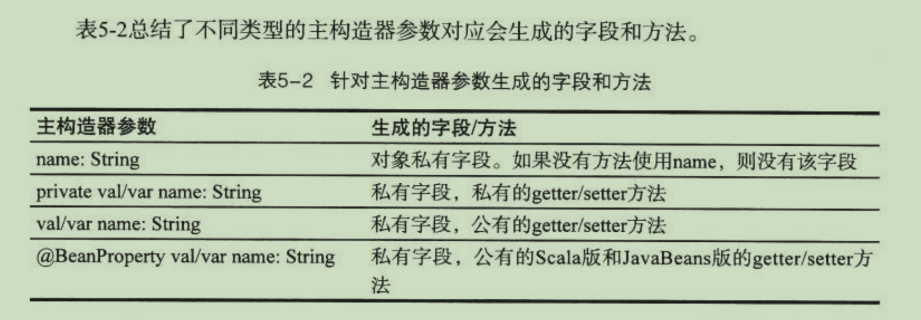

当然也可以让主构造器变成私有的，这样可以限制用户使用主构造器，从而必须使用辅助构造器来构造对象：

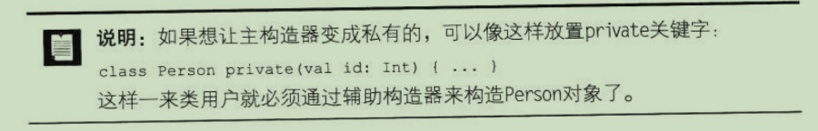

## 5.8 嵌套类

在 Scala 之中，可以在类之中定义类。

但是同一个外部类生成的不同实例，算是不同的内部类。也就是说实际上内部类是跟着对象走的。书中的解释是这样可以使新建一个内部对象的方式更加符合我们平时的规范：

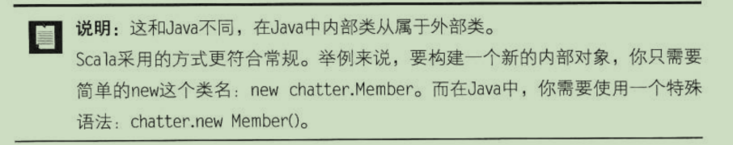

那如果我想要让内部类是属于外部类的，而不是属于某个对象的，应该怎么做？

1. 将内部类作为外部类的伴生对象：

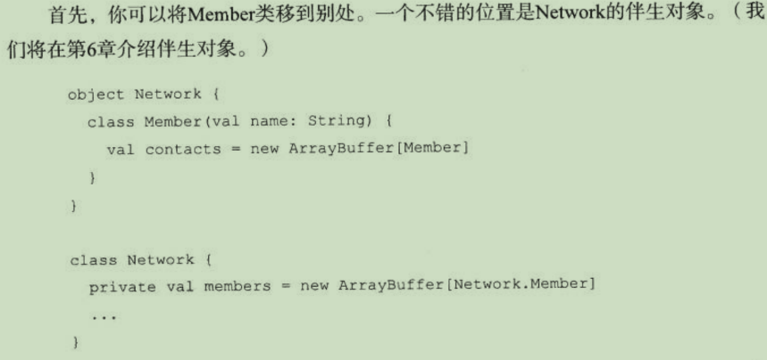

2. 使用类型投影`Network#Member`，其含义是“任何 Network 的 Member”。

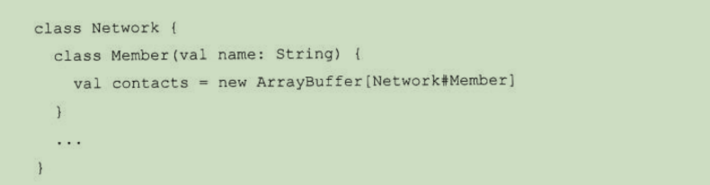

**在内嵌类之中如何使用外部类的 this引用？**

可以在内嵌类之中通过`外部类.this` 来访问外部类的 this引用。也可以在外部类的语法之中建立一个指向其引用的别名（注意，这个别名用来指引的是 `外部类.this`：

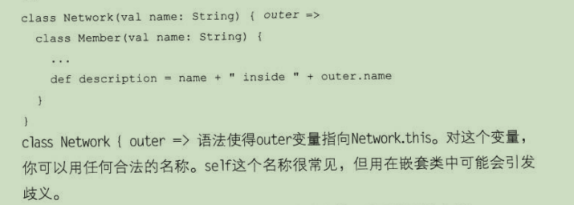

# 第六章 对象

## 6.1 单例对象

scala 没有静态方法或者静态字段，可以使用 object 这个语法结构来达到同样的目的。

1. 对象的构造器在第一次被使用时候调用，如果其从未被使用，那么构造器也不会被执行
2. 在 object 之中，不可以提供构造器参数（这很正常，提供构造器参数意味着可以通过不同值的参数来得到不同的对象，这个和”静态“的定义本就冲突）

## 6.2 伴生对象

在 Java 之中很常见的一种是一个类既有实例方法又有静态方法。对于这一种，我们可以使用伴生对象，即在一个文件之中通过类和类同名的”伴生“对象来达到目的。

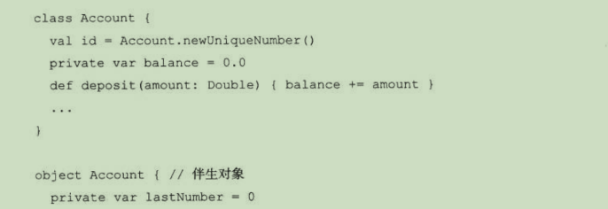

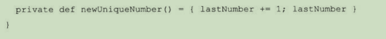

1. 类和其伴生对象可以互相访问私有特性=> 如果不能互相访问私有特性，那怎么相互之间提供操作，这个”伴生“的概念肯定也没有了
2. 类和其伴生对象必须存在于一个源文件之中=>暂时看只是编译时期的规定，而非 JVM 内部的硬规则
3. 类的伴生对象可以被访问，但是其并不在作用域之中，也就是 Class 的私有方法也必须使用 Class.privateMethod()来访问而不能直接 privateMethod()来获取

## 6.3 扩展类或者特质的对象

object 可以扩展类以及一个或者多个特质(=>可以扩展一些行为)，其结果是一个扩展了指定类和特质的类的**对象**，同时拥有在对象定义之中给出的所有特性。

一个有用的使用场景是给出可以被共享的缺省对象。也就是在默认情况下被大家使用的对象。

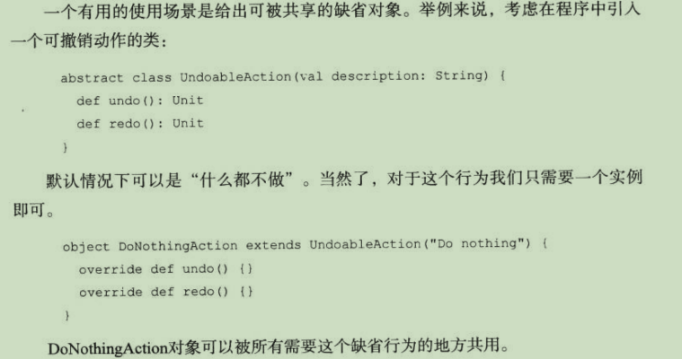

## 6.4 apply 方法

apply 方法返回的是**伴生类**的对象。

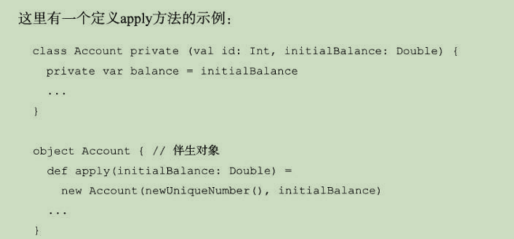

可以用下面的方式初始化：

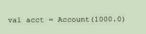

那么其就是 new 了一个伴生类的对象出来。

## 6.5 应用程序对象

每个 Scala 程序都必须从一个对象的 main 方法开始，其类型为 Array[String] => Unit，也就是接受程序所有的参数。

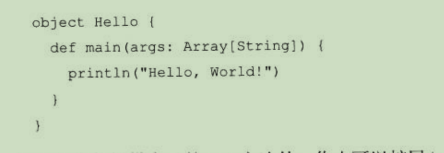

除了每次自己写之外，还可以扩充 Scala 自带的 trait App，其extends 了 DelayedInit，算是提供了一系列的初始化方法。

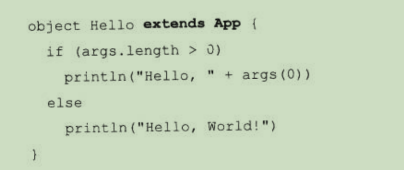

## 6.6 枚举

每一个枚举值都有两个属性：id 和 name；可以在构造的时候直接传入：

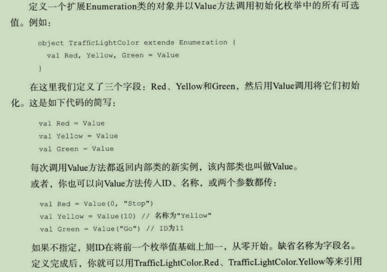

定位的时候，可以直接通过枚举的 ID 或者是名称来进行查找定位。比如：

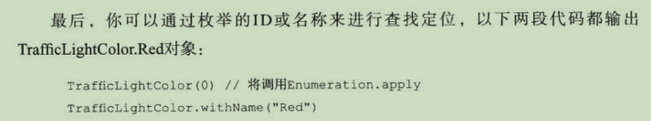

可以通过对类的 values 调用来输出所有枚举值的集合：

`for (c <- TrafficColor.values) println(c.id + " " + c)`

# 第七章 包和引入

## 7.1 包

Scala 的包和其他语言之中的包其目的是相同的，但是其和文件的具体位置解绑了，那么文件的位置就不必是包名的绝对路径，而且一个文件之中可以有多个包。

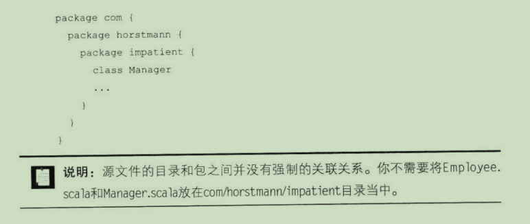

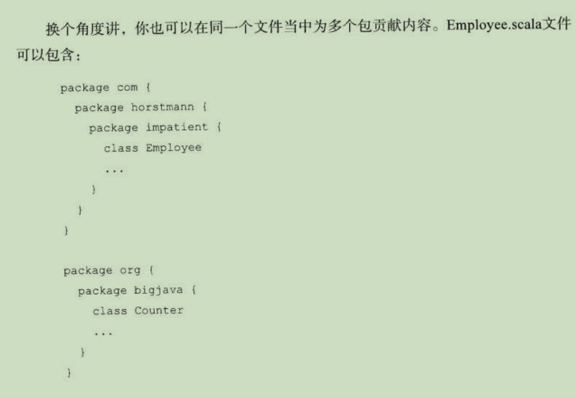

## 7.2 作用域规则

Scala 的包和其他的作用域一样，支持嵌套。也就是说在每一层之中可以访问上层作用域之中的名称。

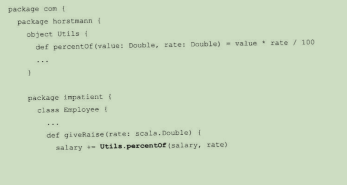


可以看到其直接使用 Utils 这个类，因为其定义在父包之中，从而不需要再使用绝对的定义：`com.horstmann.Utils.precentOf`。

但是这种相对关系的包引用，可能会有问题。在 java 之中，包的路径是绝对的，因此不会有冲突问题。但是如果在 scala 之中，在某个包的父包之中定义了一个类，其名称和某些公共的类，比如  scala 这个包之中的某些类，那么在查找的时候会直接去尝试使用这个父包之中自己定义的类，就会造成找不到对应方法的问题。

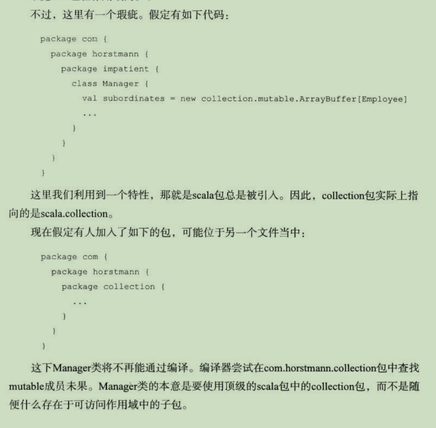

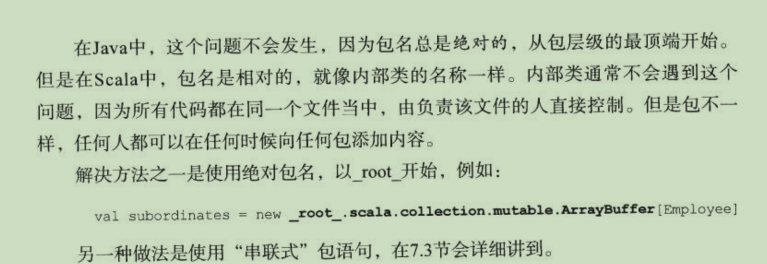

## 7.3 串联式包语句

也就是我们最常使用的那种：

`package com.aaa.bbb.ccc`

那么在这个package 之中，com 和 aaa 的成员都不可见。

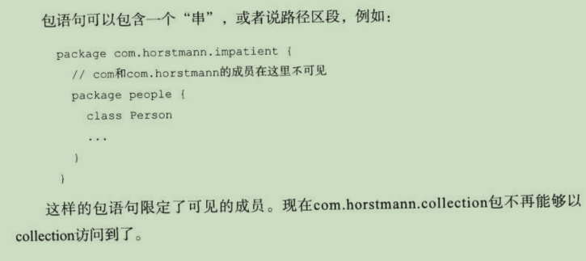

## 7.4 文件顶部标记法

这也就是最常用的方法，直接在文件的顶部定义相关的包。只要这个文件之中不是包含多个包的类（一般都是不包含），这样就会更加清晰。

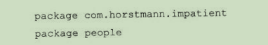

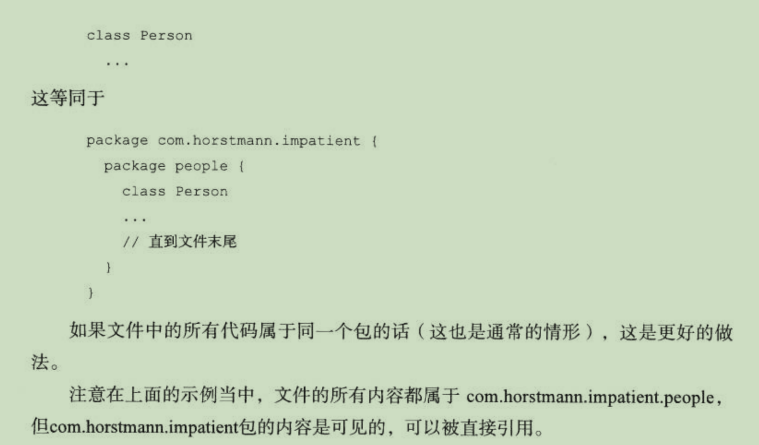

在习题之中也有体现，那就是如果不用串联式的包语句，那么就起不到限制访问的作用。

## 7.5 包对象

因为 JVM 的局限性，包可以包含类，对象或者特质，但是没法包含函数或者变量的定义。如果有在包层面需要的工具函数或者是常量，那么将其添加到包而不是某个 Util 之中是更合理的做法。这也就引出了”包对象“的概念。

每个包都可以有一个包对象，其名字要和子包相同。

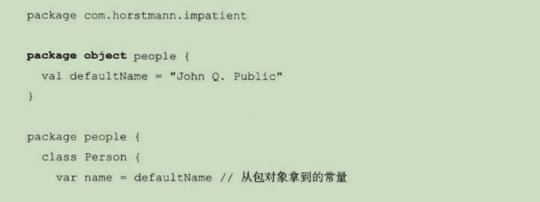

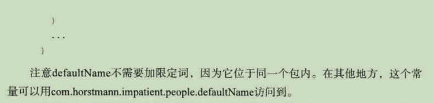

在幕后，包对象被编译成带有静态方法和字段的 JVM 类，名为 package.class,放在相应的包下面。（JVM 之中可以用 package 作为类名）

## 7.6 包可见性

Scala 之中是通过修饰符来达到包可见性的定义的。

以下这个方法在其自己的包之中可见(=>其指定了 people 这个包)

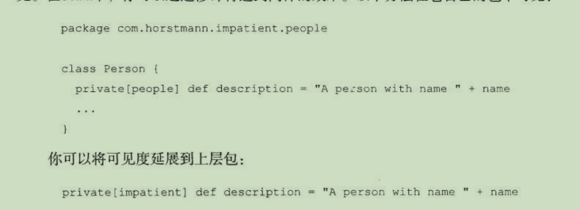

## 7.7 引入语句

和 java 是相似的，用引入语句来得到相应的包从而缩短在使用时候的类名。

在 Scala 之中，用`_`来引入某个包的所有成员，效果和java 之中的`*`类似。但是在 Scala 之中，`*`是一个合法的标识符，但是最好不要使用其以免造成歧义。

## 7.8 任何地方都可以声明引入

import 语句的效果知道包含该语句的块末尾，从而减少通配引入可能带来的引入冲突（=>都限定作用域了相对就安全多了）

## 7.9 重命名和隐藏方法

选取器可以只引入几个成员，并且可以顺便给其重命名。

如果使用 `HashMap => _`，那么将隐藏这个成员，这个特性可以用在要排除某些可能冲突的类时。

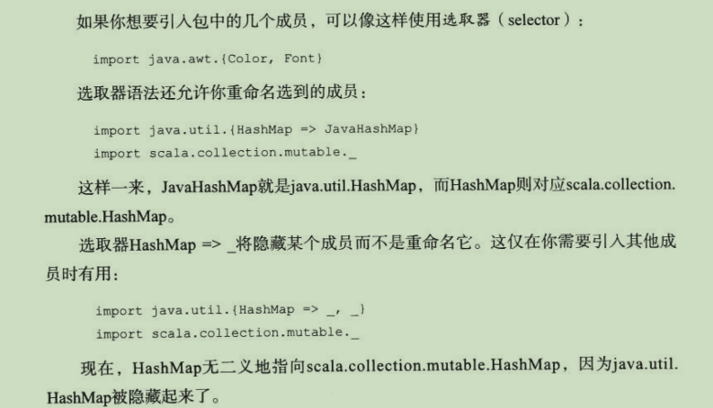

## 7.10 隐式引入

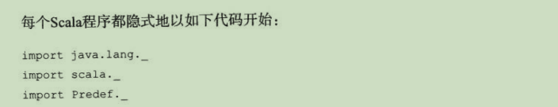

但是 scala 的包之中的引入会覆盖掉之前的引入。比如 scala.StringBuilder 会覆盖掉 java.lang.StringBuilder。

## 习题

参考：http://www.swanlinux.net/2014/09/09/scala_note_7/

1. 编写示例程序，展示为什么
   package com.horstmann.impatient
   不同于
   package com
   package horstmann
   package impatient

```scala
// 假如有这样一个包
package com {
  object Test1{}
  package horstmann {
    object Test2 {}
    package impatient {
      object Test3 {}
    }       
  }         
}
package com
package horstmann
package impatient

object Test4 {
  val x = Test1 // 可以访问
  val y = Test2 // 可以访问
  val z = Test3 // 可以访问
}
package com.horstmann.impatient

object Test4 {
  val x = Test1 // 不可以访问
  val y = Test2 // 不可以访问
  val z = Test3 // 可以访问
}
```

# 第8章 继承

本章之中我们只探讨继承自另外一个**类**的情况。

## 8.1 扩展类

Scala 之中扩展类的方式也是使用 extend 关键字，使用之后就可以在子类当中给出超类中没有的方法。

可以将类，方法或者字段声明为 final，这样其就不可以被重写。

注意这里面的 final 使用方式和 java 不太一样，java 之中 final 是意味着字段不可变，类似于 Scala 之中的 val

## 8.2 重写方法

在 scala 之中重写一个*非抽象方法*必须使用 override 修饰符。如果没有的话，会报下面的错误：

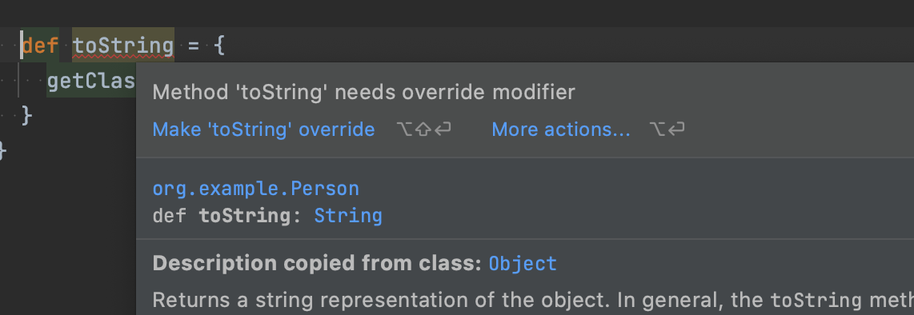

这种方式可以让 scala 给出有用的错误提示，包括：拼错方法名，使用了错误的参数类型和**在超类之中引入了新的和子类的方法相抵触的方法(=>意思是在超类之中修改方法的时候没有考虑到所有继承的子类是否已经定义了一样的方法或者变量从而导致冲突)。**

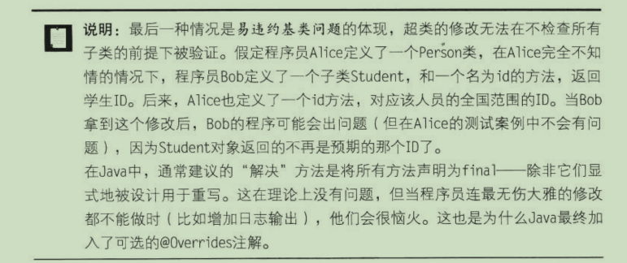

调用超类的时候和 java 一样，使用 super 关键字。

## 8.3 类型检查和转换

1. 类型检查使用`isInstanceOf[]`，其只要是某个类或者其子类的对象，都是 true。对 null 其会返回 false
2. 类型转换使用`asInstanceOf[]`，其如果是 null，会返回一个 null。如果转换失败，会抛出异常。
3. 只想测试一个特定的类，而非其子类的话，可以使用`classOf[]`，其只会检查是不是这个类的对象，不会检查其他的子类之类。

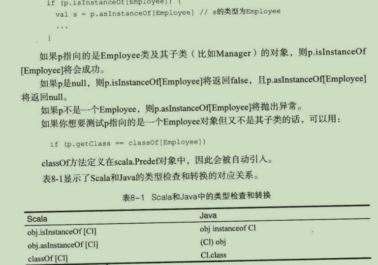

但是相比之下，模式匹配是更好的选择，使用 match case 用来处理某种类型和其他默认情况更好一些。

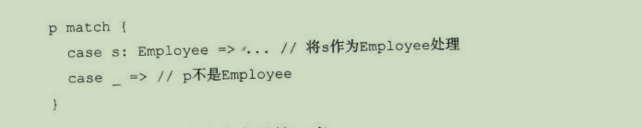

## 8.4 受保护字段和方法

也是可以使用 protected，这样任何子类就可以访问此对象。

**和 Java 不同，protected 的成员对于类所属的包而言是不可见的。想要对包可见，得用包修饰符**

和 `private[this]`一样，其将访问权限定在自己的对象可以使用`protected[this]`

## 8.5 超类的构造

之前我们提到过，每一个辅助构造器都必须调用其他的辅助构造器或者主构造器，这也就意味着 Scala 之中*辅助构造器不可能直接调用超类的构造器*。只有主构造器才能调用超类的构造器。

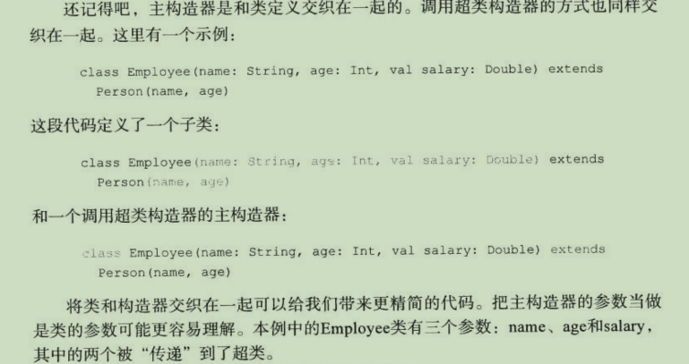

Scala 类可以扩展Java类，这种情况下其主构造器必须调用 Java 超类的某一个构造方法。

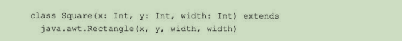

## 8.6 重写字段

=> 这部分有点复杂，专注其本质就好。

之前我们说过，Scala 的字段是由一个私有字段和 getter/setter 方法构成。

1. 可以用同名的 val 来重写一个 val 或者不带参数的 def ，子类有一个私有字段和一个公有的 getter 方法，这个 getter 重写了超类的 getter => 带参数的 def 就是 setter啦！val 不可以有 setter！

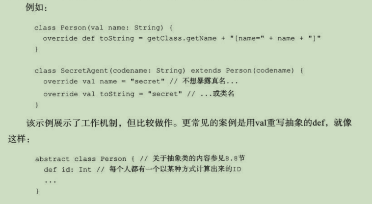

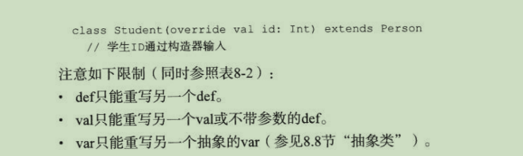

此处限制我自己解析如下=>

1. 其实其只能重写 def，而且是不带参数的 def，所以 def 和 val 可以重写但是 var 不可以（var 会生成带有参数的 def）

那么相应来说，使用 var 的变量就没法对于其他的类来扩展了。

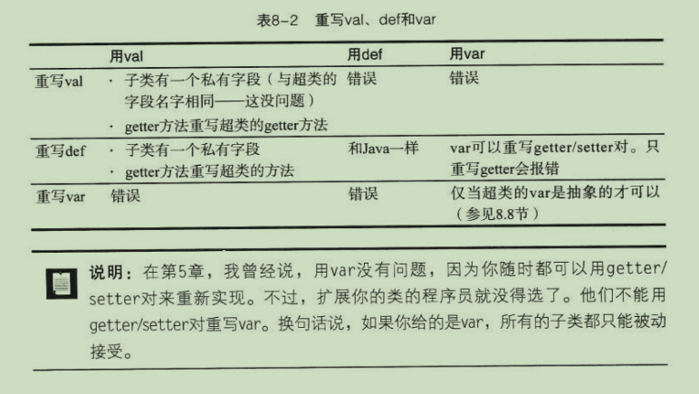

## 8.7 匿名子类

可以通过包含带有定义或者重写的代码块的方式创建一个匿名子类：

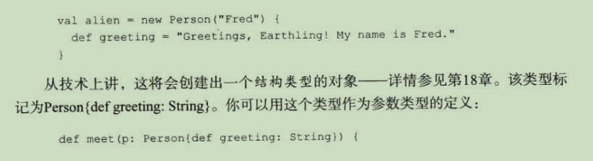

## 8.8 抽象类

可以用 abstract 来标记不能被实例化的类，其往往是因为其中的某个或者某几个方法没有完整定义，比如只有 def 标记但是没有其后面方法体的方法：

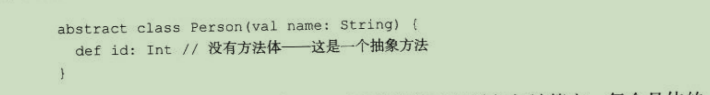

这里面的方法不需要使用 abstract 来表明其是抽象方法，只要省去方法体就可以。但是类的前面还是得有 abstract 标记

子类之中重写超类的抽象方法时候，不需要使用 override 关键字

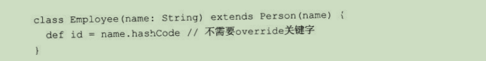

## 8.9 抽象字段

类还可以具有抽象字段，也就是一个没有初始值的字段。比如：

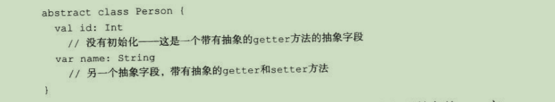

=> 为什么抽象字段 var 就可以被 override 呢？ 有一点书中说到，这种定义之中形成的 java 类并不带有具体的字段。可能这就是可以被覆盖的原因。

和方法一样，在子类之中重写超类的抽象字段时候，不需要 override 关键字。

## 8.10 构造顺序和提前定义

在子类之中重写 val，而且在超类的构造器之中使用该值的话，可能会有构造顺序上面的问题：假设超类之中使用了某些 override 的值：

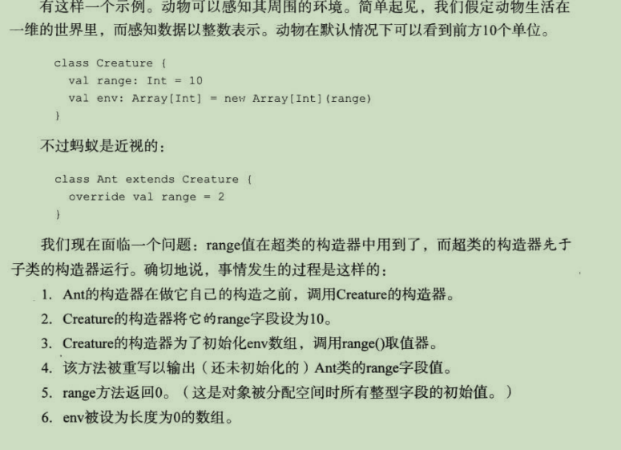

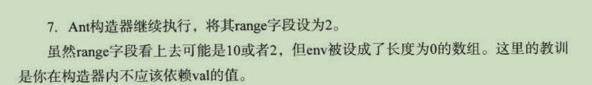

可以通过在子类之中使用*提前定义语法*，来在超类的构造器执行之前初始化子类的 val字段。需要将 val 字段放在 extends 关键字之后的一个块中：

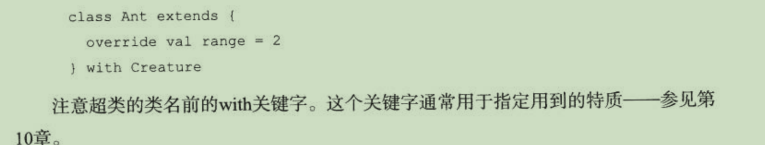

## 8.11 Scala 继承层级

1. 和 java之中的基本类型相对应的类，以及 unit 类型，都扩展自 AnyVal
2. 所有其他类都是 AnyRef 类型的子类，AnyRef 是 JVM 之中 Object 的同义词
3. AnyVal 和 AnyRef 都扩展自 Any 类，而 Any 类是整个继承层级的根节点，其中定义了 `isInstanceOf`,`asInstanceOf`，`equals`和 `hashcode`相关方法
4. AnyVal 没有追加任何方法，只是所有值类型的一个标记
5. AnyRef 之中追加了 Object 类的监视方法：wait 和 notifyAll，提供了一个带有函数参数的方法 synchronized,比如


6. 所有的 Scala 类都实现 ScalaObject 这个标记接口，其没定义任何方法
7. 继承层级的另外一端是 Nothing 和 Null。
   1. Null 唯一实例是 null 值，可以赋给任何 Ref 但是不可以赋给 Val。比如 Int 不能为 null。
   2. Nothing没有实例，用于泛型。比如空列表 Nil 的类型是 List[Nothing]
   3. Nothing 和 void 是两回事，Scala 之中 void 是由 Unit 类型进行表示，其只有一个值，那就是()

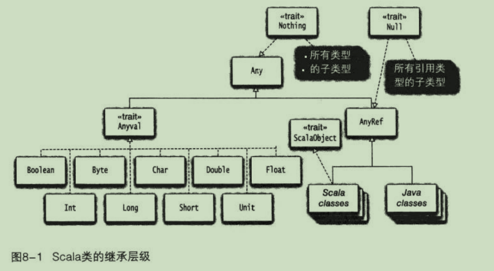

## 8.12 对象相等性

AnyRef 的 eq 方法检查的是**两个引用是否指向同一个对象。**和 java 类似，可以通过重写来实现一个自然的相等性判断。

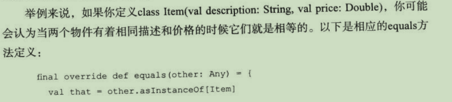

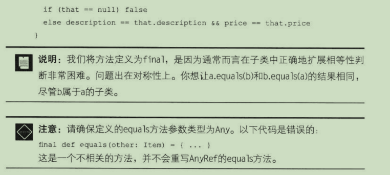

**注意确保定义 equals 方法的参数类型是 Any**。

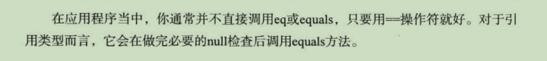

# 第9章 文件和正则表达式

## 9.1 读取行

要读取所有行，可以使用 scala.io.Source 对象的 getLines 方法。其会返回一个迭代器。可以对这个迭代器使用 toArray 或者是 toBuffer方法， 将这些行放到数组或者数组缓冲之中使用。

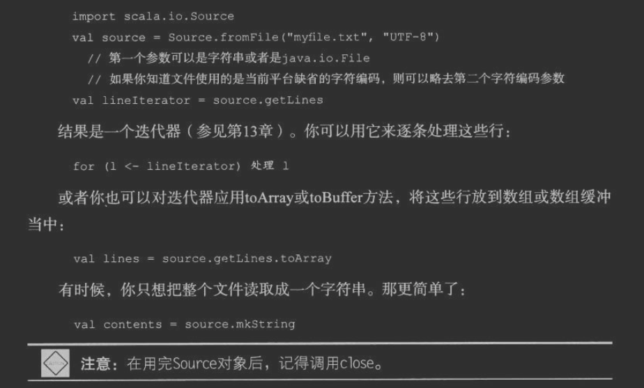

## 9.2 读取字符

在文件之中读取单个字符，可以将 source 对象当做迭代器，因为 Source类来自`Iterator[Char]`

想查看字符但是不处理掉其的话，可以使用 head 方法查看下一个字符：

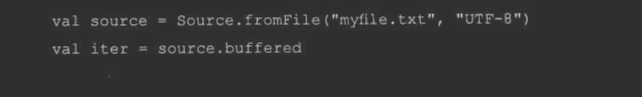

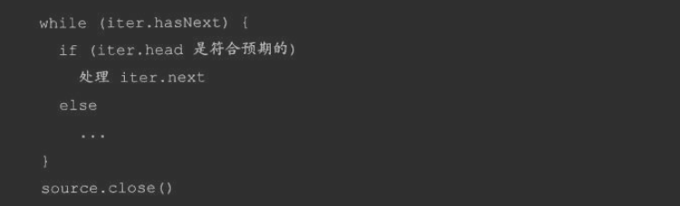

## 9.5 读取二进制文件

Scala 没提供读取二进制文件的方法，需要使用 Java 类库来达到这个目的。下面是如何将文件读取成字节数组：

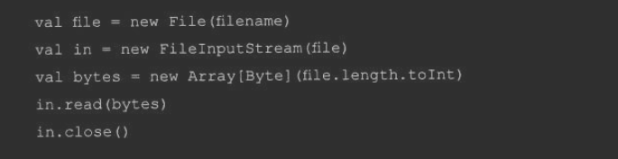

## 9.6 写入文本文件

Scala 内建也是没有对文本文件的支持，要写入文本文集 Jan，需要使用 java.io.PrintWriter.

## 9.8 序列化

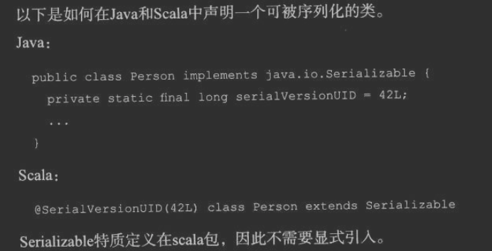

## 9.9 进程控制

scala 的目标之一就是可以在简单的脚本化任务和大型程序之间保持良好的伸缩性。`scala.sys.process`包下面提供了所有和 shell 程序交互的工具。

`sys.process` 包下面包含了一个从字符串到 ProcessBuilder 对象的隐式转换，`!`操作符执行的就是这个 ProcessBuilder 对象。

`!`操作符返回的结果是被执行程序的返回值，成功就是0，失败就是显示错误的非0值。

还可以指定数据输出的方式，追加写入等等。

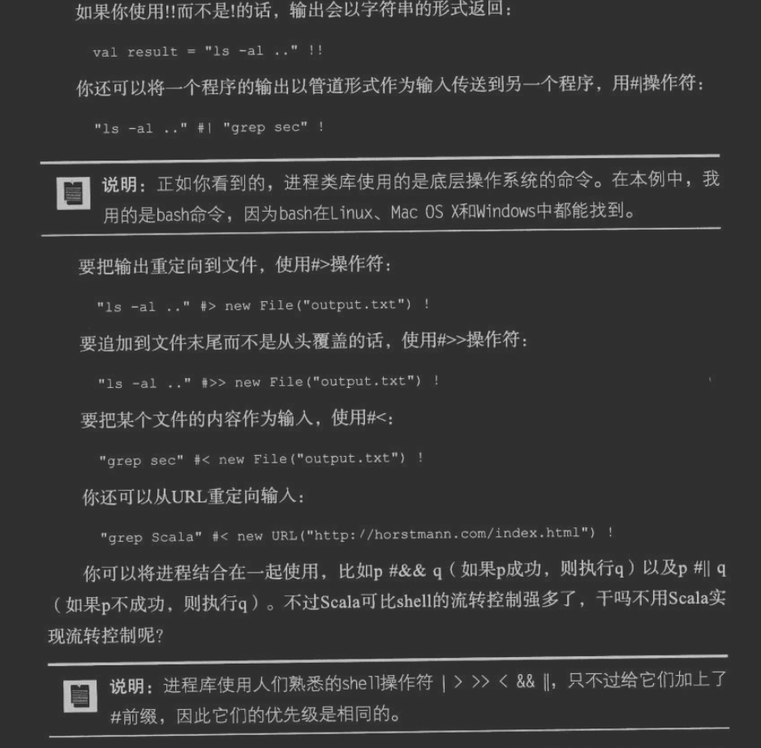

要在不同的目录下面运行进程的话， 用 Process 的 apply 方法构造 ProcessBuilder,给出：命令，起始目录和一串K-V 来设置环境变量：

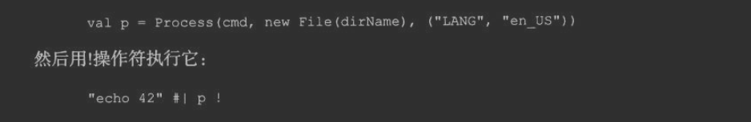

## 9.10 正则表达式

1. 如果正则表达式包含反斜杠或者引号的话，最好使用“原始”字符串语法`"""..."""`，比如：

   

2. `findAllIn` 返回遍历所有匹配项的迭代器，可以在 for 循环之中使用：

   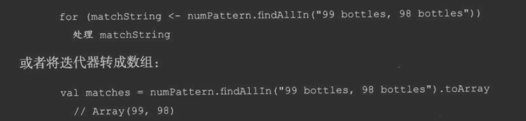

3. 还可以做到查找第一个匹配项，检查某个字符串之中的开始部分能否匹配，替换首个或者全部匹配项

## 9.11 正则表达式组

分组可以用来获得正则表达式的子表达式，每个子表达式都会提取一部分对象。

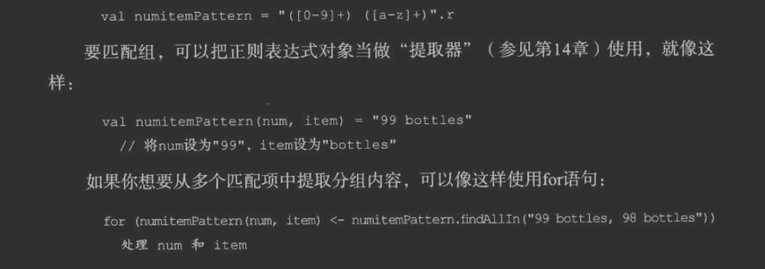
