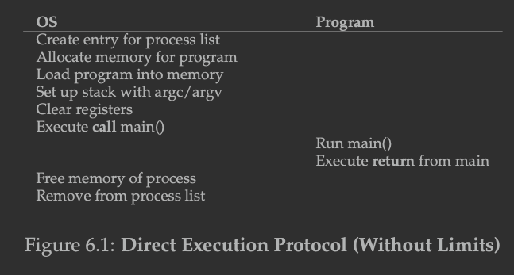
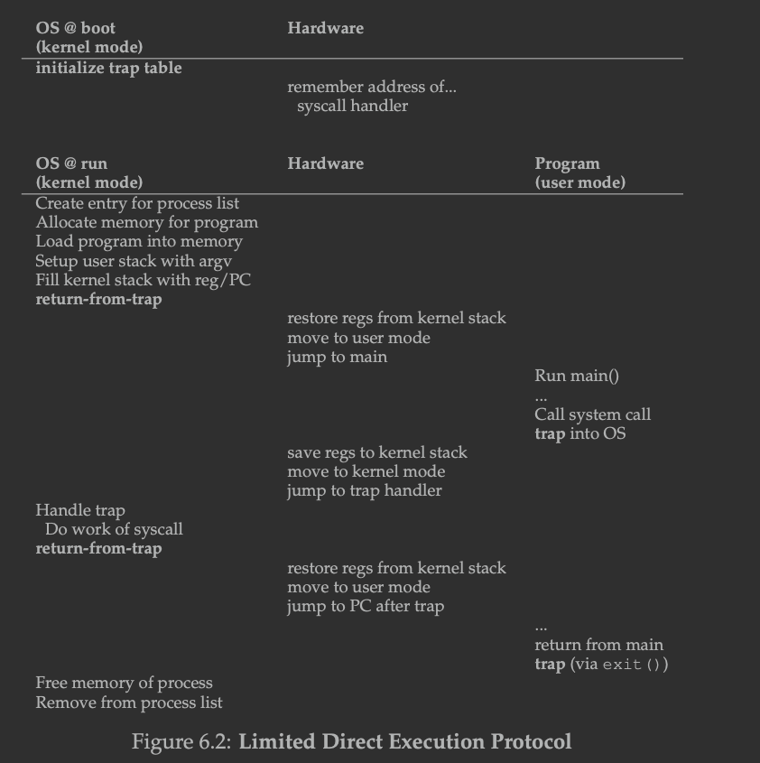
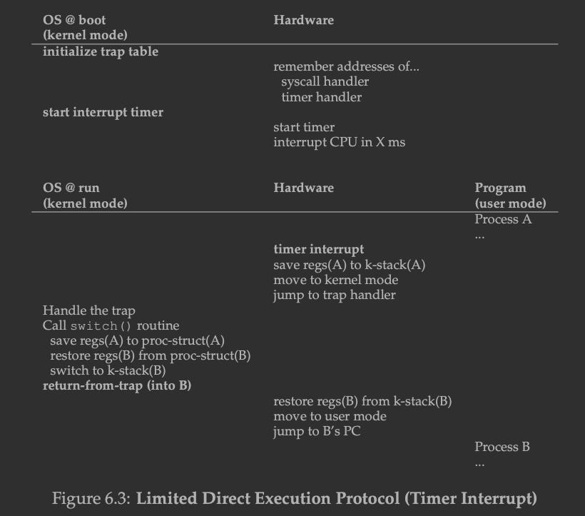
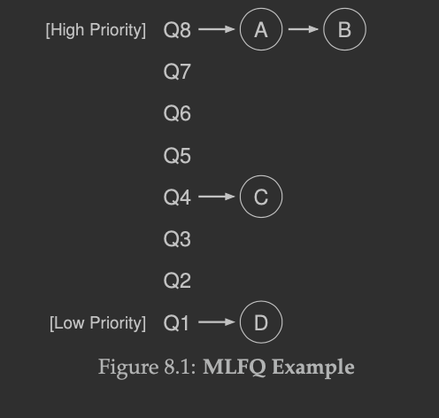
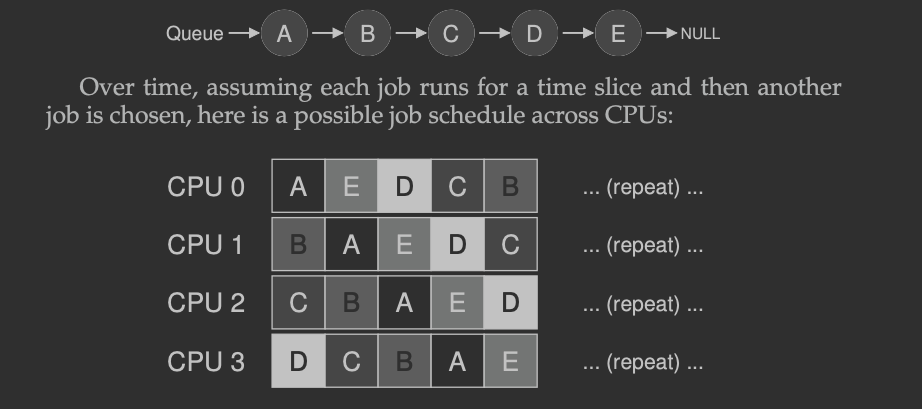
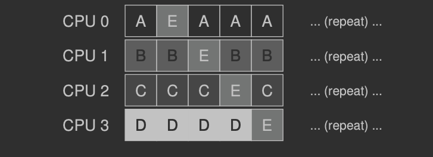
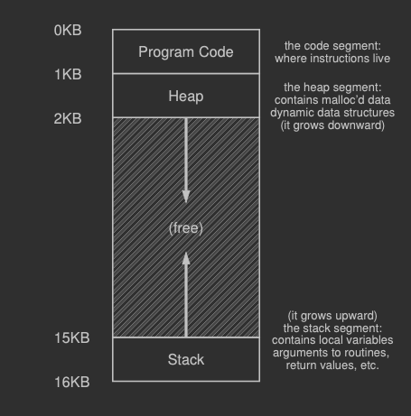
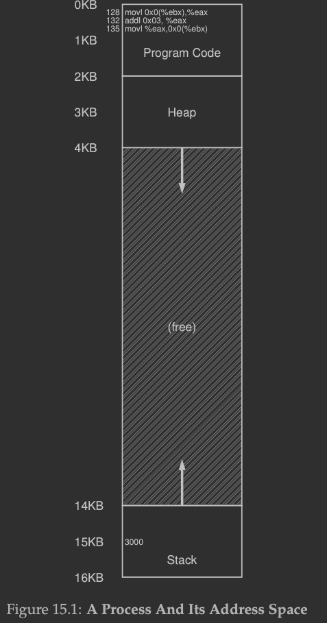

本书的英文版是《**Operating Systems: Three Easy Pieces**》。

# Preface

The three pieces of OS mentioned in this book are:

1. Virtualization: Mainly in memory
2. Concurrency: CPU concurrency, about locks 
3. Persistence: Outer devices like disk

# Introduction to Operating Systems

1. What happens when a program runs?
   1. Fetch instrcution from memory
   2. Decode it to figure out the meaning of instruction
   3. Execute it

## 2.4 Persistence

1. To write a file on the disk, the program needs to make 3 calls into the OS:
   1. Open()
   2. Write()
   3. Close()
2. For performance issues, the file systems will delay writes on disk for a while, hoping to batch them into larger groups. 
3. File system also needs to find way out if a failure occurs during write sequence, the system can recover to reasonale state afterwards.

# Part I Virtualization

## 4. The Abstraction: The Process

1. Process, is only one running program, which is on the disk and consists of a branch of instructions waiting to spring into action. **Operating System** is the thing that take these bytes in and gets them running, transforming the program into something useful.

2. For time-sharing way of CPU, the OS need the **low-level machinery** to provide the ability to switch different context and need the **high-level policies** to decide which process will be in the CPU in next timeslot. Here are some examples of scheduling policy:

   > A scheduling policy in the OS will make this decision, likely using histori- cal information (e.g., which program has run more over the last minute?), workload knowledge (e.g., what types of programs are run), and perfor- mance metrics (e.g., is the system optimizing for interactive performance, or throughput?) to make its decision.

3. Tip: seperate policy and mechanism:

   This one is the common design paradigm , which is to seperate high-level policies from low-level policies.

### 4.2 Process API

There are some interfaces must be included into the operating system:

1. Create
2. Destroy
3. Wait: sometimes the OS needs to wait for a process to stop running. 
4. Miscellaneous Control（其他控制）: For example, the OS provides some kind of method to suspend a process then resume it. Such things can be treated as one of the Miscellaneous control.
5. Status: query status for a process like how long it has run for and what state it is in.

### 4.3 Process Creation: A Little More Detail

In some early OSes, the loading process is done eagerly, like all at once before running the program. But morden OSes perform the process lazily, by loading the code and data only when they are used.

By loading the code and static data into memory, by creating and ini- tializing a stack, and by doing other work as related to I/O setup, the OS has now (finally) set the stage for program execution.

It thus has one last task: to start the program running at the entry point, namely main().

### 4.5 Data Structures

A final process will be placed in **final** state where it has exited but not been cleaned up => why?

It is because the final state is useful as it allows other processes, like the parent which created these process to examine the return code and to see if the just-finished process executed successfully.

> When fin- ished, the parent will make one final call (e.g., wait()) to wait for the completion of the child, and to also indicate to the OS that it can clean up any relevant data structures that referred to the now-extinct process.

**What is PCB?**

Sometimes people refer to the individual struc- ture that stores information about a process as a **Process Control Block (PCB)**, a fancy way of talking about a C structure that contains information about each process (also sometimes called a **process descriptor**).

## 5. Interlude: Process API

### 5.1 The `fork()` System Call

This chapter shows how to use the process API, which including the `fork()`,`exec()` and `wait()` in UNIX.

1. `fork()`, will return 2 processes, one is the parent process and one is the child process. The child process wil get the return code 0 so that it knows itself is child process. What's more, the child process won't run from `main()`, it will run from the place called `fork()`,as itself just called it.

2. Hard to determine which process runs first and which one runs later for the `fork()` API, because it is the CPU scheduler which determines that.

### 5.3 The `exec()` System Call

This API is useful when you want to run a program that is different from the calling program. If we use `fork()`, it will only return the copy of some process, but to open another program we need to use the `exec()` to run it.

For `exec()`, the OS won't create a new process, alternatively it will replace the code segment and current static data with the thing we passed to `exec()`, then after running it will also make no return to this program if the `exec()` succeed. 

### 5.4 Why? Motivating The API

The way why design it this way is that because this way can give Unix Shell run code after the call to `fork()`  but before call to `exec()`. This code can alter the environment of the about-to-be-run program, and thus enables a variety of interesting features to be readily built.

## 6. Mechanism: Limited Direct Execution

### 6.1 Basic Technique: Limited Direct Execution

For a "direct execute process", it will be like this:



Can see it need to create entry for process list, allocate memory, load the process, clear registers and run it. After it the OS needs clean all things.

But if without limits, the OS will be hard to control all processes like time-sharing machanism. Then the OS is not an OS, it will be just a library.

### 6.2 Problem #1: Restricted Operations

For differ the operations that system can do and user can do, OS provides different modes: user mode and kernel mode. The latter one has much more permissions than the former, like read disk and other things.

For the protected control, user's processes did trap into kernel and return-from-trap back to user-mode.

System needs to store info about the traps, like to keep enough resource, registers and so on for the program. On x86 as example, all the things are kept on a *per-process kernel stack*. The return value will pop these values out then resume execution for user-mode program.

When booting the OS, kernel will get a **trap table** by the kernel mode. OS needs to tell hardware what code to run when certain exceptional events occur. For example, which code to run when a hard-disk interrupt takes place or when a keyboard interrupt occues.



Also for the system call, all things related to it needs to be cautiously treated like all arguments, like if the user's program called the `write()` function but arg of address is the trap_table then it can rewrite the system's inside info, which is quite dangerous.

### 6.3 Problem #2: Switching Between Processes

Mainly are saving and restoring context. 

For switching, there are 2 ways:

1. Cooperative way: it assumes all processes are friendly and will *yield* themselves when they don't need CPU temporary or they hold CPU for really long time, but this one will has problem when process is in a unpredictable state like falling into an infinite loop
2. Incooperative way: use a hardware interrupt timer to interrupt CPU in x ms, then each time interruption the CPU can get control back then decide which process to choose to run.



Every process has a *process structure* which contains:

1. current register values

2. Process counter

And also need to switch context, like change stack pointer to use another process's **kernel stack**

## 7. Scheduling: Introduction

### 7.2 Scheduling Metrics

We use the turnaround time as the metrix of performance:

T(turnaround) = T(completion) - T(arrival)

And in this chapter we assume that all processes arrived at the same time,which is 0, so all the turnaround time is the completion time.

Another metrix for measuring the system is the fairness, but *performance* and *fairness* always be 2 thing that cannot satisfied together.

### 7.3 First In, First Out (FIFO)

This way has problem when the first job takes really much time because all processes after it need to wait until it finished. 

### 7.4 Shortest Job First (SJF)

This way is the most efficient one but needs to get the information about which process run how long, which is quite hard to know. also if the longest job arrives first then others come, it will also process the longest job first, which cause no real difference than the FIFO.

### 7.5 Shortest Time-to-Completion First (STCF)

This metric is when a job come then see whether change job can make the performance better. Each time when a process come, it will get the one which time-to-completion is shortest and change to that process.

### 7.6 A New Metric: Response Time

We can define a new metric called Response time, which is:

T(response) = T(firstrun) - T(arrival)

It means when a job can started to run.

### 7.7 Round Robin

Introduce a new scheduling algorithm called **round-robin**, also called time-slicing.Notice that the length of time slice must be a multiple of timer-interrupt period.

**Cost of context switching**

when programs run, they build up a lot state in CPU caches, TLBs, branch predictions and other on-chip hardware, so not only rewrite the registers of CPU. So this is actually a noticeable performance cost.

**Fair policies and unfair policies trading-off**

If fair policies then the turnaround time will be bad, because all jobs will have the time-slice, but if for unfair policies then the response time will be bad, becasue if a job cost less time, even it arrives later still can get the timeslot so other jobs have to wait even it is eariler.

## 8. Scheduling: The Multi-Level Feedback Queue

Goal: **WITHOUT priori knowledge of job length,**

1. Optimise *turnaround time*, by running shorter job first.
2. Make a system feel responsive to interactive users, minimize *response time*.

Tip: MLFQ can learn from past to predict the future.

### 8.1 MLFQ: Basic Rules

- Rule 1: If Priority(A) > Priority(B), A runs (B doesn’t).
- Rule 2: If Priority(A) = Priority(B), A & B run in RR.

And MLFQ will learn from the behavior of process to get its priority, like if a process use CPU not so much but always wait for keyboard interrupt then the system will think it is an input process, so need the higher priority.

But if only use several tracks which have different priorities, and only give timeslot to the one with highest priority, then for lower priority jobs it will never be executed which we cannot accept. So also need a way to change priority of a job.



### 8.2 Attempt #1: How To Change Priority

Keep in mind of the workload: a mix of interactive jobs that are short-running, and some longer-running "CPU-bound" jobs need a lot of CPU time but response time for them is not important. This is the basic concept for us to know.

- Rule 3: when a job coming into a system, it is placed into the highest priority queue.
- Rule 4a: when a job uses up the entire time slice while running, the priority is *reduced*, like move down one queue
- Rule 4b: if a job gives up the CPU before use the whole time slice, it stays at *the same priority level.*

These are the details for how to achieve the rules.

**Why such design?**

Because when a job comes, the system doesn't know if it is a short job or a long-run job. So all jobs it assumes are short job and if the time of running is longer than it really is, then it will moved to lower priority.

**Problems:**

1. if there are too many interactive processes then the process which need a lot of CPU time would have no time. But I think this is acceptable because this can be treated as the hardware not efficecy enough.
2. A smart programmer can *trick* the OS, like when the time-slice is going to used then give whatever an operation to I/O
3. Processes also don't have only one kind of behavior. What if a process suddenly need to get input from I/O but previously it is just the CPU-bounded one?

### 8.3 Attempt #2: The Priority Boost

- Rule 5: After some time period S, move all the jobs in the system to the topmost queue.

This can prevent the cpu-bounded process never touch the CPU.

### 8.4 Attempt #3: Better Accounting

To prevent the process of tricking the system to get all CPU time, OS needs to track how much CPU time a process used and if it ran out of the quota then priority will be reduced. So rewrite the rule 4:

- Rule 4: Once a job uses up its time allotment at a given level (re- gardless of how many times it has given up the CPU), its priority is reduced (i.e., it moves down one queue).

### 8.5 Tuning MLFQ And Other Issues

Different systems use different ways of implementing MLFQ. Some use table to keep it, some uses formula to caculate it.

Refined version of MLFQ:

-  Rule 1: If Priority(A) > Priority(B), A runs (B doesn’t).
-  Rule 2: If Priority(A) = Priority(B), A & B run in round-robin fashion using the time slice (quantum length) of the given queue.
-  Rule 3: When a job enters the system, it is placed at the highest priority (the topmost queue).
-  Rule 4: Once a job uses up its time allotment at a given level (regardless of how many times it has given up the CPU), its priority is reduced (i.e., it moves down one queue).
-  Rule 5: After some time period S, move all the jobs in the system to the topmost queue.

## 9. Scheduling: Proportional Share

this is based on a concept: instead of optimizing for turnaround or response time, it aimed to guarantee that each job obtain a certain percentage of CPU time.

### 9.3 Implementation

The implementation is quite simple, only need one tracker, one winning ticket and a list to keep all processes.

## 10. Multiprocessor Scheduling (Advanced)

### 10.1 Background: Multiprocessor Architecture

Cache: popular data held in memory. It puts the data inside cache for CPU to use it fast.

***Temporal locality and spatial locality:*** 

Temporal locality is to show the locality of time, like when a data is used then it may be used again soon, like when we use loop then some variable used again and again. 

Spatial locality is to show the locality of space, when a variable of address X is used, then the data which address near X also possible to be used, like when we use loop to go through a list.

**Cache coherence**

Cache coherence is a problem when several CPU sharing the same main memory. When one CPU change data but didn't write back to main memory, another CPU also need to change this data then there is no coherence.

**Bus snooping**

Bus snooping is a technology for multi CPU processor monitoring cache invalid or change. It has one bus for all cache and if the CPU knows some piece of data which cached is changed then it will make the cache invalid or update the value.

### 10.3 One Final Issue: Cache Affinity

This is for multiprocessor when it executes jobs. When the processes changing, it is better to schedule on the same CPU because for this CPU it has cache for this job. This is what we call cache affinity.

### 10.4 Single-Queue Scheduling

We call this single-queue multiprocessor scheduling or SQMS for short.

**Advantages:**

It is quite straightforward to implement because just as simple as the one on one CPU.

**Disadvantages:**

1. It is hard to scale because for different processes it need to use lock which can make effiency quite lower.
2. The memory affinity is poor. Because if all processes shared fairly then some worst situation will be like:



This can really boil the performance.

But we can include some kind of affinity mechanism to try to make it more likely that process will continue to run on the same CPU if possible.Then the scheduling will be like:



### 10.5 Multi-Queue Scheduling

some systems opt for multiple queues, e.g., one per CPU. We call this approach **multi-queue multiprocessor scheduling** (or MQMS).

**Advantage**
One CPU one queue, then can avoid the problem of locks and it can provide cache affinity intrinsically.

**Disadvantage**

It will make different queue imbalanced. If queues steal job fast from each other then it can cause performance issue, but if not then imbalanced will happen on queues.

## 13. The Abstraction: Address Spaces

### 13.2 Multiprogramming and Time Sharing

> # [Why do stacks typically grow downwards?](https://stackoverflow.com/questions/2035568/why-do-stacks-typically-grow-downwards)
>
> As to the historic rationale, I can't say for certain (because I didn't design them). My *thoughts* on the matter are that early CPUs got their original program counter set to 0 and it was a natural desire to start the stack at the other end and grow downwards, since their code naturally grows upward.
>
> > As an aside, note that this setting of the program counter to 0 on reset is not the case for *all* early CPUs. For example, the Motorola 6809 would fetch the program counter from addresses `0xfffe/f` so you could start running at an arbitrary location, depending on what was supplied at that address (usually, but by no means limited to, ROM).
>
> One of the first things some historical systems would do would be to scan memory from the top until it found a location that would r**ead back the same value written**, so that it would know the actual RAM installed (e.g., a z80 with 64K address space didn't necessarily have 64K or RAM, in fact 64K would have been *massive* in my early days). Once it found the top actual address, it would set the stack pointer appropriately and could then start calling subroutines. This scanning would generally be done by the CPU running code in ROM as part of start-up.
>
> With regard to the stacks growth, not all of them grow downwards, see [this answer](https://stackoverflow.com/questions/664744/what-is-the-direction-of-stack-growth-in-most-modern-systems/664779#664779) for details.



### 13.3 The Address Space

We can divided all spaces into 3 pieces:

1. code, which always be static
2. stack, which can contain:
   1. functional call chain
   2. allocate local variables
   3. parameters which passed in and return values
3. Heap, which is always be the part which used by users, by `malloc()` in C or `new ` in OOP languages like Java.

Isolation is the key principle in building reliable systems. It can prevent processes from influence each other.

### 13.4 Goals

There are three goals for a virtual memory system:

1. Transparency: This means the system should not be visable to the program. The program will think it has its own memory and can use it.
2. Effiency: Not taking too much resource to do the virtual part
3. Protection: System need to protect the program from being affected by other programs.

All addresses for user level are virtual addresses. And below the code showed us a little trick of how to get the heap, stack and other address from program.(By see the address of variables)

```c

#include <stdio.h>
#include <stdlib.h>
int main(int argc, char *argv[]) {
  printf("location of code  : %p\n", (void *) main);
  printf("location of heap  : %p\n", (void *) malloc(1));
  int x = 3;
  printf("location of stack : %p\n", (void *) &x);
  return x;
}
```

## 14. Interlude: Memory API

Below all take C language as example:

### 14.1 Types of Memory

When running a C program, there are 2 types of memory that are allocated.

1. Stack: This one is allocate implicity by **compiler** for you. So this is called *automatic* memory which u only need to declare. This one always in function and alive time is really short. When the function finished then will be cleared.
2. Heap: This one is allocated **explicitly** handled by programmers. When use this, people also need to give the space of variable and then the system will allocate space for it by calling `malloc()`. `malloc()` will also return an integer for user when succeed and NULL on failure.

### 14.2 The `malloc()` Call

`Note that NULL in C isn’t really anything special at all, just a macro for the value zero.`

1. `malloc()` is a operator which will be translated at the complile time, not a function call which would like to take place at run time.
2. Pass the name of a variable into `sizeof()` also can , but it might won't give back the result u want, like if u pass a pointer into it and ask only about the size of pointer, then it will give back 4(on 32 bit machines) and 8(on 64 bit machines).
3. Give value of String also need to be careful. Need to pass `malloc(strlen(s)+1)` to get the whole length the String need because still need one end-of-string char.

### 14.4 Common Errors

**Not allocating enough memory**

Below is the wrong code:

```c
 char *src = "hello";
    char *dst = (char *) malloc(strlen(src)); // too small!
    strcpy(dst, src); // work properly
```

why this can work properly?

Sometimes it is because this can overwrite some not important variable's space, and some are because `malloc` library allocated a little extra space.

**Forgetting to Initialize Allocated Memory**

This means didn't give type value into the allocated memory. It will cause really serious problem.

**Calling` free()` Incorrectly**

`free()` is only for the pointers which received from `malloc()` earlier. If pass in some other value, bad things can and will happen.

## 15. Mechanism: Address Translation

**Efficiency** and **control** together are two of the main goals of any modern operating system.

### 15.2 An Example



### 15.3 Dynamic (Hardware-based) Relocation

In CPU the OS will put 2 values into the registers, one is called **base**, and another one is called **bounds**, which is also called **limit** register. The pair is going to make process can only access its own address space.

When progress want to get something, the physical address is:

​        ` physical address = virtual address + base`

> Bad things of software-based relocation, which is only add the address by program itself when get the variable:
>
> 1. It does not provide protection. 
> 2. Once it is placed, it is difficult to relocate an address space to another location.

