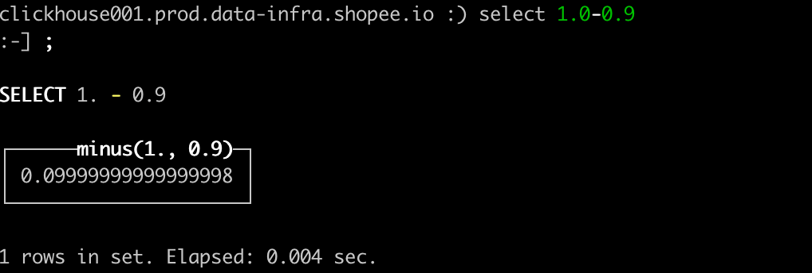
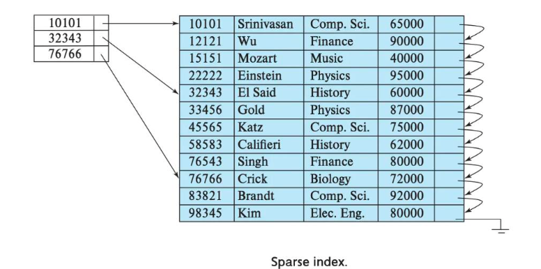

# 第 1 章 ClickHouse 入门

啥是 clickhouse？

是一个**列式数据库**(DBMS)，主要用于**在线分析处理查询**(OLAP)，能够用 **SQL 查询**实时生成**分析数据报告**

> OLAP和 OLTP
>
> OLTP 指的是分布式事务处理，典型代表是 Mysql 这种用来做增删改查的需求，但是 OLAP 适合的是一次插入多次分析处理（聚合查询等等），相对来说更新删除效率低一些

## 1.1 ClickHouse 的特点

### 1.1.1 列式存储

Clickhouse 本身是列式存储，列式存储的好处：

1. 对于列式查询的效率会极大增加，比如列的聚合，计数和求和等等统计操作
2. 因为每一列的数据类型相同，所以针对性的数据存储更容易进行数据压缩。可以每一列来选择更优的数据压缩算法，来提高数据的压缩比重。

> 为啥要压缩？数据量本身很大才有压缩的必要。列式存储天生就适合大数据。

1. 因为数据的压缩比更好，所以对 cache 有了更多的发挥空间

### 1.1.2 DBMS 的功能

几乎覆盖了标准 sql 的语法，包括DDL（建表语句）和 DML（操作语句），还有配套的各种函数，权限管理，数据的备份和恢复。

### 1.1.3 多样化引擎

Clickhouse 和 MySQL 类似，将表级的存储引擎插件化，**根据表的不同需求，设定不同的存储引擎**

> 有表引擎和库引擎

### 1.1.4 高吞吐写入能力

1. Clickhouse 在数据导入的时候全都是顺序 append，写入之后**不可更改**。
2. Clickhouse 采用类 LSM Tree(Log-structured merge-tree) 的结构，数据写入之后定期在后台做压缩

> 这个也是为什么当进入的数据量过大，ck 会直接说 insert 比 merge 快来拒绝服务

3. 在后台压缩的时候也是**多个段 merge sort** 之后**顺序**写回磁盘。

> 所以其主要还是因为可以顺序写入，不允许修改。这个特性对于 HDD 来说尤为重要

### 1.1.5 数据分区和线程级并行

数据分区是线程级并行的前提，将粒度变细之后就可以在哪怕一条 query 上面使用所有的 CPU。这也是 Clickhouse 为啥这么快的原因之一。

> 数据分区是为了避免全表扫描。
>
> 不适合做初级存储，适合做一张存储已经分析过的数据的大宽表。（因为其 QPS 过高扛不住）

但是不利于多条并发（一条来了就占满了，多条也就排队）。

# 第 2 章 ClickHouse 的安装 

## 2.1 准备工作

### 2.1.2 CentOS 取消打开文件数限制

一般限制都有两种，一种是软限制，一种是硬限制，软限制是说当前的日常状态的限制，而硬限制是其最大情况下的限制，所以软限制一般比硬限制要小。

# 第3章 数据类型

## 3.1 整型

固定长度的整型，包括有符号整型或无符号整型。 

**整型范围:**
Int8 - [-128 : 127]
Int16 - [-32768 : 32767]
Int32 - [-2147483648 : 2147483647]
Int64 - [-9223372036854775808 : 9223372036854775807] 

**无符号整型范围:**
UInt8 - [0 : 255]
UInt16 - [0 : 65535]
UInt32 - [0 : 4294967295]
UInt64 - [0 : 18446744073709551615]
使用场景: 个数、数量、也可以存储型 id。

## 3.2 浮点型 

Float32 - float

Float64 – double
建议尽可能以整数形式存储数据。例如，将固定精度的数字转换为整数值，如时间用毫秒为单位表示，因为浮点型进行计算时可能引起四舍五入的误差。

比如：



就会出现精度丢失的问题。

## 3.3 布尔型

没有单独的类型来存储布尔值。可以使用 UInt8 类型，取值限制为 0 或 1。

## 3.4 Decimal 型

有符号的浮点数，可在加、减和乘法运算过程中保持精度。对于除法，最低有效数字会 被丢弃(不舍入)。
有三种声明:
➢ Decimal32(s)，相当于Decimal(9-s,s)，有效位数为1~9
➢ Decimal64(s)，相当于Decimal(18-s,s)，有效位数为1~18
➢ Decimal128(s)，相当于Decimal(38-s,s)，有效位数为1~38

其中s 用来标识小数位。一般在金融场合为了保证精度，都会使用 Decimal 类型。

## 3.5 字符串

有 String 和 FixedString(N) 两种，后者并不建议使用，因为其已经将位数定死，使用起来并不是很方便。

FixedString(N) 本身*可以*在一些固定性质的场合使用，比如编码，性别，但是会带来无法修改的风险，因此最好不要使用。

FixedString(N) 之中，如果服务器端读取的数据长度大于 N，**会直接报错**。

## 3.6 枚举类型

包括 Enum8 和 Enum16 类型。Enum 保存 'string'= integer 的对应关系。

Enum8 用 'String'= Int8 对描述。
Enum16 用 'String'= Int16 对描述。

> 并不建议使用，虽然其也算是一种数据约束，但是在实际的使用过程之中，往往有一些数据内容的变化来增加一定的维护成本，甚至是数据丢失的问题。谨慎使用。

## 3.7 时间类型

目前 ClickHouse 有三种时间类型
➢ Date 接受年-月-日的字符串比如‘2019-12-16’
➢ Datetime 接受年-月-日 时:分:秒的字符串比如 ‘2019-12-16 20:50:10’
➢ Datetime64 接受年-月-日 时:分:秒.亚秒的字符串比如‘2019-12-16 20:50:10.66’ 

日期类型，用两个字节存储，表示从 1970-01-01 (无符号) 到当前的日期值。 还有很多数据结构，可以参考官方文档:https://clickhouse.yandex/docs/zh/data_types/

## 3.8 数组

1. 数组之中的类型必须相同
2. clickhouse 本身对于多维数组的支持不是很好，所以不建议使用多维数组。

可以使用`toTypeName(x)` 来得到x 的对应类型。

```sql
:) select [1,2] AS x, toTypeName(x);

SELECT
    [1, 2] AS x,
    toTypeName(x)

┌─x─────┬─toTypeName([1, 2])─┐
│ [1,2] │ Array(UInt8)       │
└───────┴────────────────────┘
```

# 第 4 章 表引擎

## 4.1 表引擎的使用

表引擎决定了数据是以什么方式被存储的，包括：

1. 数据的存储方式和位置，写到哪，从哪读
2. 支持哪些查询，支持的机制是怎么实现的
3. 并发数据访问
4. 索引的使用（如果有）
5. 是否可以执行多线程
6. 数据复制的参数

**引擎的大小写敏感！**

## 4.2 TinyLog

生产没人用。没索引，没并发控制。

## 4.3 Memory

用内存，服务器重启数据消失。不支持索引。

## 4.4 MergeTree

最强大的引擎族。

```sql
create table t_order_mt(
   id UInt32,
   sku_id String,
   total_amount Decimal(16,2),
   create_time Datetime
) engine =MergeTree
partition by toYYYYMMDD(create_time) 
primary key (id)
order by (id,sku_id);
```

 用上面这个来举例子。

其中最重要的三个参数：

1. partition by
2. Primary key
3. Order by(必须有)

### 4.4.1 partition by 分区(可选)

1. 作用：

   1. 降低扫描的范围来优化查询速度
   2. 分 partition，从而可以并行查找

2. 如果不填会如何？

   只会使用一个分区。这在生产环境之中是不可能的。

3. 分区目录

   首先，clickhouse 的数据是存在本地磁盘上面的，而不是依赖于 hdfs 这些。MergeTree 本身是以**列文件+索引文件+表定义文件**组成的，其中列文件是因为其为列式数据库。

   设定了partition，那么这些文件就会保存到不同的**分区**目录之中。

4. 并行

   上面提到了，其作用之一就是用于并行查询。如果一个查询是跨分区的，那么 clickhouse 会以分区作为单位来进行并行处理

5. 数据的写入和分区合并

   任何一个批次的数据写入，都会产生一个临时分区，在一段时间之后（比如10-15分钟），clickhouse 会自动执行合并操作（或者可以根据 optimize 来进行手动合并），将临时分区的内容合并到已有分区之中。

6. 数据的具体格式

   其数据文件的格式为：

   parttiitonId + MinBlockNum + MaxBlockNum + Level

   1. partitionId: 

      其生成规则是分区 ID 决定的，而分区 ID 是` partition by`分区键来决定。不同的分区键字段类型，ID 的生成规则不同。可以分为：

      1. **未定义分区键**：没有定义 partition by，那么根据我们之前的”如果不填会如何“，可以知道其会生成一个目录名为 all 的数据分区，所有的数据存放均是在 all 这个分区下面。
      2. **整型分区键**：直接用其整型值的字符串形式作为分区 ID
      3. **日期类分区键**： 分区键为日期类型，或者可以转换成日期类型

      > 这个地方有一点要注意，有些字符串，比如'2021-08-21'这种，虽然可以通过`toDate()`来进行转换，但是转换势必要消耗 CPU 资源，因此最好还是不要通过”可以转换成日期类型"的字符串进行分区

      4. 其他类型分区键：String，Float 类型等等，可以通过128位的 Hash 算法来**生成 Hash 值**作为其分区 ID。

      > 看 又有转换了 所以：最好不要

   2. MinBlockNum

      最小的分区块编号，自增，从1开始递增，每产生一个新的目录分区，就向上递增一个数字

   3. MaxBlockNum

      最大的分区块编号，新创建的分区，MinBlockNum = MaxBlockNum

   4. Level

      合并的次数，合并的越多层级值越大。

   那么可以推理出：一个新的块，格式应该类似于 20210909_3_3_0。最后这一位肯定是0，因为其还没经历过任何合并。

   **那么数据文件的具体层级关系是？**

   老版本的 clickhouse，其会针对每一列来生成两个文件，一个是 bin，一个是 mrk2.新版本之中只是针对整个表生成两个：data.bin 和 data.mrk3. 其中 mrk 文件是用来做标记的 mark 文件。

**在 optimise 的时候可以指定分区，只对对应的分区做合并操作。**

### 4.4.2 primary key（可选）

clickhouse 之中的主键，只是提供了数据的**一级索引**，而非**唯一约束**。这意味着，可以存在相同的 primary key 的数据。

> Mysql 之中的 primary key 既是索引，也是唯一约束。和 clickhouse 不同。
>
> 个人认为，是因为 clickhouse 之中的 order by 充当了唯一约束的作用（作为一个 OLAP 平台，其本身对数据就有自动排序归类来增加效率的要求）

此处的 primary key 是稀疏索引，默认的粒度是8192。一般这个值不需要改变，只有当该列存在大量重复值，想要增加索引的效率的时候才需要增加。

> 索引粒度，指的就是在稀疏索引之中两个相邻索引的对应数据间隔。
>
> 为什么在其存在大量重复值的时候可以增加呢？想像一列，一共有10万数据，9万数据都是1，其他的按序排列，2，3，4等等。那么如果不增加，在索引之中的大部分数据都是1，那么这个索引就没有意义。



上面就是稀疏索引的例子。

### 4.4.3 order by（必选！！）

order by 必选是因为作为一个 OLAP 平台，天然就有数据按序存储的需要。

这个必填项比 primary key 还重要，当用户不设置主键的时候，很多的处理会按照 order by 的字段来进行处理，比如去重和汇总

**主键 primary key 必须是 order by 的前缀字段。**

比如 order by 字段是 (id,sku_id) 那么主键必须是 id 或者(id,sku_id)

### 4.4.4 二级索引

```sql
create table t_order_mt2(
   id UInt32,
sku_id String,
total_amount Decimal(16,2), create_time Datetime,
    INDEX a total_amount TYPE minmax GRANULARITY 5
 ) engine =MergeTree
  partition by toYYYYMMDD(create_time)
   primary key (id)
order by (id, sku_id);
```

其中这个 INDEX 就是二级索引。而`GRANULARITY`就是二级索引对于一级索引的粒度。

**为什么要有二级索引**

其实二级索引是”索引的索引“，也就是说在一级索引上面**变粗**的索引。

1. 数据量太大，一级索引数据量也很大，导致其效率降低。
2. 数据之中有大量的重复

那么在这些情况下，”稀疏索引“本身已经都不够稀疏了，二级索引的实现方式是跳数索引。

### 4.4.5 数据 TTL

**只有 MergeTree 才有TTL。**

1. TTL 可以针对表级别，或者是列级别来进行设置。
2. 数据在达到 TTL 之后，可以选择删除或者是挪到其他的位置来归档。
3. TTL 并不是实时的，也是集群在后台进行相应的操作。如果没有 optimize 或者加上 final 的话，查询出来的结果可能会是过期也没删除的数据。
4. TTL 不可以是主键（显而易见，主键是要用来作为索引的，当然不能到时间就清除值）
5. TTL 的类型，必须是 `Date` 或者 `DateTime`。
6. TTL 可以不和表同步建立，可以在已经建表之后再去更新。

## 4.5 ReplacingMergeTree

ReplacingMergeTree 是 MergeTree 的一个子类，其在 MergeTree 上面加入了一个去重的功能。

1. 去重时间
   数据的去重只会在插入数据时候或者是数据合并的时候出现，合并会在未知的时间进行，所以直接查询的话很有可能还查到最近的重复数据

2. 去重范围
   对于分区表而言，其只能在分区内部进行去重，不能执行跨分区的去重。

   > 所以说，不同分区的数据其还可能有重复的，这个是其能力限制。

3. 怎么用？

   ```sql
   create table t_order_rmt(
      id UInt32,
   sku_id String,
   total_amount Decimal(16,2) , create_time Datetime
   ) engine =ReplacingMergeTree(create_time)
     partition by toYYYYMMDD(create_time)
     primary key (id)
     order by (id, sku_id);
   ```

   在表定义之中的`ReplacingMergeTree`的括号之中就是版本列， key 判断的根据是**order by之中的列**。

   重复数据的话，会保留版本数据最大的一个（此处是 create_time最大的行），如果不填写版本字段的话，默认会按照插入的顺序保留最后一条。

4. 小结论

   1. 其使用 order by 作为唯一键
   2. **去重是不可以跨分区的**
   3. 同一批插入，或者是合并分区的时候才会进行去重

## 4.6 SummingMergeTree

应对只关心维度来进行汇总聚合结果的场景。

```sql
create table t_order_smt(
   id UInt32,
   sku_id String,
   total_amount Decimal(16,2) ,
   create_time Datetime
) engine =SummingMergeTree(total_amount)
  partition by toYYYYMMDD(create_time)
  primary key (id)
  order by (id,sku_id );
```

 举个例子。

1. `SummingMergeTree()`之中指定的列是汇总数据列，可以填写多个**数字列**，如果不填，以所有非维度列（不是 order by 的列）且为数字列作为汇总数据列。
2. 以`order by`的列为准作为维度列
3. 其他的列，按照插入顺序来保留**第一行**。
4. 只会聚合**同一个分区**的数据
5. 只有在同一批次插入，或者是分片合并时候才会进行聚合操作。

**开发建议**

设计聚合表的时候，唯一键值，流水号等等都可以去掉，所有的字段全都是：

1. 维度
2. 度量
3. 时间戳（用来标记版本）

**问：那么查询的时候可以直接查来获取其汇总值吗？**

可以直接?

`select total_amount from XXX where province_name=’’ and create_date=’xxx’`

当然不行，其中可能会包含一些还没来得及聚合的明细，如果要汇总值，还是需要使用 sum 来进行聚合。

要用：

`select sum(total_amount) from province_name=’’ and create_date=‘xxx’`

