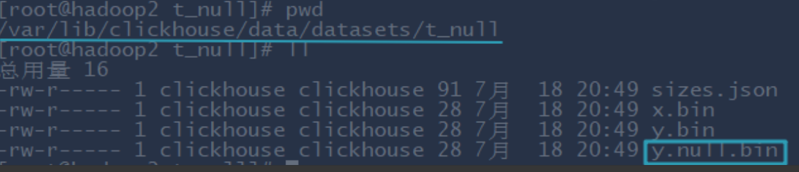

# Chapter 1 Get Execution plan by `Explain`

Before version 20.6, if we need to get execution plan we need look into the logs, from 20.6 we can use `explain` to get execution plan.

## 1.1 Basic grammar

Refer: https://clickhouse.com/docs/en/sql-reference/statements/explain

```sql
EXPLAIN [AST | SYNTAX | PLAN | PIPELINE] [setting = value, ...] SELECT ... [FORMAT ...]
```

There are 4 types for explaining:

1. Plan: Default value, for getting the excution plan
   - Header: Default 0, can show the type of all parameters
   - Description: Default 1, show step-by-step description for the execution plan
   - Actions: Default 0, show detailed information of all steps
2. AST: Show grammar tree for execution plan
3. SYNTAX: Show optimized grammer for execution plan
4. PIPELINE: Will show detailed information, like how many threads did the work

Here are some examples:

1. **Simple query**

```sql
explain plan select arrayJoin([1,2,3,null,null]);
```

Result:

```sql
EXPLAIN
SELECT arrayJoin([1, 2, 3, NULL, NULL])

┌─explain───────────────────────────────────────────────────────────────────┐
│ Expression ((Projection + Before ORDER BY))                               │
│   SettingQuotaAndLimits (Set limits and quota after reading from storage) │
│     ReadFromStorage (SystemOne)                                           │
└───────────────────────────────────────────────────────────────────────────┘

3 rows in set. Elapsed: 0.004 sec.
```

2. **Execution plan for complex query**

```sql
explain select database,table,count(1) cnt from system.parts where
database in ('datasets','system') group by database,table order by
database,cnt desc limit 2 by database;
```

Above is the SQL for query in system database, and here is the result:

```sql
┌─explain─────────────────────────────────────────────────────────────────────────────────────┐
│ Expression (Projection)                                                                     │
│   LimitBy                                                                                   │
│     Expression (Before LIMIT BY)                                                            │
│       MergingSorted (Merge sorted streams for ORDER BY)                                     │
│         MergeSorting (Merge sorted blocks for ORDER BY)                                     │
│           PartialSorting (Sort each block for ORDER BY)                                     │
│             Expression (Before ORDER BY)                                                    │
│               Aggregating                                                                   │
│                 Expression (Before GROUP BY)                                                │
│                   Filter (WHERE)                                                            │
│                     SettingQuotaAndLimits (Set limits and quota after reading from storage) │
│                       ReadFromStorage (SystemParts)                                         │
└─────────────────────────────────────────────────────────────────────────────────────────────┘
```

Step sequence is from the bottom to the top.

3. **AST grammar tree**

```sql
EXPLAIN AST SELECT number from system.numbers limit 10;
```

```sql
┌─explain─────────────────────────────────────┐
│ SelectWithUnionQuery (children 1)           │
│  ExpressionList (children 1)                │
│   SelectQuery (children 3)                  │
│    ExpressionList (children 1)              │
│     Identifier number                       │
│    TablesInSelectQuery (children 1)         │
│     TablesInSelectQueryElement (children 1) │
│      TableExpression (children 1)           │
│       TableIdentifier system.numbers        │
│    Literal UInt64_10                        │
└─────────────────────────────────────────────┘
```

4. **SYNTAX grammar optimization **
   Below is the example for before and after opening conditional operator(三目运算符)

   ```sql
   SELECT number = 1 ? 'hello' : (number = 2 ? 'world' : 'atguigu') FROM numbers(10);
   ```

   ```
   ┌─if(equals(number, 1), 'hello', if(equals(number, 2), 'world', 'atguigu'))─┐
   │ atguigu                                                                   │
   │ hello                                                                     │
   │ world                                                                     │
   │ atguigu                                                                   │
   │ atguigu                                                                   │
   │ atguigu                                                                   │
   │ atguigu                                                                   │
   │ atguigu                                                                   │
   │ atguigu                                                                   │
   │ atguigu                                                                   │
   └───────────────────────────────────────────────────────────────────────────┘
   ```

   And we see the optimization for conditional operator:

   ```sql
   EXPLAIN SYNTAX
   SELECT if(number = 1, 'hello', if(number = 2, 'world', 'atguigu'))
   FROM numbers(10)
   
   ┌─explain────────────────────────────────────────────────────────────┐
   │ SELECT if(number = 1, 'hello', if(number = 2, 'world', 'atguigu')) │
   │ FROM numbers(10)                                                   │
   └────────────────────────────────────────────────────────────────────┘
   ```

   Here we can see no change because we didn't open the optimization choice for conditional operator.

   And we open it:

   ```sql
   SET optimize_if_chain_to_multiif = 1;
   ```

   ```sql
   EXPLAIN SYNTAX
   SELECT if(number = 1, 'hello', if(number = 2, 'world', 'atguigu'))
   FROM numbers(10)
   
   ┌─explain─────────────────────────────────────────────────────────────┐
   │ SELECT multiIf(number = 1, 'hello', number = 2, 'world', 'atguigu') │
   │ FROM numbers(10)                                                    │
   └─────────────────────────────────────────────────────────────────────┘
   ```

   Previously the result is several `if`, and after we open the optimization then can see it becomes `multiIf`, which is like `switch`.

5. **For pipeline**

   ```sql
   EXPLAIN PIPELINE
   SELECT sum(number)
   FROM numbers_mt(100000)
   GROUP BY number % 20
   
   ┌─explain─────────────────────────┐
   │ (Expression)                    │
   │ ExpressionTransform             │
   │   (Aggregating)                 │
   │   Resize 32 → 1                 │
   │     AggregatingTransform × 32   │
   │       (Expression)              │
   │       ExpressionTransform × 32  │
   │         (SettingQuotaAndLimits) │
   │           (ReadFromStorage)     │
   │           NumbersMt × 32 0 → 1  │
   └─────────────────────────────────┘
   ```

   Here can see some `32` , which means the machine we are using now is 32 working threads.

# Chapter 2 Optimization for creating tables

## 2.1 Data type

### 2.1.1 Type for time column

We always use all String in Hive, but in Clickhouse, if something can be represented by numeric or  date type, then don't use String.

If wanna store time, it's better to use DateTime type rather than Long, because DateTime we don't need to transfer again when we use, so the performance is better and readable.

Like below, we use `Int32` as the type so when we use we need to transfer again:

```sql
create table t_type2(
   id UInt32,
sku_id String,
total_amount Decimal(16,2) , create_time Int32
) engine =ReplacingMergeTree(create_time)
partition by toYYYYMMDD(toDate(create_time)) –-需要转换一次，否则报错
  primary key (id)
  order by (id, sku_id);
```

### 2.1.2 Null value storage

`Nullable` type always makes the performance poor, **why**?

1. Nullable column cannot be indexed
2. Clickhouse need to **use another file** to store the labels for `NULL`



**Null value in Clickhouse doesn't support numeric operations, like 1 + null = null.**

So if not special occasion, we should use default value to represent Null, or give a value which has no meaning in business, like -1 in Int32.

## 2.2 Partitions and index

**Partitions:**

We always choose to partition by day, and best practices are for 100 million data, partitions should be controlled between 10-30.

**Indexes:**

In clickhouse, indexes are be configed by `order by`, which usually be considered by filter conditions.

Usually it should be frequent column the position need to be front.

And if the base number is really large, then should not be the index column , like userId which always not the same. Best practice is after filter the amount in million level.

## 2.3 Table parameters

`Index_granularity` default value is 8192, no need to change if data volume is not really large or duplicated values too many.

Also suggested that add TTL for the tables.

## 2.4 Writing and Deleting optimization

**For realtime systems, we must consider the stress of storage system, especially the concurrency!**

The whole optimising principles are "accumulating data into big batch then do opeartion".

1. DON'T execute small batch data insertaion or delete, which will make a lot of small partition files and give large pressure to background merge job
2. DON'T write into too many partitions once, or writing data too fast. Writing too fast will casue the speed of merge cannot catch up speed of insertaion so give error. 
   **recommanded: 2-3 times of writing per second, and each time 20000 - 50000 data**

**How to solve `too many parts`**

```java
1. Code: 252, e.displayText() = DB::Exception: Too many parts(304).
Merges are processing significantly slower than inserts
2. Code: 241, e.displayText() = DB::Exception: Memory limit (for query)
exceeded:would use 9.37 GiB (attempt to allocate chunk of 301989888
bytes), maximum: 9.31 GiB
```

1. If the memory of server is enough then can increase quota of memory, meanly by  `max_memory_usage` 
2. If memory of server is not enough, then can allocate the exceed part on disk, but not recommanded because will **absolutly lower the speed**.

## 2.5 Common configs

In Clickhouse, configs are a little different, it has 2 files, one is `config.xml`, another one is `users.xml`.

And most of the configs are in `users.xml`, which can be changed by `SET xxxx=n` in the clickhouse client, but for configurations in `config.xml`, it cannot be changed this way and if changed something then need to restart server.

### 2.5.1 CPU resource

1. Background_pool_size

   Thread pool size in background, which not only `merge` operation executed in this thread pool. 
   Default is 16, suggested to change it to `2*cpu core number`

2. background_schedule_pool_size
   Thread numbers when executing the background tasks, like:

   - copy tables
   - kafka Stream
   - DNS cache refreshment

   Default: 128. Suggested: `2*cpu-core-number`

3. background_distributed_schedule_ pool_size
   For exeution of distributed tables. 
   Default: 16. Suggested:  `2*cpu-core-number`

4. max_concurrent_queries
   Maximum query numbers, **including select, insert, etc.** 

   > Means all kinds of query in the same time. Because clickhouse can parallel the query into different cores so that can see the concurrency not so high.

   RecommandL 150-300. 

### 2.5.2 Memory resource

1. max_memory_usage
   This one in `users.xml`, which showed max memory usage in **single query**. This can be a little large to higher the limitation of whole cluster.
   Can reserve some for OS, e,g. give 100GB of memory of one 128GB memory machine

2. max_bytes_before_external_group_ by
   When group use more memory than this parameter then will flush into disk to query, usually for half of the `max_memory_usage`.
   Because aggragation of clickhouse including 2 stages:

   - query and build the internal data
   - merge the internal data

   So can set half of `max_memory_usage`, as 50GB.

3. max_bytes_before_external_sort
   When order by use more resource than this then will use disk to sort. If not set this value then will throw exception when memory not enough, but if use this, then speed of order_by will be very slow. 

4. max_table_size_to_drop
   Table size which exceed this cannot drop. Default is 50GB, and suggested change to 0 to delete any data.

### 2.5.3 Storage

Clickhouse doesn't support the multi-path, which is like Hive can use different partitions in HDFS. So how to improve the storage efficiency?

Can use virtual disk group to improve, which one group contains a lot of disks to improve the read and write efficiency.


