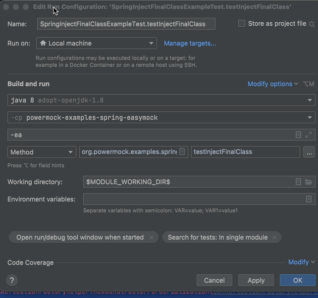

# 一些相关信息讲解

先上一个官方的测试用例：

```java
package org.powermock.examples.spring.mockito;

import org.easymock.TestSubject;
import org.junit.Test;
import org.junit.runner.RunWith;
import org.powermock.api.easymock.annotation.Mock;
import org.powermock.core.classloader.annotations.PrepareForTest;
import org.powermock.modules.junit4.PowerMockRunner;
import powermock.examples.spring.FinalClass;
import powermock.examples.spring.MyBean;

import static org.easymock.EasyMock.expect;
import static org.easymock.EasyMock.replay;
import static org.junit.Assert.assertEquals;

@RunWith(PowerMockRunner.class)
@PrepareForTest(FinalClass.class)
public class SpringInjectFinalClassExampleTest {

    @Mock
    private FinalClass finalClass;

    @TestSubject
    private MyBean myBean = new MyBean();;

    @Test
    public void testInjectFinalClass() {
        final String value = "What's up?";
        expect(finalClass.sayHello()).andReturn(value);
        replay(finalClass);

        assertEquals(value, myBean.sayHello());

    }

}

```


## @PrepareForTest

先看官方注释：

> This annotation tells PowerMock to prepare certain classes for testing. Classes needed to be defined using this annotation are typically those that needs to be byte-code manipulated. This includes final classes, classes with final, private, static or native methods that should be mocked and also classes that should be return a mock object upon instantiation.

也就是需要powermock框架将对应的final等类先进行bytecode编译之后给框架用来mock使用的类。

## @Mock

官方注释：

> This annotation can be placed on those fields in your test class that should be mocked. This eliminates the need to setup and tear-down mocks manually which minimizes repetitive test code and makes the test more readable. In order for PowerMock to control the life-cycle of the mocks you must supply the PowerMockListener annotation to the class-level of the test case. For example:

“放在应该被mock的类上面”。当然如果一个类之中的方法过多，也可以直接指定对应要mock的方法。

注意 mock 和 spy的不同用法，mock之中在测试代码里面需要将用到的所有方法打桩，也就是其只是一个壳。但是spy是产生真实的对象，对其中的某些行为进行更改。

## expect

这个是Easymock之中的，一般和andReturn() 一起：

```java
expect(finalClass.sayHello()).andReturn(value);
```

对expect()之中的行为进行打桩，并且返回后面的andReturn()中内容。如果@Mock标示的对象没有对应的expect()作为打桩，那么调用方法的时候就会直接返回null（框架也不知道要mock什么出来）

## replay

是Easymock之中的，用来将对应的mock的调用重放，除非对一个方法多次调用，需要多个mock的时候之外一般可以不用。

参考：https://www.cnblogs.com/ld-mars/p/12082200.html

> 当代码里涉及到同一个接口方法多次调用时，如果仅仅是在单元测试里EasyMock方法，而没有replay()时，在单元测试运行的时候，是无法对接口方法进行Mock的。
>
> EasyMock.replay()是将Mock的行为按照Mock的步骤重发一遍，在单元测试运行的时候，就能够正确的执行了。

## @TestSubject

Easymock中。标示要测试的类，powermock会将mock的类注入其中。


# 例子

## 内部组件的注入

用`setInternalState()`

```java
	/**
	 * Set the value of a field using reflection. This method will traverse the
	 * super class hierarchy until the first field assignable to the
	 * <tt>value</tt> type is found. The <tt>value</tt> (or
	 * <tt>additionaValues</tt> if present) will then be assigned to this field.
	 * 
	 * @param object
	 *            the object to modify
	 * @param value
	 *            the new value of the field
	 * @param additionalValues
	 *            Additional values to set on the object
	 */
	public static void setInternalState(Object object, Object value, Object... additionalValues) {
		WhiteboxImpl.setInternalState(object, value, additionalValues);
	}
```

举例：将bundleContextMock 注入到 tested之中：

```java
        setInternalState(tested, bundleContextMock);
```

## void类型的取值和验证

函数的返回值是void, 没法`expect...andReturn`，用下面的方式：

```java
       // TODO Expect the call to serviceRegistrationMock.unregister()
			// 此处的 serviceRegistrationMock.unregister() 返回void
        serviceRegistrationMock.unregister();
        PowerMock.expectLastCall().times(1);
```

## 抛出和检验异常

被测试方法：

```java
	@Override
	public void unregisterService(long id) {
		final ServiceRegistration registration = serviceRegistrations.remove(id);
		if (registration == null) {
			throw new IllegalStateException("Registration with id " + id + " has already been removed or has never been registered");
		}
		registration.unregister();
	}
```

如何测试：用`fail()`

```java
 // TODO Expect the call to serviceRegistrationMock.unregister() and throw an IllegalStateException
        try{
            tested.unregisterService(id);
            fail("Here should throw Exception....");
        }catch (IllegalStateException e){
            assertEquals("Registration with id " + id + " has already been removed or has never been registered", e.getMessage());
        }

```


# 在运行时候发生`org.objenesis.ObjenesisException: java.lang.reflect.InvocationTargetException`

详细报错是：可以看到主要是因为`java.lang.reflect.InvocationTargetException`.

解决方案：可以看到其是“调用部分出现异常”，查询之后发现是因为jdk版本不是jdk8 导致的。在run设置之中更改其为jdk8即可。



```java
org.objenesis.ObjenesisException: java.lang.reflect.InvocationTargetException

	at org.objenesis.instantiator.sun.SunReflectionFactoryHelper.newConstructorForSerialization(SunReflectionFactoryHelper.java:54)
	at org.objenesis.instantiator.sun.SunReflectionFactoryInstantiator.<init>(SunReflectionFactoryInstantiator.java:38)
	at org.objenesis.strategy.StdInstantiatorStrategy.newInstantiatorOf(StdInstantiatorStrategy.java:68)
	at org.objenesis.ObjenesisBase.getInstantiatorOf(ObjenesisBase.java:91)
	at org.powermock.reflect.internal.WhiteboxImpl.newInstance(WhiteboxImpl.java:259)
	at org.powermock.reflect.Whitebox.newInstance(Whitebox.java:139)
	at org.powermock.tests.utils.impl.AbstractTestSuiteChunkerImpl.getPowerMockTestListenersLoadedByASpecificClassLoader(AbstractTestSuiteChunkerImpl.java:95)
	at org.powermock.modules.junit4.common.internal.impl.JUnit4TestSuiteChunkerImpl.createDelegatorFromClassloader(JUnit4TestSuiteChunkerImpl.java:174)
	at org.powermock.modules.junit4.common.internal.impl.JUnit4TestSuiteChunkerImpl.createDelegatorFromClassloader(JUnit4TestSuiteChunkerImpl.java:48)
	at org.powermock.tests.utils.impl.AbstractTestSuiteChunkerImpl.createTestDelegators(AbstractTestSuiteChunkerImpl.java:108)
	at org.powermock.modules.junit4.common.internal.impl.JUnit4TestSuiteChunkerImpl.<init>(JUnit4TestSuiteChunkerImpl.java:71)
	at org.powermock.modules.junit4.common.internal.impl.AbstractCommonPowerMockRunner.<init>(AbstractCommonPowerMockRunner.java:36)
	at org.powermock.modules.junit4.PowerMockRunner.<init>(PowerMockRunner.java:34)
	at java.base/jdk.internal.reflect.NativeConstructorAccessorImpl.newInstance0(Native Method)
	at java.base/jdk.internal.reflect.NativeConstructorAccessorImpl.newInstance(NativeConstructorAccessorImpl.java:77)
	at java.base/jdk.internal.reflect.DelegatingConstructorAccessorImpl.newInstance(DelegatingConstructorAccessorImpl.java:45)
	at java.base/java.lang.reflect.Constructor.newInstanceWithCaller(Constructor.java:499)
	at java.base/java.lang.reflect.Constructor.newInstance(Constructor.java:480)
	at org.junit.internal.builders.AnnotatedBuilder.buildRunner(AnnotatedBuilder.java:104)
	at org.junit.internal.builders.AnnotatedBuilder.runnerForClass(AnnotatedBuilder.java:86)
	at org.junit.runners.model.RunnerBuilder.safeRunnerForClass(RunnerBuilder.java:59)
	at org.junit.internal.builders.AllDefaultPossibilitiesBuilder.runnerForClass(AllDefaultPossibilitiesBuilder.java:26)
	at org.junit.runners.model.RunnerBuilder.safeRunnerForClass(RunnerBuilder.java:59)
	at org.junit.internal.requests.ClassRequest.getRunner(ClassRequest.java:33)
	at org.junit.internal.requests.FilterRequest.getRunner(FilterRequest.java:36)
	at com.intellij.junit4.JUnit4IdeaTestRunner.startRunnerWithArgs(JUnit4IdeaTestRunner.java:50)
	at com.intellij.rt.junit.IdeaTestRunner$Repeater.startRunnerWithArgs(IdeaTestRunner.java:33)
	at com.intellij.rt.junit.JUnitStarter.prepareStreamsAndStart(JUnitStarter.java:235)
	at com.intellij.rt.junit.JUnitStarter.main(JUnitStarter.java:54)
Caused by: java.lang.reflect.InvocationTargetException
	at java.base/jdk.internal.reflect.NativeMethodAccessorImpl.invoke0(Native Method)
	at java.base/jdk.internal.reflect.NativeMethodAccessorImpl.invoke(NativeMethodAccessorImpl.java:77)
	at java.base/jdk.internal.reflect.DelegatingMethodAccessorImpl.invoke(DelegatingMethodAccessorImpl.java:43)
	at java.base/java.lang.reflect.Method.invoke(Method.java:568)
	at org.objenesis.instantiator.sun.SunReflectionFactoryHelper.newConstructorForSerialization(SunReflectionFactoryHelper.java:44)
	... 28 more
Caused by: java.lang.IllegalAccessError: class jdk.internal.reflect.ConstructorAccessorImpl loaded by org.powermock.core.classloader.MockClassLoader @233c0b17 cannot access jdk/internal/reflect superclass jdk.internal.reflect.MagicAccessorImpl
	at java.base/java.lang.ClassLoader.defineClass1(Native Method)
	at java.base/java.lang.ClassLoader.defineClass(ClassLoader.java:1012)
	at org.powermock.core.classloader.MockClassLoader.loadUnmockedClass(MockClassLoader.java:262)
	at org.powermock.core.classloader.MockClassLoader.loadModifiedClass(MockClassLoader.java:206)
	at org.powermock.core.classloader.DeferSupportingClassLoader.loadClass1(DeferSupportingClassLoader.java:89)
	at org.powermock.core.classloader.DeferSupportingClassLoader.loadClass(DeferSupportingClassLoader.java:79)
	at java.base/java.lang.ClassLoader.loadClass(ClassLoader.java:520)
	at java.base/java.lang.ClassLoader.defineClass1(Native Method)
	at java.base/java.lang.ClassLoader.defineClass(ClassLoader.java:1012)
	at org.powermock.core.classloader.MockClassLoader.loadUnmockedClass(MockClassLoader.java:262)
	at org.powermock.core.classloader.MockClassLoader.loadModifiedClass(MockClassLoader.java:206)
	at org.powermock.core.classloader.DeferSupportingClassLoader.loadClass1(DeferSupportingClassLoader.java:89)
	at org.powermock.core.classloader.DeferSupportingClassLoader.loadClass(DeferSupportingClassLoader.java:79)
	at java.base/java.lang.ClassLoader.loadClass(ClassLoader.java:520)
	at java.base/java.lang.ClassLoader.defineClass1(Native Method)
	at java.base/java.lang.System$2.defineClass(System.java:2303)
	at java.base/jdk.internal.reflect.ClassDefiner.defineClass(ClassDefiner.java:66)
	at java.base/jdk.internal.reflect.MethodAccessorGenerator$1.run(MethodAccessorGenerator.java:401)
	at java.base/jdk.internal.reflect.MethodAccessorGenerator$1.run(MethodAccessorGenerator.java:395)
	at java.base/java.security.AccessController.doPrivileged(AccessController.java:318)
	at java.base/jdk.internal.reflect.MethodAccessorGenerator.generate(MethodAccessorGenerator.java:394)
	at java.base/jdk.internal.reflect.MethodAccessorGenerator.generateSerializationConstructor(MethodAccessorGenerator.java:112)
	at java.base/jdk.internal.reflect.ReflectionFactory.generateConstructor(ReflectionFactory.java:463)
	at java.base/jdk.internal.reflect.ReflectionFactory.newConstructorForSerialization(ReflectionFactory.java:376)
	at jdk.unsupported/sun.reflect.ReflectionFactory.newConstructorForSerialization(ReflectionFactory.java:100)
	... 33 more
```

