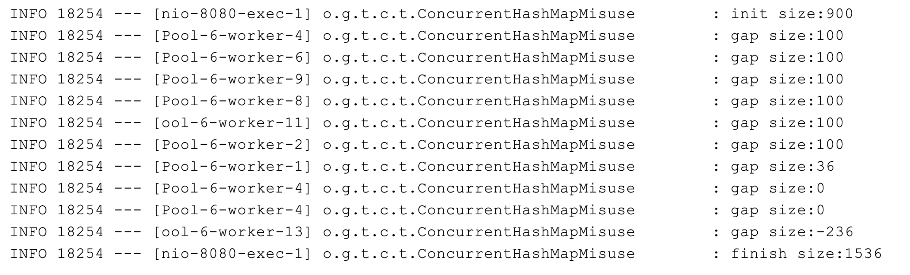
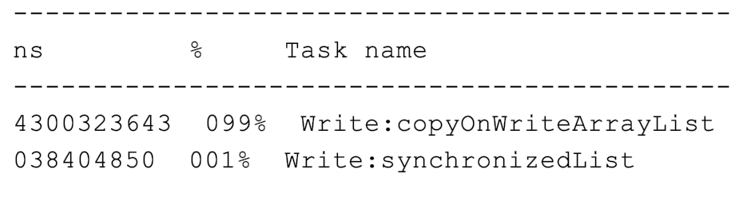
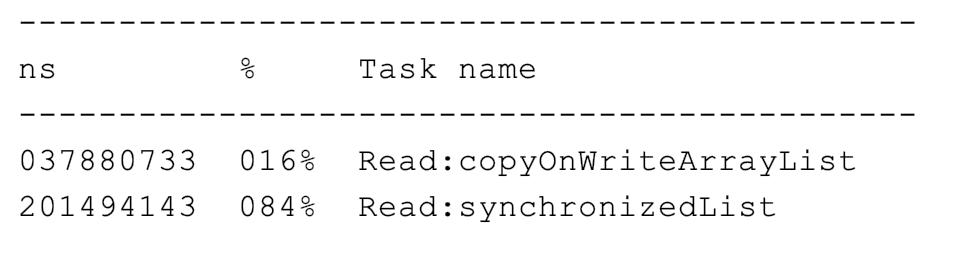

发现一个非常好的教程：https://learn.lianglianglee.com/%E4%B8%93%E6%A0%8F/Java%20%E4%B8%9A%E5%8A%A1%E5%BC%80%E5%8F%91%E5%B8%B8%E8%A7%81%E9%94%99%E8%AF%AF%20100%20%E4%BE%8B

里面全是在业务相关时候的实操。

今天先讲一个并发类的使用方式：

# 忽略了 ThreadLocal 变量所在线程是线程池之中对象

问题：使用 ThreadLocal 来获取信息，有时候获取的信息是错误的。

原因：**在使用 ThreadLocal 之后没有将其值清空，而程序是运行在 Tomcat 里面的，执行程序的线程是 Tomcat 的工作线程，其基于线程池。那么重用固定的几个线程，获取的可能是之前其他用户的遗留值。这时候所取得的信息就是错误的。**

在写业务代码的时候，要弄清楚代码会跑在什么线程上。Web 服务器之中往往会使用线程池来处理请求，这意味线程会被**重用**。那么使用 ThreadLocal 来存放一些数据的时候，要注意在代码运行结束之后去显式的清除对应数据。

## **问题代码**

```java
private static final ThreadLocal<Integer> currentUser = ThreadLocal.withInitial(() -> null);

@GetMapping("wrong")

public Map wrong(@RequestParam("userId") Integer userId) {

    //设置用户信息之前先查询一次ThreadLocal中的用户信息

    String before  = Thread.currentThread().getName() + ":" + currentUser.get();

    //设置用户信息到ThreadLocal

    currentUser.set(userId);

    //设置用户信息之后再查询一次ThreadLocal中的用户信息

    String after  = Thread.currentThread().getName() + ":" + currentUser.get();

    //汇总输出两次查询结果

    Map result = new HashMap();

    result.put("before", before);

    result.put("after", after);

    return result;

}
```

**修正方案：**在代码的 finally 之中，显式的清除 ThreadLocal 之中的数据。这样新的请求过来也不会获取到错误的用户信息。

## **修正代码：**

```java
@GetMapping("right")

public Map right(@RequestParam("userId") Integer userId) {

    String before  = Thread.currentThread().getName() + ":" + currentUser.get();

    currentUser.set(userId);

    try {

        String after = Thread.currentThread().getName() + ":" + currentUser.get();

        Map result = new HashMap();

        result.put("before", before);

        result.put("after", after);

        return result;

    } finally {

        //在finally代码块中删除ThreadLocal中的数据，确保数据不串

        currentUser.remove();

    }

}
```

# 线程安全的并发工具使用错误

比如 ConcurrentHashMap,其线程安全只能保证原子性的读写操作是线程安全的。如果操作不是原子性的，或者更过分的操作之中插入了一些其他操作，那么就会出现线程安全的问题。

下面这段代码之中，就是先通过 size()拿到当前的元素数量，计算需要补充多少元素之后对其 log，最后在 putAll 之中把缺少的元素添加进去。

```java
//线程个数

private static int THREAD_COUNT = 10;

//总元素数量

private static int ITEM_COUNT = 1000;

//帮助方法，用来获得一个指定元素数量模拟数据的ConcurrentHashMap

private ConcurrentHashMap<String, Long> getData(int count) {

    return LongStream.rangeClosed(1, count)

            .boxed()

            .collect(Collectors.toConcurrentMap(i -> UUID.randomUUID().toString(), Function.identity(),

                    (o1, o2) -> o1, ConcurrentHashMap::new));

}

@GetMapping("wrong")

public String wrong() throws InterruptedException {

    ConcurrentHashMap<String, Long> concurrentHashMap = getData(ITEM_COUNT - 100);

    //初始900个元素

    log.info("init size:{}", concurrentHashMap.size());

    ForkJoinPool forkJoinPool = new ForkJoinPool(THREAD_COUNT);

    //使用线程池并发处理逻辑

    forkJoinPool.execute(() -> IntStream.rangeClosed(1, 10).parallel().forEach(i -> {

        //查询还需要补充多少个元素

        int gap = ITEM_COUNT - concurrentHashMap.size();

        log.info("gap size:{}", gap);

        //补充元素

        concurrentHashMap.putAll(getData(gap));

    }));

    //等待所有任务完成

    forkJoinPool.shutdown();

    forkJoinPool.awaitTermination(1, TimeUnit.HOURS);

    //最后元素个数会是1000吗？

    log.info("finish size:{}", concurrentHashMap.size());

    return "OK";

}

```

输出日志为：



可以看到好几个线程都往里面怼了100个元素，还有的直接在 gap 里面看到了-236，意味着这个时候这个13号线程里面的元素数量已经是1236个，远远超出了范围。

首先，我们要分清，concurrentHashMap 这种线程安全是怎么个安全法：

其线程安全，指的是不同的线程使用这个类的时候不会有**相互干扰**的问题。比如 put(),其会先锁住对应的节点然后做 CAS，这样就导致两个线程的更改不会同时产生影响。本文之中的例子，使用的是size()，我们去源码之中看一下。

```java
    /**
     * Returns the number of key-value mappings in this map.  If the
     * map contains more than {@code Integer.MAX_VALUE} elements, returns
     * {@code Integer.MAX_VALUE}.
     *
     * @return the number of key-value mappings in this map
     */
    public int size() {
        long n = sumCount();
        return ((n < 0L) ? 0 :
                (n > (long)Integer.MAX_VALUE) ? Integer.MAX_VALUE :
                (int)n);
    }
```

其中主要的方法是 sumCount()：

```java
    final long sumCount() {
        CounterCell[] cs = counterCells;
        long sum = baseCount;
        if (cs != null) {
            for (CounterCell c : cs)
                if (c != null)
                    sum += c.value;
        }
        return sum;
    }
```

把类之中本身存在的 counterCells 进行一个指针的 copy，然后把其中的值进行相加。这个 counterCell 本身是一个分布式的相加，不是我们的重点，所以先放在这源码：

```java
    /**
     * A padded cell for distributing counts.  Adapted from LongAdder
     * and Striped64.  See their internal docs for explanation.
     */
    @jdk.internal.vm.annotation.Contended static final class CounterCell {
        volatile long value;
        CounterCell(long x) { value = x; }
    }

```

这一段代码的逻辑，并不能保证在线程池之中的每个线程调用这个服务的时候，都能够拿到一样的值。（只是对 CounterCell 里面的值进行一定的处理）。

而且代码之中，是先拿到对应的 size，打了一个 log，再进行相应的填充，很有可能在线程 A 拿值的时候，值是900，然后线程 B 拿值的时候，值也是900，A 直接做一个100的填充，B 并不知道，也填100，导致最后的结果错误。

## **修正代码：**

### 效率低：加锁

把从查看gap 到最后填充值的部分全都加锁来保证线程安全

```java
@GetMapping("right")

public String right() throws InterruptedException {

    ConcurrentHashMap<String, Long> concurrentHashMap = getData(ITEM_COUNT - 100);

    log.info("init size:{}", concurrentHashMap.size());


    ForkJoinPool forkJoinPool = new ForkJoinPool(THREAD_COUNT);

    forkJoinPool.execute(() -> IntStream.rangeClosed(1, 10).parallel().forEach(i -> {

        //下面的这段复合逻辑需要锁一下这个ConcurrentHashMap

        synchronized (concurrentHashMap) {

            int gap = ITEM_COUNT - concurrentHashMap.size();

            log.info("gap size:{}", gap);

            concurrentHashMap.putAll(getData(gap));

        }

    }));

    forkJoinPool.shutdown();

    forkJoinPool.awaitTermination(1, TimeUnit.HOURS);

    log.info("finish size:{}", concurrentHashMap.size());

    return "OK";

}
```

结果：

### 效率高：使用自带的工具类

下面是一个新的统计需求：

> 使用 ConcurrentHashMap 来统计，Key 的范围是 10。
>
> 使用最多 10 个并发，循环操作 1000 万次，每次操作累加随机的 Key。
>
> 如果 Key 不存在的话，首次设置值为 1。

**优化之后的代码：**

```java
private Map<String, Long> gooduse() throws InterruptedException {

    ConcurrentHashMap<String, LongAdder> freqs = new ConcurrentHashMap<>(ITEM_COUNT);

    ForkJoinPool forkJoinPool = new ForkJoinPool(THREAD_COUNT);

    forkJoinPool.execute(() -> IntStream.rangeClosed(1, LOOP_COUNT).parallel().forEach(i -> {

        String key = "item" + ThreadLocalRandom.current().nextInt(ITEM_COUNT);

                //利用computeIfAbsent()方法来实例化LongAdder，然后利用LongAdder来进行线程安全计数

                freqs.computeIfAbsent(key, k -> new LongAdder()).increment();

            }

    ));

    forkJoinPool.shutdown();

    forkJoinPool.awaitTermination(1, TimeUnit.HOURS);

    //因为我们的Value是LongAdder而不是Long，所以需要做一次转换才能返回

    return freqs.entrySet().stream()

            .collect(Collectors.toMap(

                    e -> e.getKey(),

                    e -> e.getValue().longValue())

            );

}
```

 我们使用了 concurrentHashMap 的原子性方法 computeIfAbsent 来做复合的逻辑操作：

> 注：这个地方下面有一个思考题，就是 computeIfAbsent() 和 putIfAbsent() 有什么区别。其中 putIfAbsent()是如果本身是空那么进行填充值，但是 computeIfAbsent()则是可以先做一段计算，再将值放到 map 之中。
>
> 先上可以用 concurrentHashMap 做统计的官方文档注释：
>
> ```java
>  * <p>A ConcurrentHashMap can be used as a scalable frequency map (a
>  * form of histogram or multiset) by using {@link
>  * java.util.concurrent.atomic.LongAdder} values and initializing via
>  * {@link #computeIfAbsent computeIfAbsent}. For example, to add a count
>  * to a {@code ConcurrentHashMap<String,LongAdder> freqs}, you can use
>  * {@code freqs.computeIfAbsent(key, k -> new LongAdder()).increment();}
> ```
>
> 这个函数本身返回的是 V：
>
> ```java
> public V computeIfAbsent(K key, Function<? super K, ? extends V> mappingFunction) {}
> ```
>
> 那么对于上面这一段：
>
> ```java
> freqs.computeIfAbsent(key, k -> new LongAdder()).increment();
> ```
>
>  本身 computeIfAbsent 返回的就是一个 LongAdder，那么就可以调用其中的 increment() 方法。
>
> 而文档之中说了，computeIfAbsent 是原子的，原理是 Unsafe 自带的 CAS。在 LongAdder 我们也可以看到其是一个线程安全的累加器，那么可以直接调用 increment 方法进行累加。

## ForkJoinPool

FirkJpinPool 本身是一个线程池，用来将对应的任务进行分解再处理。很像算法之中的递归解法。

参考：https://www.liaoxuefeng.com/wiki/1252599548343744/1306581226487842

那么逻辑要分成三部分，第一部分是对任务进行分解，第二部分是判断任务是否已经小到足够执行，并且执行。最后一部分对结果进行一个汇总即可。

```java
public class Main {
    public static void main(String[] args) throws Exception {
        // 创建2000个随机数组成的数组:
        long[] array = new long[2000];
        long expectedSum = 0;
        for (int i = 0; i < array.length; i++) {
            array[i] = random();
            expectedSum += array[i];
        }
        System.out.println("Expected sum: " + expectedSum);
        // fork/join:
        ForkJoinTask<Long> task = new SumTask(array, 0, array.length);
        long startTime = System.currentTimeMillis();
        Long result = ForkJoinPool.commonPool().invoke(task);
        long endTime = System.currentTimeMillis();
        System.out.println("Fork/join sum: " + result + " in " + (endTime - startTime) + " ms.");
    }

    static Random random = new Random(0);

    static long random() {
        return random.nextInt(10000);
    }
}

class SumTask extends RecursiveTask<Long> {
    static final int THRESHOLD = 500;
    long[] array;
    int start;
    int end;

    SumTask(long[] array, int start, int end) {
        this.array = array;
        this.start = start;
        this.end = end;
    }

    @Override
    protected Long compute() {
        if (end - start <= THRESHOLD) {
            // 如果任务足够小,直接计算:
            long sum = 0;
            for (int i = start; i < end; i++) {
                sum += this.array[i];
                // 故意放慢计算速度:
                try {
                    Thread.sleep(1);
                } catch (InterruptedException e) {
                }
            }
            return sum;
        }
        // 任务太大,一分为二:
        int middle = (end + start) / 2;
        System.out.println(String.format("split %d~%d ==> %d~%d, %d~%d", start, end, start, middle, middle, end));
        SumTask subtask1 = new SumTask(this.array, start, middle);
        SumTask subtask2 = new SumTask(this.array, middle, end);
        invokeAll(subtask1, subtask2);
        Long subresult1 = subtask1.join();
        Long subresult2 = subtask2.join();
        Long result = subresult1 + subresult2;
        System.out.println("result = " + subresult1 + " + " + subresult2 + " ==> " + result);
        return result;
    }
}
```

### 工作窃取算法(work-stealing)

参考：https://godiscoder.cn/%E6%8E%80%E4%BD%A0%E7%9F%AD%E8%A3%99/article/5d085d64a70b1d53db964e99

ForkJoinPool 之中使用的是工作窃取算法， 指的是某个线程从其他线程之中窃取任务并且执行。其主要是为了效率（一个线程如果执行完自己的任务，可以去接着执行其他任务而不是干等着）。那么如何保证多个线程不相互干扰呢？通常使用双端队列， 窃取任务和被窃取任务的线程可以从队列的两端来拿任务执行。

# 没认清并发工具的使用场景，导致性能问题

## 问题

没有搞清楚其原理就盲目的使用，比如 copyOnWriteArrayList,其本身的线程安全是因为在每次修改数据的时候，会先复制一份数据出来，所以其更适用于读多写少的场景。如果对于写比较多的场景，应该使用加锁（甚至这种情况下乐观锁都不是好方法）的方式来控制其读写。

### CopyOnWriteArrayList 和普通 ArrayList 加锁的读写性能对比

```java
//测试并发写的性能

@GetMapping("write")

public Map testWrite() {

    List<Integer> copyOnWriteArrayList = new CopyOnWriteArrayList<>();

    List<Integer> synchronizedList = Collections.synchronizedList(new ArrayList<>());

    StopWatch stopWatch = new StopWatch();

    int loopCount = 100000;

    stopWatch.start("Write:copyOnWriteArrayList");

    //循环100000次并发往CopyOnWriteArrayList写入随机元素

    IntStream.rangeClosed(1, loopCount).parallel().forEach(__ -> copyOnWriteArrayList.add(ThreadLocalRandom.current().nextInt(loopCount)));

    stopWatch.stop();

    stopWatch.start("Write:synchronizedList");

    //循环100000次并发往加锁的ArrayList写入随机元素

    IntStream.rangeClosed(1, loopCount).parallel().forEach(__ -> synchronizedList.add(ThreadLocalRandom.current().nextInt(loopCount)));

    stopWatch.stop();

    log.info(stopWatch.prettyPrint());

    Map result = new HashMap();

    result.put("copyOnWriteArrayList", copyOnWriteArrayList.size());

    result.put("synchronizedList", synchronizedList.size());

    return result;

}

//帮助方法用来填充List

private void addAll(List<Integer> list) {

    list.addAll(IntStream.rangeClosed(1, 1000000).boxed().collect(Collectors.toList()));

}

//测试并发读的性能

@GetMapping("read")

public Map testRead() {

    //创建两个测试对象

    List<Integer> copyOnWriteArrayList = new CopyOnWriteArrayList<>();

    List<Integer> synchronizedList = Collections.synchronizedList(new ArrayList<>());

    //填充数据   

    addAll(copyOnWriteArrayList);

    addAll(synchronizedList);

    StopWatch stopWatch = new StopWatch();

    int loopCount = 1000000;

    int count = copyOnWriteArrayList.size();

    stopWatch.start("Read:copyOnWriteArrayList");

    //循环1000000次并发从CopyOnWriteArrayList随机查询元素

    IntStream.rangeClosed(1, loopCount).parallel().forEach(__ -> copyOnWriteArrayList.get(ThreadLocalRandom.current().nextInt(count)));

    stopWatch.stop();

    stopWatch.start("Read:synchronizedList");

    //循环1000000次并发从加锁的ArrayList随机查询元素

    IntStream.range(0, loopCount).parallel().forEach(__ -> synchronizedList.get(ThreadLocalRandom.current().nextInt(count)));

    stopWatch.stop();

    log.info(stopWatch.prettyPrint());

    Map result = new HashMap();

    result.put("copyOnWriteArrayList", copyOnWriteArrayList.size());

    result.put("synchronizedList", synchronizedList.size());

    return result;

}
```

上面是十万次写操作，下面是一百万次读操作，区别如下：

十万次 add:



一百万次读：



# 个人后记

## 为什么一般 ThreadLocal 要用 static 修饰？

参考：将ThreadLocal变量设置为private static的好处是啥？ - Viscent大千的回答 - 知乎 https://www.zhihu.com/question/35250439/answer/101676937

可以避免重复创建 TSO(thread specific object，也就是 ThreadLocal 所关联的对象）导致的浪费。

一个 HtreadLocal 实例对应当前线程之中的一个 TSO实例，因此，如果将 ThreadLocal 声明为某个累的实例变量，那么每一个实例都会导致一个新的 TSO 被创建。这些被创建的 TSO 是同一个类的实例，因此同一个线程可能访问到不同实例，这样会导致错误

