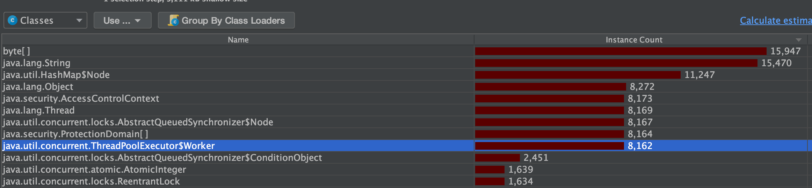

参照如下：

```
https://learn.lianglianglee.com/%E4%B8%93%E6%A0%8F/Java%20%E4%B8%9A%E5%8A%A1%E5%BC%80%E5%8F%91%E5%B8%B8%E8%A7%81%E9%94%99%E8%AF%AF%20100%20%E4%BE%8B/03%20%E7%BA%BF%E7%A8%8B%E6%B1%A0%EF%BC%9A%E4%B8%9A%E5%8A%A1%E4%BB%A3%E7%A0%81%E6%9C%80%E5%B8%B8%E7%94%A8%E4%B9%9F%E6%9C%80%E5%AE%B9%E6%98%93%E7%8A%AF%E9%94%99%E7%9A%84%E7%BB%84%E4%BB%B6.md
```

# 线程池引用的 OOM 问题（笔者自述

本地线程池变量相关的 OOM 问题：

一般而言，我们都是在线程池创建之后一直使用，不去销毁。但是如果不小心在本地变量之中每次在使用的时候都新建一个线程池，会有什么后果呢？

```java
public class ThreadPoolTest {
    public static void main(String[] args) throws Exception {
        ThreadMXBean bean = ManagementFactory.getThreadMXBean();
        int n = 30000;
        for (int i = 0; i < n; i++) {
            ThreadPoolExecutor executor = new ThreadPoolExecutor(10, 20, 1000, TimeUnit.SECONDS, new LinkedBlockingDeque<>());
            for (int j = 0; j < 10; j++) {
                executor.execute(() -> {
                    System.out.println("thread count is " + bean.getThreadCount());
                });
            }
//            executor.shutdown();
        }
        Thread.sleep(10000);
        System.out.println("finally thread count is " + bean.getThreadCount());
    }
}
```

可以看到上面的代码在每次使用时候都新建一个线程池。

结果是OOM，没法再创建新的 native thread.

```java
....
thread count is 8165
thread count is 8166
thread count is 8167
thread count is 8168
thread count is 8169
[1.540s][warning][os,thread] Failed to start thread - pthread_create failed (EAGAIN) for attributes: stacksize: 2048k, guardsize: 16k, detached.
Exception in thread "main" java.lang.OutOfMemoryError: unable to create native thread: possibly out of memory or process/resource limits reached
	at java.base/java.lang.Thread.start0(Native Method)
	at java.base/java.lang.Thread.start(Thread.java:798)
	at java.base/java.util.concurrent.ThreadPoolExecutor.addWorker(ThreadPoolExecutor.java:937)
	at java.base/java.util.concurrent.ThreadPoolExecutor.execute(ThreadPoolExecutor.java:1343)
	at threadPool.ThreadPoolTest.main(ThreadPoolTest.java:16)

```

我们把对应的进程用 Jmap dump 一下，使用 JProfier解析：



可以看到一共有8162个 Worker, 8169个 thread。因为其是 ThreadPoolExecutor 的内部类，所以也意味着有8162个 ThreadPoolExecutor.

## OOM 的原因

每一次新建 threadPoolExecutor 之后，执行结束对应任务，应该就已经没有引用，被 GC 回收了啊？这样只是性能上出现一些问题，但是不应该 OOM 呀？

那为什么会有这样的问题出现呢？这得深入 Java 的 GC 来说。

线程池之中会将 Thread 包装成一个 worker, 而在 worker 之中有一个 thread 变量。java 之中的 thread 变量本身是一个包装，其内部对应的是 Linux 本身的 thread。Linux 的 thread 怎么可能被 Java 的 GC回收？GC 之中有一种 GC root 就是 thread 之中的变量。那么 thread 不会被销毁，其 worker 对象也不会被销毁，worker 又是 threadPoolExecutor 之中的一个非静态内部类，其实例化的时候会**隐式的持有一个外部类的强引用**，那么线程池对象也不会被销毁。

> 参考：https://www.saoniuhuo.com/article/detail-32480.html

但是该线程池再也没有办法被访问到，也无法向其中提交任何任务，因此造成了内存泄露。在这种线程池之中，线程处于的状态是**WAITING(parking)**

# 线程池的声明需要手动进行

## newFixedThreadPool 出现OOM 的原因

newFixedThreadPool 的工作队列，直接 new 了一个LinkedBlockingQueue，默认的构造方法之中，LinkedBlockingQueue 本身也是一个长度为 Integer.MAX_VALUE 的队列，可以认为其是一个无界队列。

那么如果任务比较多而且执行比较慢的情况，就会出现队列快速积压，撑爆内存导致 OOM。

## newCachedThreadPool 出现 OOM 的原因

newCachedThreadPool 本身创建的时候，其线程池的最大线程数是 Integer.MAX_VALUE，可以认为其没有上限，而其工作队列 SynchronousQueue 是一个没有存储空间的阻塞队列。这意味着，一旦请求到来，就必须找到一条工作线程来处理。如果当前没有空闲的线程，就创建新的线程。那么这种情况下无限制的创建线程必然导致 OOM。

# 线程池线程管理策略详解

1. 线程池在初始化的时候，并不会有任何的线程初始化
2. 在任务到来的时候开始创建线程，数量为 corePoolSize
3. 核心线程满了之后不会立刻扩容线程池，而是将其堆积到工作队列之中
4. 工作队列满了之后扩容线程池线程，直到其达到 maximumPoolSize 为止
5. 队列已满，且达到最大线程数之后还有任务进来，按照拒绝策略RejectPolicy 处理
6. 当线程数大于核心线程数时候，线程池等待 keepAlicveTIme 后还没有任务需要处理，收缩其到核心线程数

## 作者的作业：如何先开启更多线程

> 不知道你有没有想过：Java 线程池是先用工作队列来存放来不及处理的任务，满了之后再扩容线程池。当我们的工作队列设置得很大时，最大线程数这个参数显得没有意义，因为队列很难满，或者到满的时候再去扩容线程池已经于事无补了。
>
> 那么，我们有没有办法让线程池更激进一点，优先开启更多的线程，而把队列当成一个后备方案呢？比如我们这个例子，任务执行得很慢，需要 10 秒，如果线程池可以优先扩容到 5 个最大线程，那么这些任务最终都可以完成，而不会因为线程池扩容过晚导致慢任务来不及处理。
>
> 限于篇幅，这里我只给你一个大致思路：
>
> 由于线程池在工作队列满了无法入队的情况下会扩容线程池，那么我们是否可以重写队列的 offer 方法，造成这个队列已满的假象呢？
>
> 由于我们 Hack 了队列，在达到了最大线程后势必会触发拒绝策略，那么能否实现一个自定义的拒绝策略处理程序，这个时候再把任务真正插入队列呢？
>
> 接下来，就请你动手试试看如何实现这样一个“弹性”线程池吧。Tomcat 线程池也实现了类似的效果，可供你借鉴。

我认为没有必要。按照作者的思路，拒绝策略应该是：

检查队列的长度，如果长度没有满，那么就插入，如果真的满了，再执行对应的真正的拒绝策略：比如抛出 exception 这种。

**如果需要，而且大部分时候的确可以这样配置线程池：将核心线程的数量和最大线程的数量保持一致。**

# 务必确认清楚线程池本身是不是复用的

和第一点是一样的

# 需要仔细斟酌线程池的混用策略

虽然说线程池的意义在于复用，但是程序应该用不同的参数来指定相应线程池的核心参数，比如线程数，回收策略和任务队列这些。

1. 对于执行慢的数量不大的 IO 任务，要考虑更多的线程数，不需要太大的队列
2. 对于吞吐量比较大的计算型任务，线程数量不应该过多，可以是 CPU 核数或者是核数*2（线程数量过多只会增加线程切换的开销），但是需要较长的队列作为缓冲。

如果遇到问题，发现程序本身应该执行的比较快，但是监控发嫌弃处理的非常慢，就要看看是不是线程池之中还有别的任务用到了，也被占用了这一种。

## 不能认为提交到线程池的任务一定是异步处理的

如果使用了 CallerRunsPolicy，异步执行可能会变成同不执行，也就是谁去调用线程池谁来执行这个任务。

## 最好不要用 CallerRunsPolicy 策略作为拒绝策略

当线程池饱和的时候，任务会在执行 Web 请求的 Tomcat 线程执行，这样会进一步影响到其他同步处理的线程，甚至造成整个应用崩溃

# Java8 parallel stream 的线程池的坑

Java8的 parallel stream 功能，其背后是共享**同一个** ForkJoinPool，默认的并行度是 **CPU 核数-1**。所以如果外界的 IO操作比较多的话，建议自定义一个 ForkJoinPool，不然可能任务质检会互相干扰。

