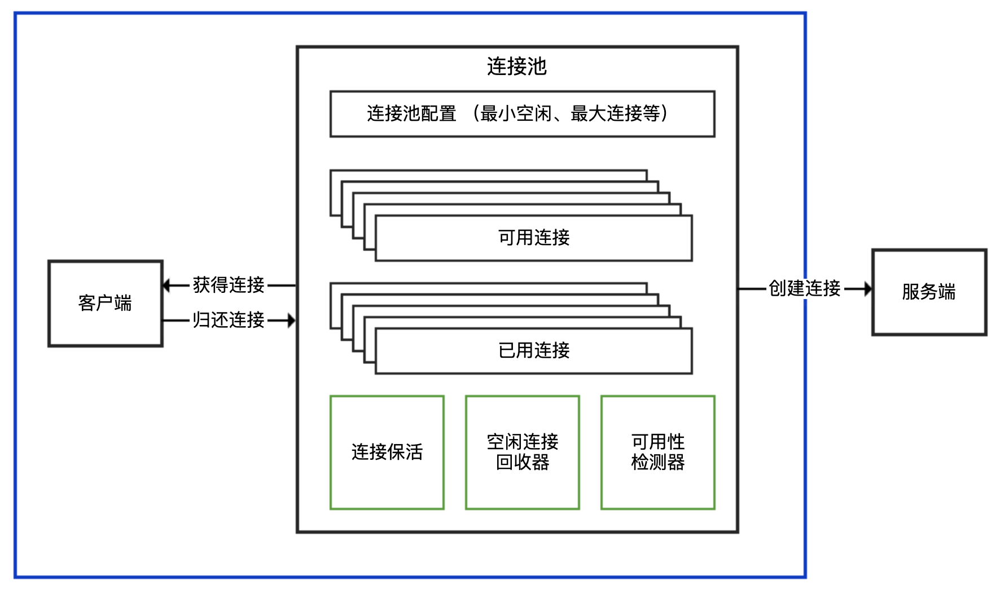

参考课程：

https://learn.lianglianglee.com/%E4%B8%93%E6%A0%8F/Java%20%E4%B8%9A%E5%8A%A1%E5%BC%80%E5%8F%91%E5%B8%B8%E8%A7%81%E9%94%99%E8%AF%AF%20100%20%E4%BE%8B/04%20%E8%BF%9E%E6%8E%A5%E6%B1%A0%EF%BC%9A%E5%88%AB%E8%AE%A9%E8%BF%9E%E6%8E%A5%E6%B1%A0%E5%B8%AE%E4%BA%86%E5%80%92%E5%BF%99.md

**连接池：**

一般对外提供：

1. 获得和归还连接的接口
2. 暴露最小空闲连接数，最大连接数等参数

对内：

1. 连接建立和管理
2. 心跳保持
3. 空闲连接回收
4. 连接可用性检验（比如归还的连接是否是 broken的）

连接池结构示意图：

## 注意鉴别客户端 SDK 是否基于连接池

连接池一般情况下都是面向 TCP 连接，TCP 我们知道，是**面向连接**的**字节流**协议：

- 面向连接，其为了保证可靠性需要三次握手四次挥手。
- 字节流，意味协议本身并不区分报文和报文，**也无法感知是否多个客户端使用同一个连接**。多线程情况下对同一个链接进行复用，可能会产生线程安全问题。

### SDK 对外提供 API 的三种方式

#### 连接池和连接分离开：

提供两个组件：一个XXXPool负责连接池实现，先从其获得XXXConnection，再用这个connection来建立连接。 
