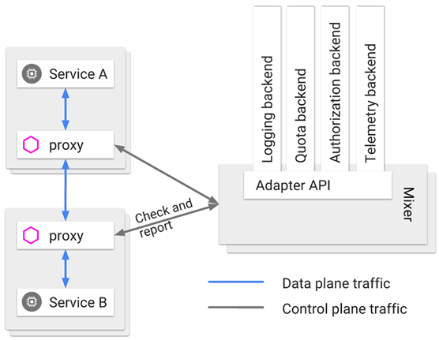

感谢作者本人的开源电子书：http://icyfenix.cn/

# 服务架构演进史

## 原始分布式时代

远程服务调用需要考虑点：

1. 远程的服务在哪里（服务发现）
2. 远程服务的数量（负载均衡）
3. 网络出现分区，超时或者出错该怎么办（熔断，降级）
4. 方法的返回参数该怎么表示（序列化协议）
5. 信息如何传输（传输协议）
6. 服务权限如何管理（认证，授权）
7. 如何保证通信安全（网络安全层）
8. 如何令调用不同机器的服务返回相同结果（分布式数据一致性）

## 单体系统时代

其单体，主要指的不是说“未拆分的大型单体系统”。而是说其内部可以“自给自足”，不需要通过外部的rpc来供给部分能力。

单体系统内部的层次，一定也是根据不同level来进行划分的。

### 单体系统的缺点

有利就有弊，单体系统本身所有的模块，方法的调用全是进程内调用（IPC），简单，高效的同时也意味着彼此之间干扰性极强。

1. 如果一部分代码出现缺陷，导致过度消耗进程空间内自愿，比如内存泄漏，线程爆炸，阻塞，死循环等问题，会影响整个程序，而不只是某一个功能和模块的范围。
   如果是更高层次的公共资源，比如端口号或者是连接池泄漏，还会波及整个机器或者是其他副本的工作（可能抢占了集群对外的资源）
2. 所有代码共享一个进程空间，无法隔离，也就没办法做到单独的停止，更新或者升级一部分代码。（没有停掉半个程序这种操作）。所以单体系统在可维护性上不占优势。程序升级和修改缺陷往往需要专门的停机更新计划和灰度发布等。
3. 技术异构有困难。每个模块的代码通常需要选择一样的程序语言。单体的技术栈异构不一定做不到（比如JNI可以让java混用c++或者c)，但是通常不是最优雅的选择

除了上面这些方面之外，还有最大的一个点要注意：单体系统很难实现`phoenix`的特性，如果一个单体系统大到一定程度，那么最后一定是无法交付的（根据墨菲定律，一定会有地方出错）。那么

## SOA (Service-Oriented Architecture） 时代

## 微服务时代

> 微服务架构（Microservices）
>
> 微服务是一种通过多个小型服务组合来构建单个应用的架构风格，这些服务围绕业务能力而非特定的技术标准来构建。各个服务可以采用不同的编程语言，不同的数据存储技术，运行在不同的进程之中。服务采取轻量级的通信机制和自动化的部署机制实现通信与运维。

现代微服务的定义如上。更关注业务逻辑而非技术上的大一统，允许各个服务之间的技术完全不同，彼此使用轻量级的通信机制和自动化的部署来实现通信和运维。

### 微服务的九个核心业务和技术特征

1. 围绕业务能力构建：

   > 康威定律：有什么样的组织，就有什么样的产品。

2. 分散治理：服务对应的开发团队具有直接对服务运行质量负责的责任，也有不受外界干预的掌控服务各方面的权力。
   虽说大部分情况下，公司内部对于技术栈有一个建议的标准，比如java或者Golang等，但是确实有必要异构时，要有“不统一”的权力。比如人工智能训练模型时候可以选择python

3. 通过服务来实现独立自治的组件：
   尽管远程服务有更高昂的调用成本，但是这是给组件带来隔离和治理能力的代价。

4. 产品化思维：不只是做一个项目，而是去对其整个生命周期负责，包括作为其他用户的支持者。之前单体架构的情况下，很难每个人知道自己服务的方方面面，但是在微服务的体系下是可以的。

5. 数据去中心化：数据应该按照领域去**分散**的管理，更新，维护和存储。同一个实体，在不同的服务视角之中形态也往往不同，各个服务的侧重点不同，就很难用一套模型去代表。这部分会面临分布式事务的问题。

6. 强终端弱管道：管道本身不要“全家桶”，比如SOP有很多协议族来处理事务，一致性或者认证授权这些工作，因为不是所有的微服务都需要这些功能。如果服务自己需要额外的通信能力，就应该在服务自己的endpoint解决，而不是让通道来处理。

7. 容错性管理：接受服务总会出错的现实。有自动化的机制对依赖的服务进行快速故障检测，在持续出错时候隔离，在恢复的时候重新联通。
   没有容错性的设计会因为一两个组件的崩溃带来的血崩效应gg

8. 演进式设计：服务会被报废，一个设计良好的服务，不应该出现无法替代的情况。

9. 基础设施自动化：在成千上万的示例面前，人工运维是很难支撑的。

微服务追求的是更加自由的架构风格，那么一定会出现百花齐放的场景。每一个部分都有很多的解决方案，作为一个螺丝钉而言，一个服务大概率不需要在所有方面进行引入，那么就不会这么复杂；另一方面spring cloud这样的工具，通过一致的声明和配置，进一步降低了复杂度和切换成本。

但是对于架构师而言，每一种的优劣势都要烂熟于心，是一个地狱般的挑战。

## 后微服务时代

微服务时代，各种“协调”的功能都是由软件定义出来的，比如安全部分使用spring cloud，但是这只是一种当下妥协的方案（硬件层面的进展赶不上软件），如何能在硬件层面做这一切呢？这就是"虚拟化"和"容器化"。

下面是两种方案的对比：

表 1-1 传统 Spring Cloud 与 Kubernetes 提供的解决方案对比

|          | Kubernetes              | Spring Cloud          |
| -------- | ----------------------- | --------------------- |
| 弹性伸缩 | Autoscaling             | N/A                   |
| 服务发现 | KubeDNS / CoreDNS       | Spring Cloud Eureka   |
| 配置中心 | ConfigMap / Secret      | Spring Cloud Config   |
| 服务网关 | Ingress Controller      | Spring Cloud Zuul     |
| 负载均衡 | Load Balancer           | Spring Cloud Ribbon   |
| 服务安全 | RBAC API                | Spring Cloud Security |
| 跟踪监控 | Metrics API / Dashboard | Spring Cloud Turbine  |
| 降级熔断 | N/A                     | Spring Cloud Hystrix  |

如果虚拟的硬件可以跟上软件的灵活性，那么和业务无关的技术性问题就可能从软件层面剥离开，这样软件就只专注于业务相关的部分。这就为进一步达到“透明的分布式应用”成为可能。

单纯的kubernetes效果不够好，因为在container层面的配置规则相对比较粗放，对于一些在应用系统和基础设施边缘的问题，不好做精细化管理：

比如微服务A调用了微服务B的两个服务，B1和B2，假设B1正常但是B2一直持续500 error，那么一定阈值之后就会对B2熔断，以免产生雪崩效应。只在基础设施层面的话，切断A到B的网络会影响到B1的正常使用，而不切断的话就会持续收到B2的错误影响。

在这种情况下， 虚拟的基础设施很快完成了第二次进化，引入了被成为服务网格(service mesh)的“边车代理模式”，也就是系统自动在服务容器之中注入一个代理通信服务器，接管应用对外的所有通信。

这个代理，除了实现正常的服务间通信之外（数据平面通信），还接受来自控制器的指令（控制平面通信）。控制平面之中的配置，会对数据平面的通信进行分析处理，来实现：

1. 熔断
2. 认证
3. 监控
4. 负载均衡

等等功能，这样就不用在应用层面加入额外代码，也不亚于程序代码的管理能力。



图来自 Istio 的[配置文档](https://istio.io/docs/reference/config/policy-and-telemetry/mixer-overview/)，图中的 Mixer 在 Istio 1.5 之后已经取消，这里仅作示意

# 访问远程服务

## 远程服务调用

### 进程间通信

先看一下本地方法调用的时候，计算机如何处理：

```java
// Caller    :  调用者，代码里的main()
// Callee    ： 被调用者，代码里的println()
// Call Site ： 调用点，即发生方法调用的指令流位置
// Parameter ： 参数，由Caller传递给Callee的数据，即“hello world”
// Retval    ： 返回值，由Callee传递给Caller的数据。以下代码中如果方法能够正常结束，它是void，如果方法异常完成，它是对应的异常
public static void main(String[] args) {
	System.out.println(“hello world”);
}
```

在不考虑编译器优化的前提下，程序运行的时候需要完成的工作包括：

1. 传递方法参数： 将`helloworld`的引用地址压栈
2. 确定方法版本：根据`println()`方法的签名，确定其执行版本。
   这个部分需要明确找到唯一的callee，或者是有严格等级优先级的多个callee，比如不同的重载版本。
3. 执行被调方法：从栈之中弹出`parameter`的值或者引用，以此为输入执行`callee`内部逻辑。
4. 返回执行结果：将 callee 的结果压栈，且将指令流恢复到call site的下一行指令，继续向下执行

**但是如果caller和callee补在一个进程之中呢？**

至少两个障碍：

1. 第一步和第四步需要的传递参数和返回结果，都需要栈内存的帮助，但是如果二者分属不同的进程，就不会拥有相同的栈内存，压栈等等毫无意义（不同进程的压栈）
2. 第二步的方法版本取决于语言规则的定义，如果caller和callee不是一种语言实现的程序，方法版本选择就是一种模糊的不可知行为（可以通过追加更详细的定义来指定，下文会讲）

暂时简化第二个障碍，假设caller和callee是一种语言实现的，下面是两个进程之间如何交换数据的问题：

1. 管道活着具名管道（named pipe）：普通管道只允许有亲缘关系进程（由一个进程启动的另一个进程）之间的通信，具名管道除此之外还允许无亲缘关系进程之间的通信。比如：

   ```sh
   ps -ef | grep java
   ```

2. 信号（signal）：通知目标进程某件事情要发生，除了用于进程间通信之外，还可以发送信号给进程本身，比如：

   ```sh
   kill -9 pid
   ```

3. 信号量（semaphore）：信号量用于两个进程之间的同步协作，相当于**操作系统**提供的**特殊变量**，程序可以在上面进行wait和notify操作

4. 消息队列（message queue）：用于传递**较多信息**，但是实时性受限

5. 共享内存（shared memory）：允许多个进程访问**同一块**公共内存空间，是效率最高的进程间通信模式。当一块内存被多个进程共享时，哥哥进程一般需要和其他通信机制，比如信号量结合使用，来达到进程之间同步和互斥的协调操作。

   > 个人认为比如epoll的方式就是共享内存，毕竟网络进程和业务进程共享一块内存来避免在内核态和用户态之间相互拷贝

6. 套接字接口（socket）：是更普适的进程间通信机制，也可以用于不同机器之间的进程通信。当只在本机进程之间相互通信时，不会经历网络协议栈等等，只是将**应用层数据从一个进程拷贝到另外一个进程**

### 通信的成本

之所以RPC不能按照IPC来看待，就是因为在分布式环境之中，网络本身和单机的通信方式是不一样的。比如下面的一些问题：

> - 两个进程通信，谁作为服务端，谁作为客户端？
> - 怎样进行异常处理？异常该如何让调用者获知？
> - 服务端出现多线程竞争之后怎么办？
> - 如何提高网络利用的效率，譬如连接是否可被多个请求复用以减少开销？是否支持多播？
> - 参数、返回值如何表示？应该有怎样的字节序？
> - 如何保证网络的可靠性？譬如调用期间某个链接忽然断开了怎么办？
> - 发送的请求服务端收不到回复该怎么办？
> - ……

再后面的一众大佬总结出来的通过网络实施分布式运算的八宗罪：

> 1. The network is reliable —— 网络是可靠的。
> 2. Latency is zero —— 延迟是不存在的。
> 3. Bandwidth is infinite —— 带宽是无限的。
> 4. The network is secure —— 网络是安全的。
> 5. Topology doesn't change —— 拓扑结构是一成不变的。
> 6. There is one administrator —— 总会有一个管理员。
> 7. Transport cost is zero —— 不必考虑传输成本。
> 8. The network is homogeneous —— 网络是同质化的。

至此，学术界的主流观点是RPC应该是一种高层次或者语言层次的特征，而不是像IPC那样低层次的特征。

### 三个基本问题

1. 如何表示数据：其中数据包括了传递给方法的参数，以及方法执行之后的返回值。
   此处的难题是远程方法调用的双方可能面临使用不同程序语言的情况，包括但不限于：

   1. 不同程序语言
   2. 不同硬件指令集
   3. 不同操作系统

   这些情况下，同样的数据类型也完全kennel表示不一样的细节，比如数据宽度和字节序的差异等等。

   那么有效的做法就是将交互双方涉及的数据转换为某种约定好的中立数据流格式进行传输，再将数据流转换回不同语言之中对应的数据类型来使用，也就是序列化和反序列化

2. 如何传递数据：一般传递数据指的是应用层协议，实际传输一般是用标准的tcp，udp等进行的。一般包括：

   - 异常
   - 超时
   - 安全
   - 认证
   - 事务
   - 授权

3. 如何确定方法：在不同语言之中，每种语言的方法签名又可能会有差别，所以又搞出来一个跨语言的标准，比如当初DCE规定的UUID

## REST设计风格

### REST和RPC的不同

远程服务调用效率：REST一般用于浏览器，对于传输协议和序列化器并没有什么选择权

追求简化调用：真支持http协议的rpc协议，也没真的把他们用到浏览器上面的

至于分布式对象，提升调用效率，简化调用复杂性等等，和REST本身几乎没有任何关系

### 理解REST

REST，表征状态转移，其名字来自（**Re**presentational **S**tate **T**ransfer）。这个REST本质上是HTT（**H**yper**t**ext **T**ransfer）的进一步抽象。

下面是作者文中的一些讲解：

1. 资源（resource）：比如正在阅读一篇文章，那么这个文章内容本身就是资源
2. 表征：（representation）：一篇文章，在用浏览器看的时候，请求的是其html格式，而服务端
