#  1. 比特币中的密码学原理

##  比特币之中的算法性质

1. collision resistance: 对于hash算法 H(x)而言，除非暴力穷举尝试，无法制造出两个值x 和 y，让H(x)= H(y)。在实践上，还要让hash的分布足够均匀，不然暴力穷举所需时间会大大减小
2. hiding: 对于x而言，H(x)不包含x的任何本源信息，也就是哈希过程必须单向不可逆。
3. puzzle friendly: 对于一个给定的输出，无法倒推出输入应该具有的性质，只能穷举，在比特币算法之中用作POW。比特币POW的核心就是找到一个Nonce，和block header中其他数据一起算hash，得到的hash在一个范围内就合法，否则非法

# 2 比特币的数据结构

使用的是哈希指针：保存了区块的位置和哈希值，用来保证区块没有被篡改过

从创始区块开始，到后面的所有区块，每一个区块之中的hash值都是前面一整个区块取hash，这样就保证了从头到尾一旦有地方有改动，从这个点就无法校验

每一个区块之中保存的都是一个默克尔树

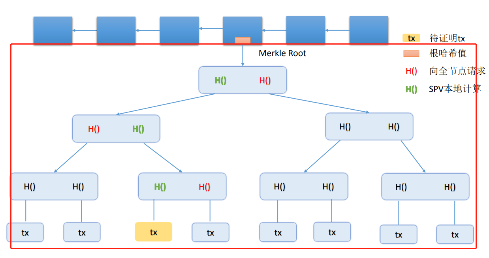

每一个block有两个部分，block header和blocker body，blocker header之中有merkle tree的根hash值，blocker body有交易的真实内容

## merkle proof

比特币的节点分为两种，一种是全节点，包含所有的区块链内容以及交易内容；一种是轻节点，只包含对应的block header，不包含交易内容，比如手机上的比特币钱包应用。

那么轻节点对于一个交易的验证，就是需要**对方**提供merkle proof：

A向B转账，那么A要给B发送tx本身和merkle proof。其中图片中标黄的是需要证明的转账，可以本地计算出绿色部分的哈希值。从此处到merkle tree root的所有路径，需要途中标红的哈希值，那么这些值都需要在网络中向全节点去请求才行。这也就是merkle tree的功能：proof of membership.

# 4. 比特币的共识协议

要在分布式系统之中解决两个问题：

1. 如何发行货币
2. 如何防止双花攻击

对于比特币转账而言，需要指定币的来源，转账方的公钥和币的走向：

1. 指定币的来源：防止假币和防止双花。防止双花是在交易结构之中不断回溯，比如下图中，要验证B给F转账5个比特币，就需要找到当前区块和B这5个币来源区块之间的所有区块，同时进行回溯，回溯到中间发现这5个币已经被花过了，就会拒绝这一次转账。
   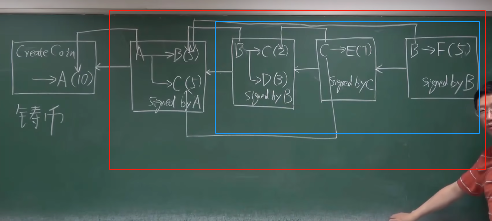

   **为什么需要A的公钥？**

   不仅是B，所有旁观者都需要知道A的公钥来进行验证数据是否可信。

## block本身数据结构

### block header： 区块头

1. version: bitcoin协议版本
2. hash of previous block header: 前一个**block header**的hash，注意不是整个block取hash
3. merkle root hash
4. target: 挖矿难度
5. nonce: 算出符合条件的随机数

### block  body：区块体

由许多交易组成，交易本身会组成一个merkle tree

## 分布式共识 distributed consensus

1. 最新区块应该连接在最长合法链后面，不可以在链中间插入区块以尝试做到回滚交易

# 5 比特币系统的实现

 每一个全节点都要维护一个UTXO(unspent transaction output)列表，这个列表中有所有账户的未花费的资金和对应的区块的hash pointer。每一次转账，都会让某一个或几个UTXO从列表中消失（因为被花费），再生成一个或者多个UTXO（有些账户上被转了钱）

## 记账奖励

对于转账而言，一般total inputs 都会大于total output，其中的差值就是给这个节点记账的奖励。

如果没有这个奖励，记账节点并没有去记录他人交易的动力（要消耗算力和带宽等等）

## block header里面的数据结构

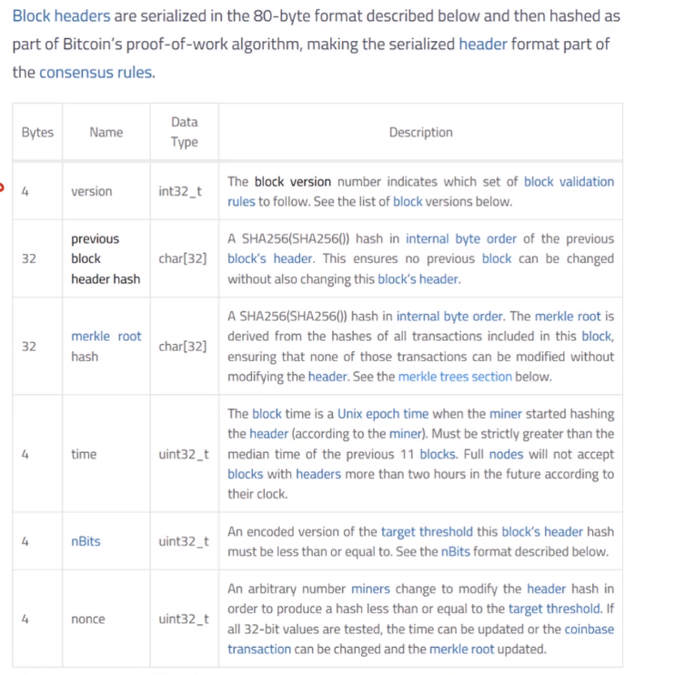

1. 目前面临的问题是，nonce只有2^32这么大的搜索空间，但是因为参与竞争的人太多，难度太高，导致nonce可能遍历都没法找到符合条件的数值，就需要在header里面找其他字段一起修改

   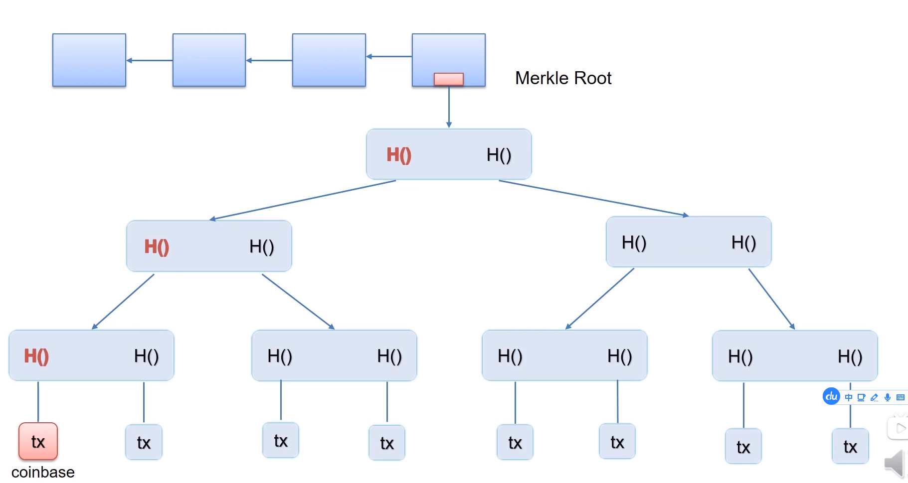

   header字段一一盘点，能进行修改的只有三个字段：

   1. time：比特币系统对时间没那么敏感，那么可以通过前后微调来改变
   2. nonce：挖矿需要修改的主力
   3. merkle root: 通过每个区块的coinbase tx修改，coinbase tx可以填写任何的内容，从而沿着上面这条链路从下往上进行影响，最后对merkle root进行影响。可以当做extra nonce

## 为什么要progress free的算法

先介绍几个概念：

1. bernoulli trial: a random experiment with binary outcome，典型情况就是掷硬币
2. bernoulli process: a sequene of independent Bernoulli trials，一系列的bernoulli trial的集合， 近似于泊松分布

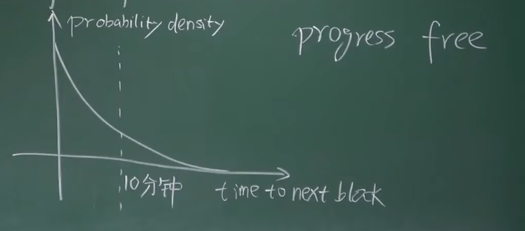

上图中横轴是出块时间，纵轴是出块的概率密度。这个过程是progress free的，也就是说之前的结果对之后无影响。做一个假设，系统之中的所有矿工算了10分钟仍然未出块，那么下次出块的时间期望还是10分钟，没有区别。

可见其从任何一个地方切断，剩下的部分都还是一样的形状，这也是其progress free的一种体现

#  6 比特币网络的工作原理

## 流程概览

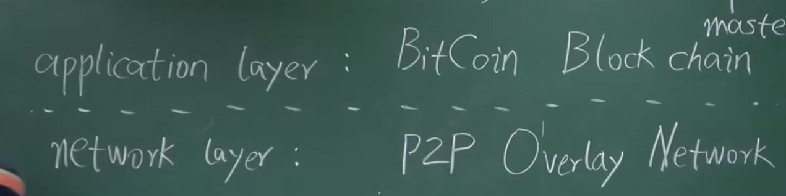

比特币网络是应用层的协议，其网络层是基于p2p的，这个p2p网络中没有任何的特殊节点，每个节点都是对等的。

新启动一个节点的时候，是这个新节点先和seed node联系，获得网络的信息。

如果要退出，直接关闭即可，其他节点一段时间没收到消息就会将这个节点删除掉。

**消息传播机制**

flooding，洪泛，每个节点第一次收到消息时候会向自己所有相邻节点广播。

相邻节点的选取也是随机的，不根据地理位置之类的属性，所以比特币网络中向身边的人进行转账和向远方的人转账，效率相同

# 7 比特币的挖矿难度调整

## 难度算法

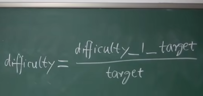

其中difficulty_1_target是当difficulty 为1时候的target,是一个很大的数，从等式可见difficulty和target成反比关系。

## 出块时常为何要保持恒定

比特币中出块时间为10min，以太坊中是15s，虽然相差40倍，但是都是一个恒定的常数。原因是如果不定期调整挖矿难度，随着系统中算力的增强，出块时间会越来越短，假设一个块的时间是一秒，那么同时可能有十个分叉一起在系统中存在。假设系统中有一些坏节点要做51%攻击，那么坏节点会只延长自己的攻击链，而好节点因为系统中分叉过多，平均下来每一条链上的算力都不大，这样做51%攻击要修改转账记录的难度就小很多。

## 挖矿难度调整公式

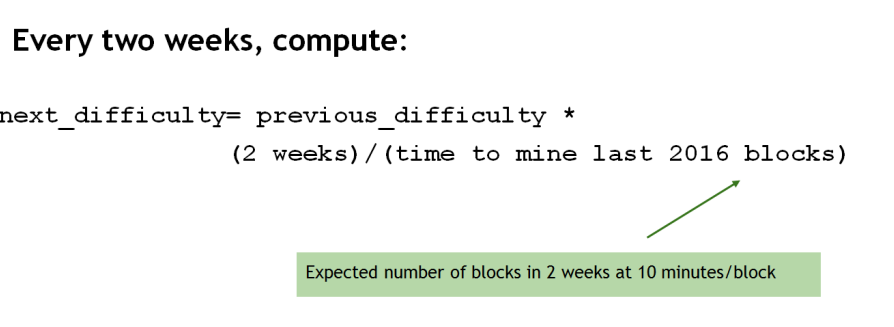

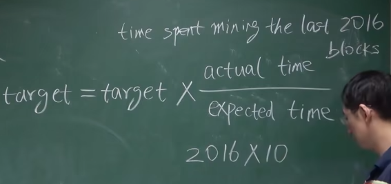

target的增加是有上限的，不能增大或者减少超过之前的4倍，防止系统出现偶发故障从而目标阈值改变过大

# 8 比特币挖矿

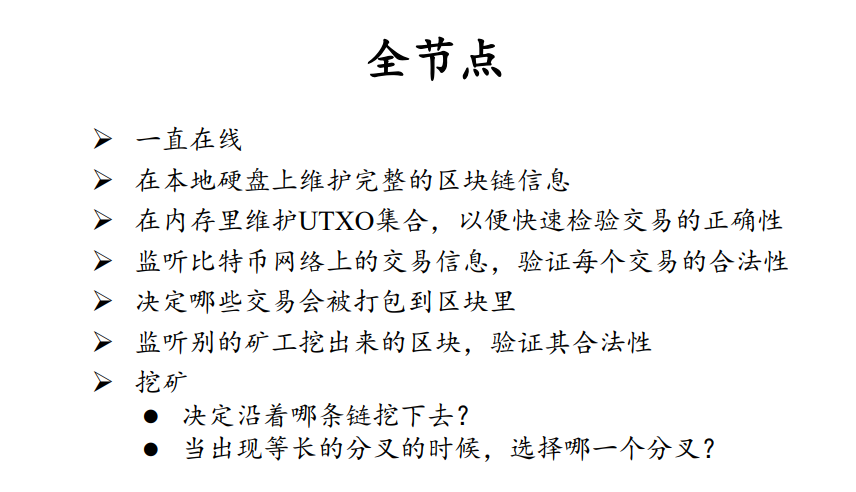

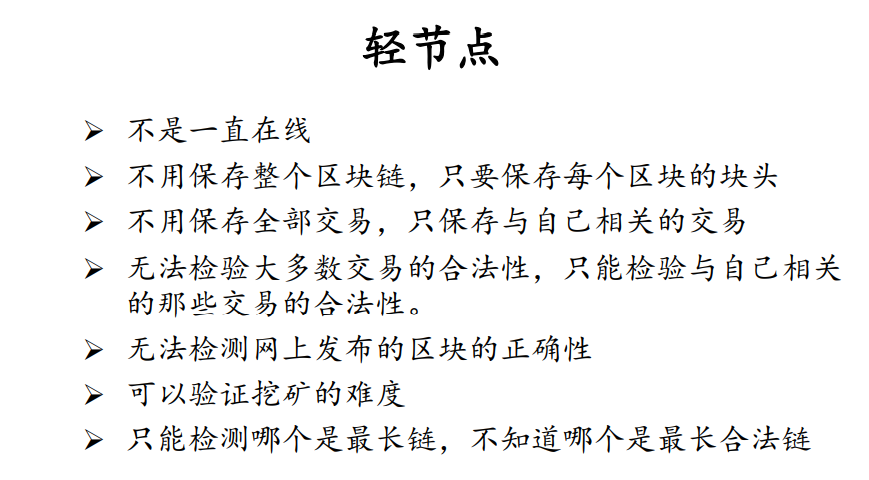

## 矿场机制

矿场中，给不同矿工分配hash段然后让矿工去尝试，其中挖到矿的矿工的币由所有人分配。

**如何确定每个矿工要分配的比例**

用 almost valid block，比如target比目标区块target大很多的区块数量来识别。这个almost valid block本身在比特币网络中什么用处都没有，只是用来矿场内部分配币的场景使用。

### 如何防止偷块

万一一个矿工挖到符合链上条件的区块就直接发布呢？挖到almost valid block再提交给矿主，这样赚取双份收益不行吗？

不行。因为每一个区块中的coinbase tx部分要填写收到这个铸币交易的块的地址，这个地址在矿主分配的时候就已经填写好了矿主自己的地址，所以符合条件的区块的收款方是没法篡改的

# 9 比特币脚本

pay to script hash 这种方式主要是加入了对于多重签名的支持

多重签名的顺序必须和公钥的顺序一致， 不可以调换顺序

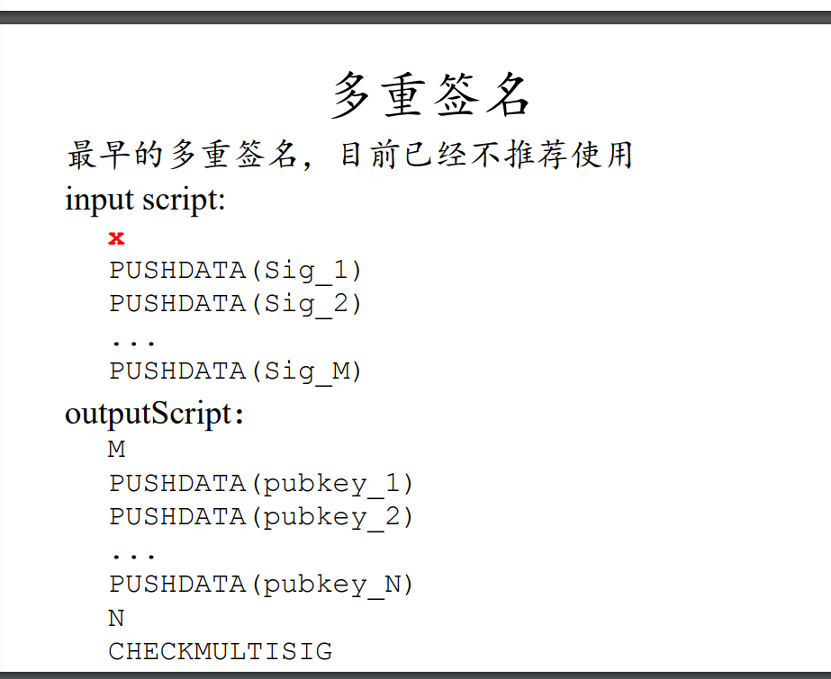

### 为什么不再使用

因为这种实现方式需要用户自己去拿到签名个数M和总得公钥数量N，相当于是把复杂度暴露出去给用户了，所以不太实用。

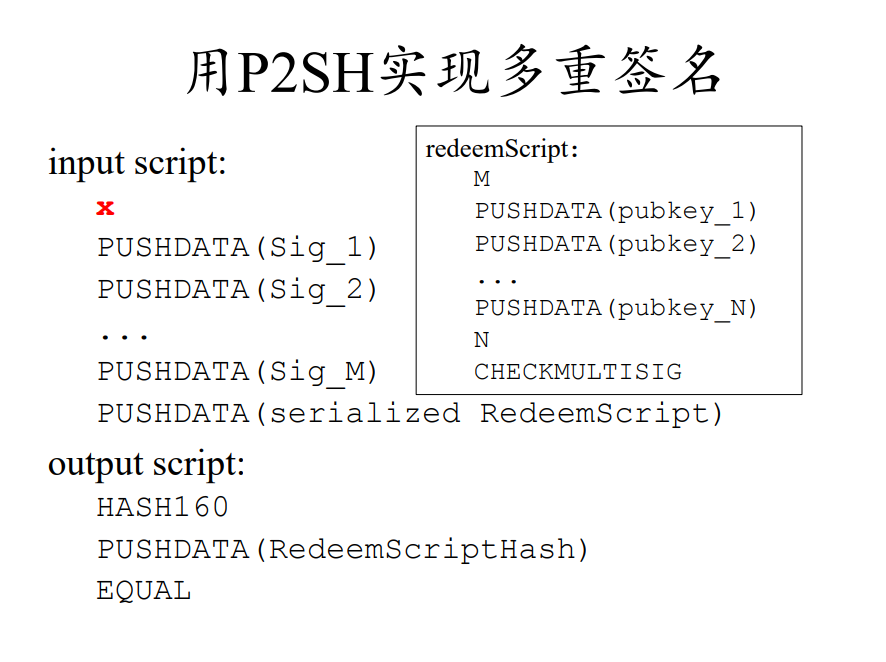

用P2SH的方式，这些M，N等等复杂度直接放在redeemScript里面了，直接使用这一段script就可以。

# 10 比特币分叉

## 硬分叉

硬分叉，比如某些协议的大升级，有一部分节点如果不认可这部分交易，就会保持原样不变，同时只支持原来协议的链，这样就导致了硬分叉——你挖你的 我挖我的

硬分叉前的币在硬分叉之后的两条链都存在。

### 硬分叉的问题？

交易回放。比如在分叉1上：A->B, 再 B->A。但是在分叉2上面B只重放了B->A的交易（因为两条链的算法，账户是一致的），这样就导致B的损失。

解决方法：各自加上chainId作为区分

## 软分叉

一种情况：原本的区块大小为1M，更新过后的为0.5M，那么如果一部分老节点仍旧沿着最长合法链坚持1M的区块，会被新节点不断忽略，这样老节点就不得不更新版本。

此处的”软分叉“指的是分叉不会一直存在

 **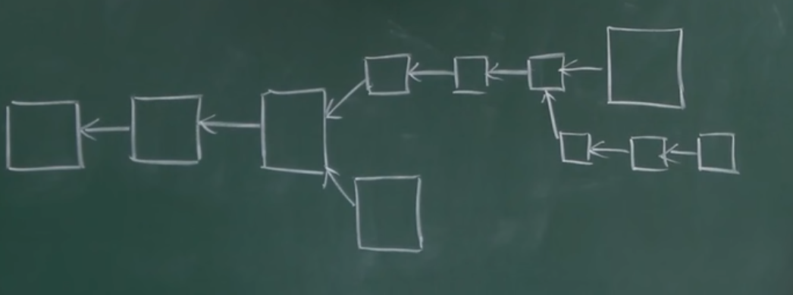**

# 11 问答

# 12 比特币的匿名性

# 15 ETH 账户

ETH是基于账户的模型（account-based ledger)

 ETH之中不会有double spending，但是会有replay attack。replay attack指的是比如A在给B转账，那么B在收款之后重放一次这笔交易，这样就会让自己的钱变多。为了防止这个问题，ETH设计之中是需要将nonce一起签名的，这个nonce就是用户的转账次数，类似于一个计数器。

## ETH账户分类

1. externally owned account: 普通账户，有balance 和 nonce两个属性
2. smart contract account: 智能合约账户，有balance, nonce, code 和storage四个属性

# 16 以太坊中的状态树

## 几种不行的方式

我们需要一个状态，来保存 地址->状态 的映射，可以方便的CRU

### HashTable

优点：查找效率很高

缺点：

	1. 无序，不同节点汇聚出的merkel树不一致
	1. 每次更新时候需要汇聚出所有节点的状态，merkel树太大

## Merkel Tree

仿照比特币的数据结构，将所有状态汇聚成一颗merkel tree, 在区块头之中存储merkel root hash

优点：每次更改账户状态时，都只会更改极小部分账户的内容，只需要针对这部分账户的merkel tree做更新，大部分不用动

缺点：不同节点merkel tree 不一致导致其树不一致，无法统一。换成sorted merkel tree的话，如果在中间需要添加一个账户，那么从这个点往后，所有的节点状态都需要改动

## 可以的方式： merkel patricia tree

patricia tree是一个已经压缩过的trie，对于patricia tree而言，数据分布越稀疏，那么压缩效率就越高

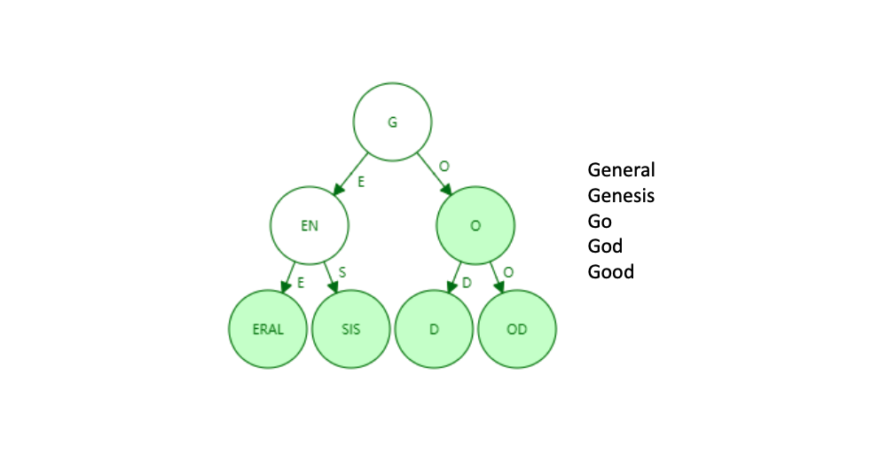

而merkel patricia tree 就是用哈希指针来代替普通指针的方式。

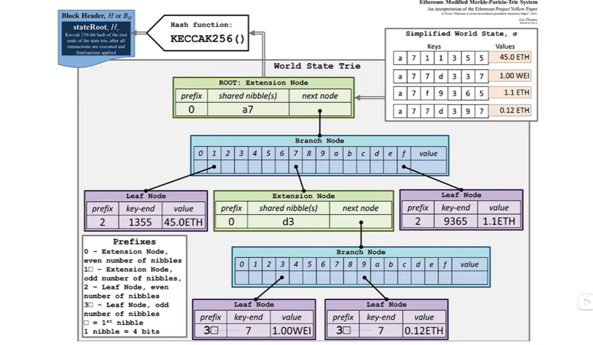

状态树的一个例子，一共有四个账户，都在右上角

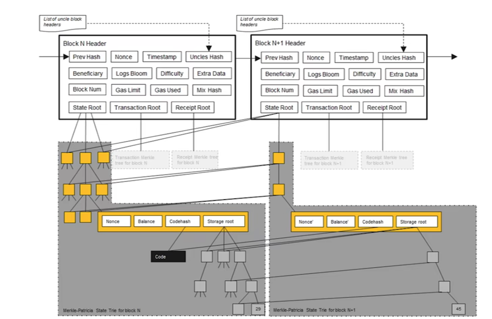

这里面的例子是前后两个区块，对于状态树而言，可以看到没有修改过的账户是直接指针指向之前的节点的，只有修改的账户才会存在于现在的节点之中，也就是说两棵状态树共享绝大部分节点。

### 为什么要保存历史状态

以太坊的出块时间是15秒，那么节点竞争的情况会比比特币更普遍。

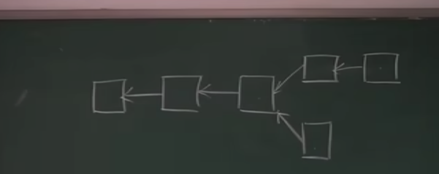

两个节点同时拿到记账权，下面这个链被抛弃掉了，那么下面这个节点需要回滚到前一个区块的状态，再在上面这个链上来加长。不像比特币的简单脚本，以太坊之中支持的编程语言是图灵完备的，没人能推算出之前的状态。如果不保存之前状态，就没有办法回滚操作。

### 以太坊区块头内容

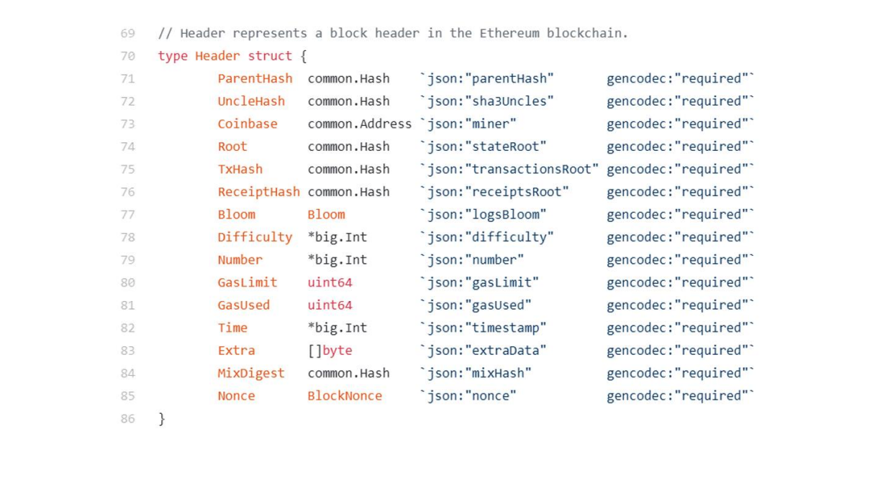

Root, txhash和receiptHash三棵树，分别是账户树，交易树和收据树。

Bloom是布隆过滤器，可以以某种条件进行查找，提供方便的查找能力

# 17 以太坊中的交易树和收据树

以太坊中的三棵树，账户树，交易树和收据树都是MPT，交易树和收据树查找的键值使用的是这个交易的序号。

因为交易和收据是每个区块不同，所以交易树和收据树也是不需要共享节点，每一个区块都是一个独立的树。

## 快速查找功能

如何快速查找？以太坊提供bloom filter 的功能。比如要查找十天之内某一个类型的交易，不可能一个一个区块去筛查，那么就先查找其块头，如果块头可以命中bloom filter再查找区块内容，不能命中的话直接就不查找了。这样可以大大减少查找数量。

**以太坊可以看作是交易驱动的状态机**

# 18 以太坊中的共识机制——ghost协议

