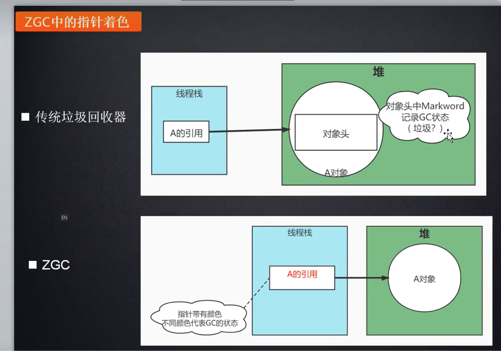
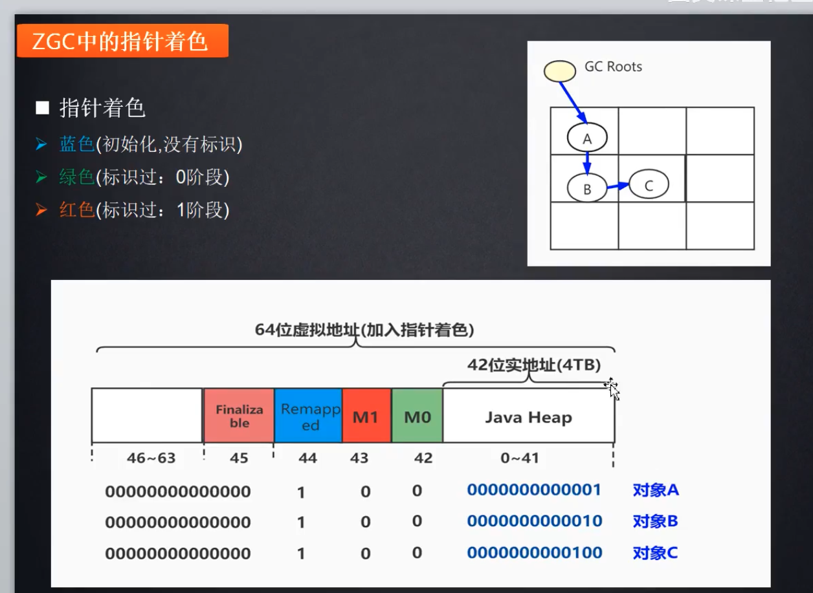
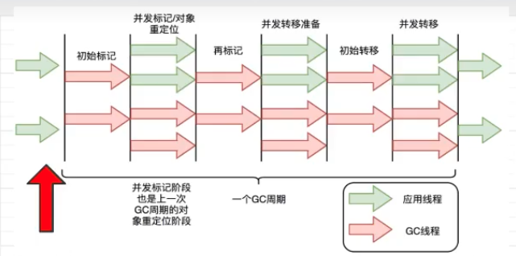
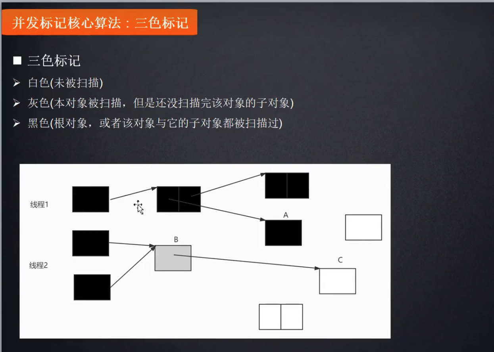
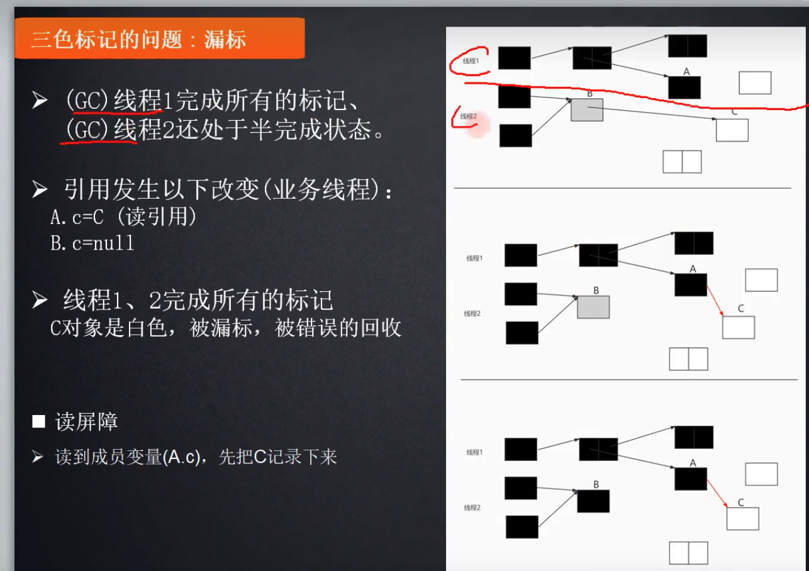
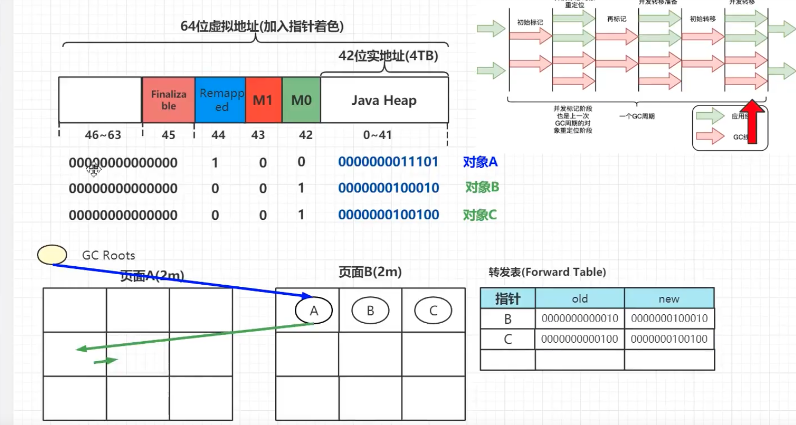
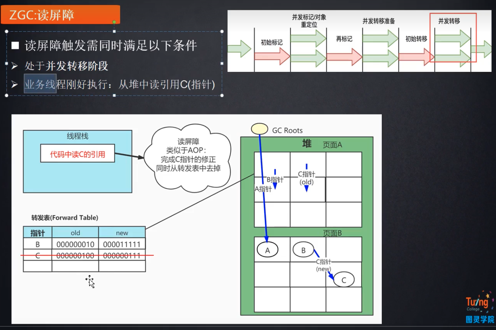
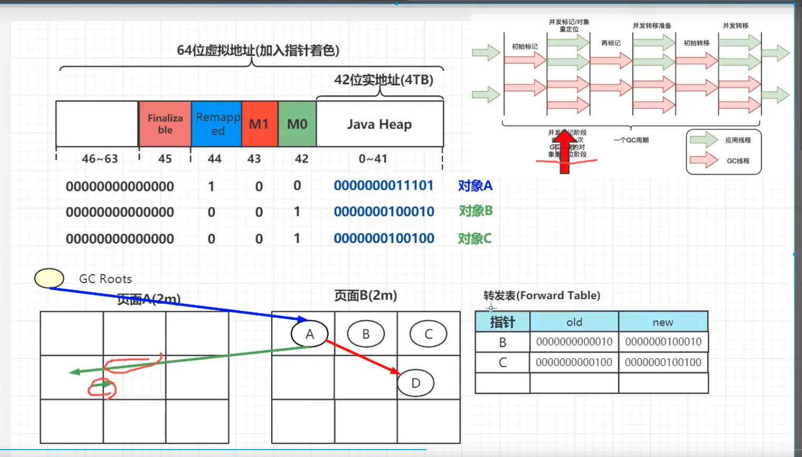
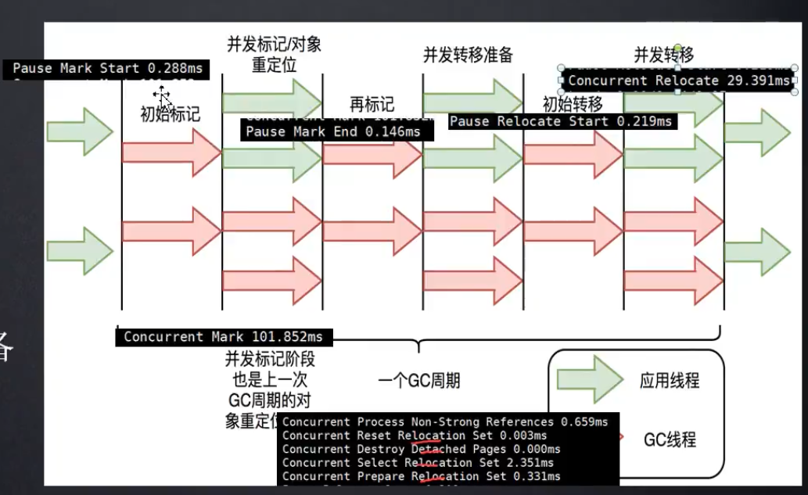

教程地址：https://www.bilibili.com/video/BV1xF411B7vZ?p=3&vd_source=5573e3970c6563a22e820636f33085f1

# 03 ZGC高并发秘诀之指针着色技术

## 传统GC回收器和ZGC回收器在实现上的区别

可以看到在传统垃圾回收器（比如CMS）之中，对象GC的相关信息是写在对象头之中的markword里面的，那么在扫描的时候就得进入堆内部的具体对象去操作。

ZGC之中，直接对线程栈之中**对象的引用**进行着色，指针的不同颜色代表GC的不同状态。

## 寻址

### 为什么32位系统最多支持4GB内存？

32位系统，也就是指针位数为32，那么最多可以寻址2^32^个地址。

我们算一下，2^10^是1KB，那么2^20^是1MB，2^30^是1GB，正好*4， 就是4GB内存寻址。

## 分区

ZGC是分区的，三种页面共同组成一个堆空间，而非是传统的分代（新生代，老年代等等）

- 小页面（2M），对象大小<256K
- 中页面（32M），对象大小256~4M
- 大页面（>32M），对象>4M

大部分java对象都是很小的，所以一般都在小页面里面

**复制算法**

ZGC走的是复制算法，也就是把每个页面之中存活的对象进行复制，再到另外的页面之中。

上面我们说过，主要是小页面，而且Java之中的大部分对象是生命周期很短的，这也是为什么复制效率比较高的原因

## 64位指针寻址方式

其中remapped,m1和m0三个位只能有一个为1

## 全流程

### 初始标记

初始标记的部分，只标记GC root和其相连的对象，后面都是并发标记。**1ms之内**

### 并发标记

并发标记使用的深度算法，三色标记

所谓的漏标，就是在多个线程同时进行GC标记的时候，一个对象在某个线程扫描完之后在并发标记阶段又和其产生的联系，但是本来扫描到这个后面链接对象的线程已经结束了，导致漏标。

**解决方案：**

使用读屏障，读到成员变量(A,c)的时候就先把C记录下来。

遇到上面这种“读引用”的代码，类似于AOP一样，进行在其读取上面插入一个记录引用的操作。这个是JVM之中的代码处理

### 再标记

就是解决漏标的问题。很短的STW时间，**1ms之内。**

### 并发转移准备

进行分区之中的筛选，统计，从而选择性的进行分区回收。

### 初始转移

1. 只转移和GC Roots相关的对象
2. 转换其指针颜色到蓝色（remapped结束），其地址也会相应进行变化

STW： 也是和GCRoot相关，和堆空间无关，1ms

### 并发转移

在B和C被转移到页面B的时候，其A之中指针的方向还是没有改变的（对象正在被使用，无法改变其内部的其他对象的指针值）。会出现途中的两个原本是B和C对象，但是实际为空的情况。

使用转发表进行信息的记录，在复制完对象之后，把对应对象的前后地址放入转发表。

在访问数据的时候，如果读屏障被触发，需要做两件事情：

1. 在转发表之中删除访问到的对象转发途径
2. 修改访问到的对象的指针

JIT实现，读屏障的损耗大概是4%

### 对象重定位（下次GC）

如果只需要标识是否为对象或者垃圾，只需要两种颜色，一种蓝色意味着GC roots，一种绿色意味着正在扫描的对象。

为什么需要红色？三种颜色，红，绿，蓝，其中红色是标识下一次GC。

在下一次GC的时候，会做这么几件事情：

本次在GC root被蓝色标识之后，和其相连的对象都会用红色来标识。在过程之中，如果发现了之前遗留的绿色指针，那么就会结合转发表进行修正，同时清除转发表的内容。

# 举个例子

可以看到，STW的部分，初始标记pause mark start 一共0.288ms, 再标记 pause mark end 0.146ms, 初始转移 puase relocate 0.219ms， 一共一起不到1ms的STW时间

