# 第二章

Spring Boot 的理念 ，配置尽量简单并且存在约定，屏蔽 Spring 内部的细节， 使得 Spring 能够开箱后经过简单的配置后即可让开发者使用，以满足快速开发、部署和测试的需要。

> 大部分的时候，默认的配置已经足够，因此不需要开发者每次都去重复一样的逻辑写法，繁琐复杂

2. spring boot的加载顺序：

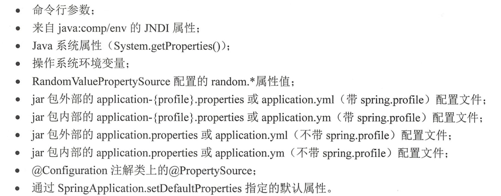

可见其是先命令行，后面再使用配置文件，再注解进行配置

3. 作者在这一章带着创建了一个最基本的spring MVC项目，其中前端是用jsp形式展示的，controller只是用于控制要返回哪一个页面

# 第三章

1. spring之中所有操作的业务对象都是spring bean, 管理这些bean的容器，就是spring IoC容器。IoC容器需要具备两个特征：
   
   1. **通过描述** 管理bean，包括发布，获取bean
   2. 通过描述完成bean之间的**依赖关系**

2. spring的定义之中，要求所有的IoC容器都要实现接口 `BeanFactory`, `BeanFactory` 之中具有最基本的容器功能，比如：
   
   1. 按照名称/类型来拿取bean，这部分对于后面的依赖注入(DI)是很重要的。
   2. 获取bean的类型

3. 但是BeanFactory只有一些最基本的功能，所以spring在其之上又增加了一个接口`ApplicationContext`。 新增了一些扩展接口，比如：
   
   > 消息国际化接口（MessageSource）、环境可配置接口（EnvironmentCapable）、应用事件发布接口（ApplicationEventPublisher）和资源模式解析接口（ResourcePatternResolver

4. 在spring之中，用注解的方式进行bean的创建更为简便，可以将想要创建的类上面打上  `@Component`，在对应的field上面打上 `@Value`来进行初始化。注意 `@Value`的传参必须是String类型。
   
   > Note that actual processing of the @Value annotation is performed by a BeanPostProcessor which in turn means that you cannot use @Value within BeanPostProcessor or BeanFactoryPostProcessor types. Please consult the javadoc for the AutowiredAnnotationBeanPostProcessor class (which, by default, checks for the presence of this annotation).
   > 
   > 这是官方对于 @Value 注解的使用说明，因为是在 BeanPostProcessor 里面进行填值的逻辑，所以不能在这两个类之中使用。

5. @Component 默认的行为是：将类名的第一个子母小谢，其他不变作为bean的名称，放入IoC容器之中。
   
   默认 @ComponentScan 之中，也只会扫描其所在类的当前包和子包。
   
   ## @Autowired

6. @Autowired 是根据类型去装配的，如果根据类型找到不止一个bean，那么会去试图匹配属性的类型：
   
   ```java
   @Component
   public class BusinessPerson implements Person {
       @Autowired
       private Animal dog;
   ```
   
       @Override
       public void service() {
           this.dog.use();
       }
       
       @Override
       public void setDog(Animal dog) {
           this.dog = dog;
       }
   
   }

```
上面这种，哪怕有多种类型的 Animal 类型的bean，框架也会试图去匹配 dog 这一种类型的 Animal 的实现

2. @Autowired 注解本身还可以标注方法，这样就会让方法之中需要的参数从IoC容器之中找到并且注入

3. @Autowired还可以用在方法的参数上面

## 消除歧义——@Primary和 @Qualifier

1. @Primary 是修改优先权的注解，在此次需要的类上面加上这个注解，就可以让IoC容器在有多种同样类型的bean的时候优先使用这个bean进行注入。
2. 但是如果多个类上面都用 @Primary 进行修饰呢？大家都有，怎么能进行分辨呢？
3. 这时候就要用上 @Qualifier 了，相当于通过 **类型+名称** 一起获取bean

### 带有参数的构造方法类的装配

面对带参数的构造方法，需要使用@Autowired 对于构造方法的参数进行注入，比如下面这个：

```java
 public BusinessPerson(@Autowired @Qualifier("dog") Animal animal){
     this.animal = animal;
 }
```

## 3.4 生命周期

1. Bean一般来说，生命周期分为四个部分： 
   1. bean的定义
   2. bean的初始化
   3. bean的生存期
   4. bean的销毁（比如希望在断开数据源链接时候销毁对应bean来释放资源）
2. Spring bean的生命周期：

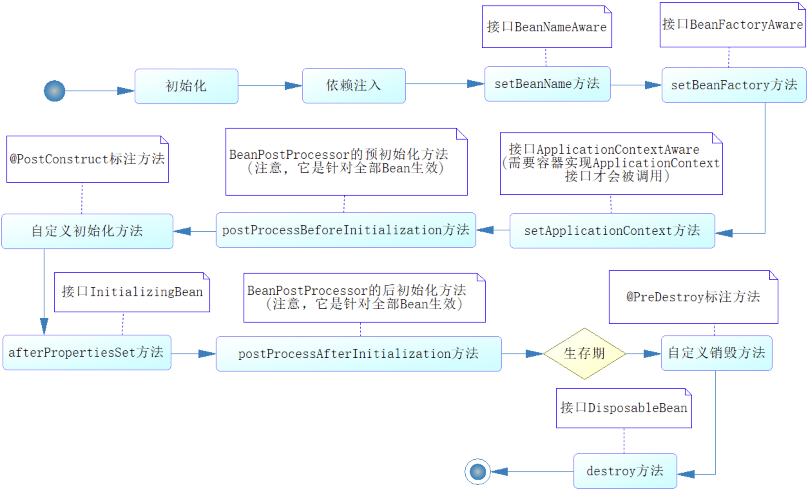

        1. 注意其中 BeanPostProcessor 是针对所有bean 而言的，其中包括 postProcessBefireInitialization 和 postProcessAfterInitialization 方法。
        1. 只有实现了 ApplicationContext 接口的容器，才会在生命周期调用 ApplicationContextAware 所定义的 setApplicationContext 方法。 Spring 对于容器的最低定义是 BeanFactory而非ApplicationContext。

## 3.5  使用属性文件

1. 使用 @ConfigurationProperties，可以让配置文件直接自动适配（by name)
2. 在spring 的启动类上面，打上 @PropertySource， 就可以配置配置文件的路径

## 3.6 有条件装配Bean

有的时候我们希望根据某些条件进行Bean的生产，不满足时候将其跳过。

spring提供了一个功能 @Conditional, 其需要配合另一个接口 Condition 来完成对应的功能。需要去自己继承Condition 这个接口然后将其作为参数放入 @Conditional 之中。

## 3.8 使用 @Profile

1. 可以使用@Profile来指定不同的环境使用不同的bean。
2. 在spring之中，还有另外两个参数可以配置，一个是 spring.profiles.active, 一个是 spring.profiles.default。如果两个属性都没有配置，spring不会启动Profile机制，那么**被@Profile标注的bean将不会被装配到IoC容器之中**。
   spring 先查找 spring.profiles.active， 再看 spring.profiles.default。这两个地方的配置都是对应配置文件的名称

## 3.9 使用SpringEL进行计算

1. 最常用的就是读取属性文件的值，比如：
   `@Value("${database.driverName}")` 。

2. 除此之外， SpringEL表达式一般是用 `"#{}"` 来进行标识的，具有运算的功能，也可以进行赋值，判断，表达式计算，引用bean的属性等等。下面是示例：
   
   ```java
   package com.springbootlearn.chapter3.pojo;
   
   import org.springframework.beans.factory.annotation.Value;
   import org.springframework.stereotype.Component;
   
   import javax.annotation.PostConstruct;
   
   @Component
   public class SpringElTest {
       @Value("${database.driverName}")
       private String driverName;
   
       @Value("#{T(System).currentTimeMillis()}")
       private Long initTime;
   
       @Value("#{'使用springEL赋值字符串'}")
       private String str;
   
       @Value("#{9.3E3}")
       private Double d;
   ```
   
   ```java
   @Value("#{3.14}")
   public Float pi;
   
   @Value("#{dataBaseProperties.url}")
   private String urlString;
   ```
   
   //    判断是否为空，不空再执行 toUpperCase()
   
   ```java
   @Value("#{dataBaseProperties.url?.toUpperCase()}")
   private String urlUpper;
   
   @Value("#{1+2}")
   private int runAdd;
   
   @Value("#{springElTest.pi == 3.14}")
   private Boolean piFlag;
   
   @Value("#{dataBaseProperties.url eq 'url'}")
   private Boolean strFlag;
   
   @Value("#{dataBaseProperties.url + '链接'}")
   private String strApp;
   
   @Value("#{springElTest.pi > 4 ? '大于' : '小于'}")
   private String resultDesc;
   
   @PostConstruct
   private void init(){
       System.out.println("Just for breakpoint");
   }
   ```

# 第4章  开始约定编程——spring AOP

## 4.2 AOP的概念

AOP实质上就是把一些流程性质的代码抽出来，这样程序员可以专注于对应的业务代码，而不是流程性质的维护代码。 在数据库事务之中可以用以下图片表示：

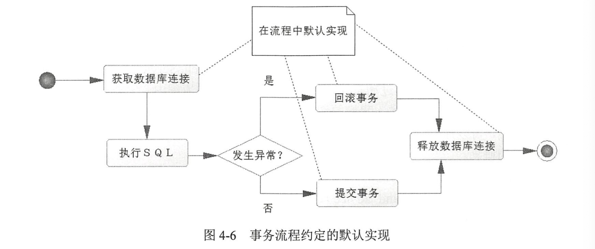

### 4.2.2 AOP 术语和流程

1. **连接点 *join point***: 具体的被拦截的对象，spring AOP 只支持方法，所以被拦截的对象往往是指定的方法

2. 切点 *cut point*: 一个个设置连接点太慢了，写一个正则匹配所有的连接点，这就是切点

3. 通知 advice ：不喜欢写的流程方法，会按照约定织入流程之中，分为：
   
   1. 前置通知  before advice
   
   2. 后置通知 after advice
   
   3. 环绕通知 around advice
   
   4. 事后返回通知 afterReturining advice
   
   5. 异常通知 afterThrowing advice

4. 目标对象 target: 被代理的对象，比如对应实现类， HelloServiceImpl

5. 引入 introduction : 引入新的类和方法，增强现有bean功能

6. 织入 weaving ：通过动态代理技术，为原有服务对象生成代理对象，并且将其和切点定义匹配的连接点拦截，按照约定将各类通知织入约定流程

7. **切面 aspect**： 可以**定义切点，各类通知和引入**的内容，一般我们写的就是这个，让spring通过切面定义来对代码进行织入

## 4.3 AOP开发详解

1. 确定连接点，找到要在什么方法上面使用AOP

2. 开发切面，描述AOP其他信息，用来织入流程

3. 定义切点，一个切点可以概括很多连接点，这样可以省去很多冗余代码
   
   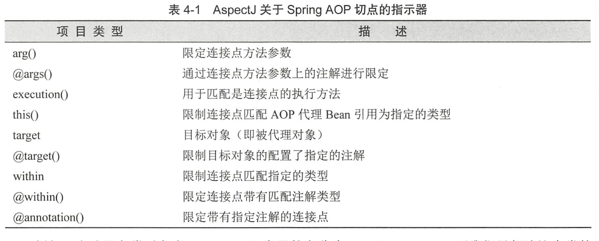

4. 测试AOP，在一开始测试的时候，主要还是自己手动在启动类之中加入注解的Bean，比如：

```java
@SpringBootApplication(scanBasePackages = {"com.example.chapter4.aspect"})
public class Chapter4Application {

//    @Bean(name = "myAspect")
//    public MyAspect initMyAspect(){
//        return new MyAspect();
//    }

    @Bean(name = "myAspect2")
    public MyAspect2 initMyAspect2(){
        return new MyAspect2();
    }

    @Bean(name = "myAspect1")
    public MyAspect1 initMyAspect1(){
        return new MyAspect1();
    }

    @Bean(name = "myAspect3")
    public MyAspect3 initMyAspect3(){
        return new MyAspect3();
    }


    public static void main(String[] args) {
        SpringApplication.run(Chapter4Application.class, args);
    }

}
```

5. 如何在前置通知之中获取参数？

```java
    @Before("pointCut() && args(user)")
    public void beforeParam(JoinPoint point, User user){
        Object[] args = point.getArgs();
        System.out.println("beforeParam....................");
    }
```

上面的代码中，`pointCut()`  表示启用之前定义的切点的规则，而且约定将连接点的名称为user的参数传递进来。

6. 在spring之中， JDK 要求的是被代理对象必须实现接口，但是CGLIB 不需要类一定有对应接口。

7. 多个切面定义的时候，可以用 `@Order` 来指定顺序，顺序靠前的会先执行before，但是会最后执行after（像调用栈一样，先进后出）， 比如下面这个示例：

```java
MyAspect1 before ......
MyAspect2 before ......
MyAspect3 before ......
测试多个切面顺序
MyAspect3 after .......
MyAspect3 afterReturning .......
MyAspect2 after .......
MyAspect2 afterReturning .......
MyAspect1 after .......
MyAspect1 afterReturning .......
```

# 第5章 访问数据库

此处书中一些代码需要修改：

```yml
1. 在比较新的mysql之中需要显式指定不需要ssl：
spring.datasource.url=jdbc:mysql://localhost:3306/chapter3?useSSL=false
2. application.properities 里面需要加入 jpa 的方言定义：
spring.jpa.database-platform=org.hibernate.dialect.MySQLDialect
```

## 5.1 配置数据源

在引入了maven 依赖之后，可以直接在application.properities之中配置数据库连接信息：

```yml
spring.datasource.url=jdbc:mysql://localhost:3306/chapter3?useSSL=false
spring.datasource.username=xxxx
spring.datasource.password=xxxx
spring.datasource.driver-class-name=com.mysql.jdbc.Driver
spring.datasource.tomcat.max-idle=10
spring.datasource.tomcat.max-active=50
#???????
spring.datasource.tomcat.max-wait=10000
spring.datasource.tomcat.initial-size=5
spring.jpa.database-platform=org.hibernate.dialect.MySQLDialect

mybatis.mapper-locations=classpath:mapper/*.xml
mybatis.type-aliases-package=com.example.chapter5.pojo
mybatis.type-handlers-package=com.example.chapter5.typehandler

logging.level.root=DEBUG
logging.level.org.springframework.web=DEBUG
logging.level.org.mybatis=DEBUG
```

如果去掉了驱动类的配置，spring boot会先尽可能去判断数据类型且按照默认情况匹配驱动类。可见最好还是加入。

## 5.2 使用jdbcTemplate操作数据库

先定义好接口，然后在实现类之中显式的写出sql，参数，并且显式调用jdbcTemplate 来操作sql，并且返回对应的值。

在操作之前，需要先用lambda表达式创建用户映射的关系。

jdbcTemplate 默认是每次调用都生成一个数据库连接，执行query方法的时候，会从数据库连接处分配一条新的连接资源，在执行结束之后**关闭连接**。如果想要在一个连接之中执行多个sql，对此可以使用 StatementCallback或者 ConnectionCallback 执行多个sql

## 5.3 使用JPA(Hibernate) 操作数据

jdbcTemplate的方式，需要在java代码之中深度融合sql，手动执行和调用，这种方式需要些很多的无用代码。

JPA(Java persistence API)， java持久化API， 是定一个**对象关系**映射(ORM)以及**实体对象持久化**的标准接口。

核心思想就是用对象的实体 entity 操作来替代显式的sql操作。

JPA 维护的核心就是 **entity**，通过持久化上下文使用(persistence context) 使用，其包括三部分：

1. 对象关系映射 ORM。注解或者xml

2. 实体操作API，通过对**实体对象的CRUD**操作，完成**对象的持久化和查询**。

3. 查询语言：面向对象的查询语言 JPQL，实现比较灵活的查询。

JPA部分，可以使用注解来标明各种属性，主键策略，对应转换器（比如Enum的场景）等等。

如果接口已经继承了JpaRepository, 那么就会有系统默认实现的方法，比如一些查询,`findById()` 等等。

### 如何做更加灵活的查询

1. 使用 `@Query` 来标识语句，在方法的上面进行注解式的开发

```java
    @Query("from user where user_name like concat('%', ?1, '%') " 
        + "and note like concat('', ?2, '%')")
    public List<User> findUsers(String userName, String note);
```

2. JPA 也可以用一定规则命名方法直接完成逻辑，比如

```java
    /**
     * 按照用户名称或者备注进行模糊查询
     * @param userName 用户名
     * @param note 备注
     * @return 用户列表
     */
    List<User> findByUserNameLikeOrNoteLike(String userName, String note);
```

## 5.4 整合MyBatis 框架

在管理系统为主的时候，Hibernate 的模型化有助于系统分析和建模，但是现在移动互联网时代，需要面对的主要是大数据，高并发和性能问题，更加关注的是系统的性能和灵活性，相对而言mybatis 更适用

mybatis的思想就是回到之前的手写sql，但是省略其他一切多余的步骤，配置完成之后用户只要写对应的方法和sql（一般在xml中），就可以直接使用，不必关心连接等等事务性的操作。

### 5.4.1 mybatis需要什么

1. sql

2. 映射关系，xml或者注解，目前xml为主

3. POJO

映射关系部分，可以自动或者驼峰映射，但是个人建议 resultMap 最好还是自己定义，避免差池。

### 5.4.2 MyBatis 的配置

基于SqlSessionFactory， 其可以生成 SqlSession 接口对象，此对象是一个功能性代码。

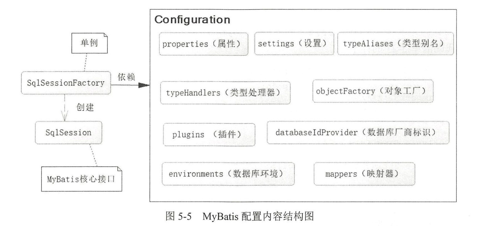

mybatis可以支持以上配置。

1. properities : 属性文件，一般spring进行配置

2. settings： 设置，改变 MyBatis 底层行为，可以配置比如：
   
   1. 映射规则：自动映射，驼峰映射
   
   2. 执行器类型
   
   3. 缓存
   
   可以参考：[mybatis &#x2013; MyBatis 3 | 配置](https://mybatis.org/mybatis-3/zh/configuration.html)

3. 类型别名(typeAliases): 类的全限定名会比较长，对于常用的类提供默认别名，此外还允许通过 typeAliases 配置自定义别名。

>        笔者：不建议使用，一是需要的时候得去全局搜索这个别名代表什么（别名是通过 @Aliase 在**类**的上面进行配置，而且万一有傻子起了通用的名称，另一个要起这个名字的傻子就冲突了。

4. typeHandler: 在MyBatis 写入和读取数据库的过程中对不同类型数据进行自定义的转换。对于java 而言是 javaType, 但是数据库而言是 jdbcType。
   主要用在枚举类型上面。

5. objectFactory： 给MyBatis 用来生成返回的POJO时候调用的工厂类。一般使用默认类。

6. Plugins: 也叫拦截器，通过动态代理和责任链模式完成，可以修改MyBatis 底层的实现。

7. environments: 可以配置数据库的连接内容和事务，一般交给spring托管

8. databaseIdProvider： 允许 MyBatis 配置多类型数据库支持，不常用

9. mapper： MyBatis 最核心的组件，提供sql和POJO的映射关系。

#### MyBatis使用别名例子

```java
package com.example.chapter5.pojo;

import com.example.chapter5.enumration.SexEnum;
import org.apache.ibatis.type.Alias;

@Alias(value = "user") // mybatis 指定别名
public class User {
    private Long id  = null;
    private String userName  = null;
    private SexEnum sex = null; // 此处用typeHandler 进行转换
    private String note  = null;

    public Long getId() {
        return id;
    }

    public void setId(Long id) {
        this.id = id;
    }

    public String getUserName() {
        return userName;
    }

    public void setUserName(String userName) {
        this.userName = userName;
    }

    public SexEnum getSex() {
        return sex;
    }

    public void setSex(SexEnum sex) {
        this.sex = sex;
    }

    public String getNote() {
        return note;
    }

    public void setNote(String note) {
        this.note = note;
    }
}
```

#### typeHandler例子

```java
package com.example.chapter5.typehandler;

import com.example.chapter5.enumration.SexEnum;
import org.apache.ibatis.type.BaseTypeHandler;
import org.apache.ibatis.type.JdbcType;
import org.apache.ibatis.type.MappedJdbcTypes;
import org.apache.ibatis.type.MappedTypes;

import java.sql.CallableStatement;
import java.sql.PreparedStatement;
import java.sql.ResultSet;
import java.sql.SQLException;

@MappedJdbcTypes(JdbcType.INTEGER)
@MappedTypes(value = SexEnum.class)
public class SexTypeHandler extends BaseTypeHandler<SexEnum> {
    @Override
    public void setNonNullParameter(PreparedStatement preparedStatement, int idx, SexEnum sexEnum, JdbcType jdbcType) throws SQLException {
        preparedStatement.setInt(idx, sexEnum.getId());
    }

    //    通过列名获取性别
    @Override
    public SexEnum getNullableResult(ResultSet resultSet, String col) throws SQLException {
        int sex = resultSet.getInt(col);
        if (sex != 1 && sex != 2) {
            return null;
        }
        return SexEnum.getEnumById(sex);
    }

    //    通过下标获取性别
    @Override
    public SexEnum getNullableResult(ResultSet resultSet, int idx) throws SQLException {
        int sex = resultSet.getInt(idx);
        if (sex != 1 && sex != 2) {
            return null;
        }
        return SexEnum.getEnumById(sex);
    }

    //   通过存储过程获取性别
    @Override
    public SexEnum getNullableResult(CallableStatement callableStatement, int idx) throws SQLException {
        int sex = callableStatement.getInt(idx);
        if (sex != 1 && sex != 2) {
            return null;
        }
        return SexEnum.getEnumById(sex);
    }
}
```

### 5.4.3 spring boot 整合 mybatis

最佳实践是使用 `@MapperScan`

```java
@SpringBootApplication
@MapperScan(basePackages = {"com.example.chapter5.*"}, sqlSessionFactoryRef = "sqlSessionFactory", sqlSessionTemplateRef = "sqlSessionTemplate", annotationClass = Repository.class)
public class Chapter5Application {

    public static void main(String[] args) {
        SpringApplication.run(Chapter5Application.class, args);
    }

}
```

注意：下面是myBatis 源码对 `sqlSessionTemplateRef` 和 `sqlSessionFactoryRef` 的说明，一般是在多于一个数据源的情况下使用的：

```java
  /**
   * Specifies which {@code SqlSessionTemplate} to use in the case that there is
   * more than one in the spring context. Usually this is only needed when you
   * have more than one datasource.
   */
  String sqlSessionTemplateRef() default "";

  /**
   * Specifies which {@code SqlSessionFactory} to use in the case that there is
   * more than one in the spring context. Usually this is only needed when you
   * have more than one datasource.
   */
  String sqlSessionFactoryRef() default "";
```

sqlSessionTemplateRef 的优先权是大于 sqlSessionFactoryRef 的。

# 第6章 聊聊数据库事务处理

## 6.1 JDBC 的数据库事务

使用 JDBC 做事务处理的时候，要手动处理：

1. 数据库连接的获取和关闭

2. 事务的提交commit

3. 出现异常时候事务的回滚 rollback 

所以会有大量的try catch finally 语句

执行  sql 的事务流程：

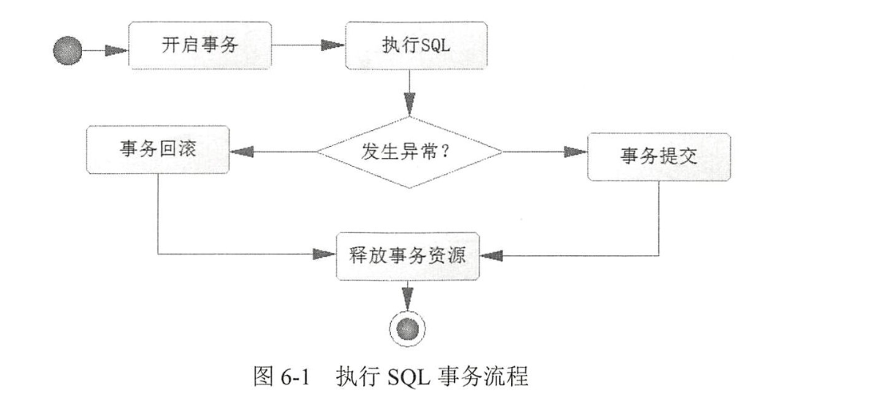

之中只有sql部分是真的业务部分。那么使用AOP把这部分之外的都抽出去单独实现，这就是spring 数据库事务编程的思想。

## 6.2 spring 声明式事务的使用

spring 使用 AOP 提供了一个数据库事务的约定流程。声明式事务而言，是通过 `@Transactional` 来进行标注的。

**用在类上面**: 这个类之中所有的**public ， 非static 方法**都会启用事务功能

还允许配置很多的属性，比如事务的隔离级别，传播行为；在什么异常情况下回滚等等。

### spring 如何实现这些？

在spring IoC 容器加载的时候便解析出来，然后存到事务定义器(TransactionDefination接口实现类) 之中，且记录好哪些类或者方法需要启动事务，采用什么策略执行事务。

**我们要做什么：** 仅仅需要使用 @Transactional 进行配置而已

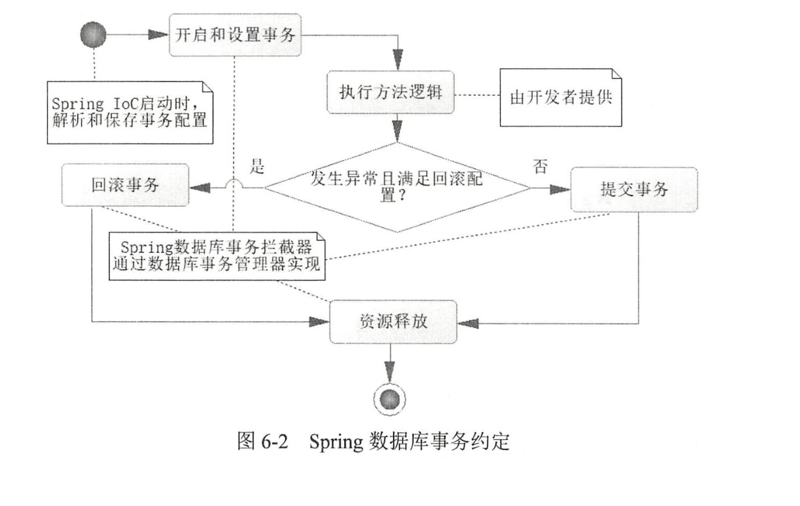

### 6.2.2 @Transactional 的配置项

```java
@Target({ElementType.METHOD, ElementType.TYPE})
@Retention(RetentionPolicy.RUNTIME)
@Inherited
@Documented
public @interface Transactional {

    /**
     * Alias for {@link #transactionManager}.
     * @see #transactionManager
     */
    @AliasFor("transactionManager")
    String value() default "";

    /**
     * A <em>qualifier</em> value for the specified transaction.
     * <p>May be used to determine the target transaction manager,
     * matching the qualifier value (or the bean name) of a specific
     * {@link org.springframework.transaction.PlatformTransactionManager}
     * bean definition.
     * @since 4.2
     * @see #value
     */
    // 通过bean name指定事务管理器
    @AliasFor("value")
    String transactionManager() default "";

    /**
     * The transaction propagation type.
     * <p>Defaults to {@link Propagation#REQUIRED}.
     * @see org.springframework.transaction.interceptor.TransactionAttribute#getPropagationBehavior()
     */
    // 和value 一样属性
    Propagation propagation() default Propagation.REQUIRED;

    /**
     * The transaction isolation level.
     * <p>Defaults to {@link Isolation#DEFAULT}.
     * <p>Exclusively designed for use with {@link Propagation#REQUIRED} or
     * {@link Propagation#REQUIRES_NEW} since it only applies to newly started
     * transactions. Consider switching the "validateExistingTransactions" flag to
     * "true" on your transaction manager if you'd like isolation level declarations
     * to get rejected when participating in an existing transaction with a different
     * isolation level.
     * @see org.springframework.transaction.interceptor.TransactionAttribute#getIsolationLevel()
     * @see org.springframework.transaction.support.AbstractPlatformTransactionManager#setValidateExistingTransaction
     */
    // 传播行为
    Isolation isolation() default Isolation.DEFAULT;

    /**
     * The timeout for this transaction.
     * <p>Defaults to the default timeout of the underlying transaction system.
     * <p>Exclusively designed for use with {@link Propagation#REQUIRED} or
     * {@link Propagation#REQUIRES_NEW} since it only applies to newly started
     * transactions.
     * @see org.springframework.transaction.interceptor.TransactionAttribute#getTimeout()
     */
    // 超时时间，单位秒
    int timeout() default TransactionDefinition.TIMEOUT_DEFAULT;

    /**
     * A boolean flag that can be set to {@code true} if the transaction is
     * effectively read-only, allowing for corresponding optimizations at runtime.
     * <p>Defaults to {@code false}.
     * <p>This just serves as a hint for the actual transaction subsystem;
     * it will <i>not necessarily</i> cause failure of write access attempts.
     * A transaction manager which cannot interpret the read-only hint will
     * <i>not</i> throw an exception when asked for a read-only transaction
     * but rather silently ignore the hint.
     * @see org.springframework.transaction.interceptor.TransactionAttribute#isReadOnly()
     * @see org.springframework.transaction.support.TransactionSynchronizationManager#isCurrentTransactionReadOnly()
     */
    // 是否为只读事务
    boolean readOnly() default false;

    /**
     * Defines zero (0) or more exception {@link Class classes}, which must be
     * subclasses of {@link Throwable}, indicating which exception types must cause
     * a transaction rollback.
     * <p>By default, a transaction will be rolling back on {@link RuntimeException}
     * and {@link Error} but not on checked exceptions (business exceptions). See
     * {@link org.springframework.transaction.interceptor.DefaultTransactionAttribute#rollbackOn(Throwable)}
     * for a detailed explanation.
     * <p>This is the preferred way to construct a rollback rule (in contrast to
     * {@link #rollbackForClassName}), matching the exception class and its subclasses.
     * <p>Similar to {@link org.springframework.transaction.interceptor.RollbackRuleAttribute#RollbackRuleAttribute(Class clazz)}.
     * @see #rollbackForClassName
     * @see org.springframework.transaction.interceptor.DefaultTransactionAttribute#rollbackOn(Throwable)
     */
    // 方法在发生指定异常时候回滚，默认回滚所有异常
    Class<? extends Throwable>[] rollbackFor() default {};

    /**
     * Defines zero (0) or more exception names (for exceptions which must be a
     * subclass of {@link Throwable}), indicating which exception types must cause
     * a transaction rollback.
     * <p>This can be a substring of a fully qualified class name, with no wildcard
     * support at present. For example, a value of {@code "ServletException"} would
     * match {@code javax.servlet.ServletException} and its subclasses.
     * <p><b>NB:</b> Consider carefully how specific the pattern is and whether
     * to include package information (which isn't mandatory). For example,
     * {@code "Exception"} will match nearly anything and will probably hide other
     * rules. {@code "java.lang.Exception"} would be correct if {@code "Exception"}
     * were meant to define a rule for all checked exceptions. With more unusual
     * {@link Exception} names such as {@code "BaseBusinessException"} there is no
     * need to use a FQN.
     * <p>Similar to {@link org.springframework.transaction.interceptor.RollbackRuleAttribute#RollbackRuleAttribute(String exceptionName)}.
     * @see #rollbackFor
     * @see org.springframework.transaction.interceptor.DefaultTransactionAttribute#rollbackOn(Throwable)
     */
    // 方法发生指定异常类名时回滚，默认所有
    String[] rollbackForClassName() default {};

    /**
     * Defines zero (0) or more exception {@link Class Classes}, which must be
     * subclasses of {@link Throwable}, indicating which exception types must
     * <b>not</b> cause a transaction rollback.
     * <p>This is the preferred way to construct a rollback rule (in contrast
     * to {@link #noRollbackForClassName}), matching the exception class and
     * its subclasses.
     * <p>Similar to {@link org.springframework.transaction.interceptor.NoRollbackRuleAttribute#NoRollbackRuleAttribute(Class clazz)}.
     * @see #noRollbackForClassName
     * @see org.springframework.transaction.interceptor.DefaultTransactionAttribute#rollbackOn(Throwable)
     */

    Class<? extends Throwable>[] noRollbackFor() default {};

    /**
     * Defines zero (0) or more exception names (for exceptions which must be a
     * subclass of {@link Throwable}) indicating which exception types must <b>not</b>
     * cause a transaction rollback.
     * <p>See the description of {@link #rollbackForClassName} for further
     * information on how the specified names are treated.
     * <p>Similar to {@link org.springframework.transaction.interceptor.NoRollbackRuleAttribute#NoRollbackRuleAttribute(String exceptionName)}.
     * @see #noRollbackFor
     * @see org.springframework.transaction.interceptor.DefaultTransactionAttribute#rollbackOn(Throwable)
     */
    String[] noRollbackForClassName() default {};

}
```

1. value 和 transactionManager 属性，是配置一个spring的**事务管理器**。

2. `@Transactional` 最好放在实现类上面，spring推荐放在实现类的理由如下：
   
   > https://docs.spring.io/spring-framework/docs/5.0.x/spring-framework-reference/data-access.html#transaction-declarative-annotations
   > 
   > Spring recommends that you only annotate concrete classes (and methods of concrete classes) with the `@Transactional` annotation, as opposed to annotating interfaces. You certainly can place the `@Transactional` annotation on an interface (or an interface method), but this works only as you would expect it to if you are using interface-based proxies. The fact that Java annotations are *not inherited from interfaces* means that if you are using class-based proxies ( `proxy-target-class="true"`) or the weaving-based aspect ( `mode="aspectj"`), then the transaction settings are not recognized by the proxying and weaving infrastructure, and the object will not be wrapped in a transactional proxy, which would be decidedly *bad*.
   
   都按在类上，那么只用 class-based proxies 和 weaving-based（织入） aspect 就可以使用。
   
   作者在书中写 cglib 不允许接口代理，我认为是错误的。

### 6.2.3 spring 事务管理器

在spring之中，最顶层的事务管理器接口是 PlatformTransactionManager, 其继承关系图为：

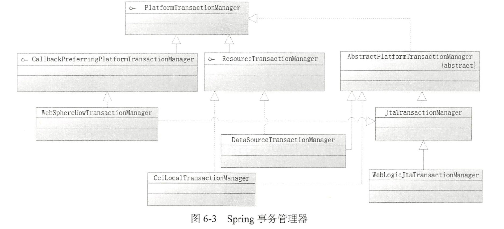

对应方法可以简化为

```java
public interface PlatformTransactionManager {

    /**
     * Return a currently active transaction or create a new one, according to
     * the specified propagation behavior.
     * <p>Note that parameters like isolation level or timeout will only be applied
     * to new transactions, and thus be ignored when participating in active ones.
     * <p>Furthermore, not all transaction definition settings will be supported
     * by every transaction manager: A proper transaction manager implementation
     * should throw an exception when unsupported settings are encountered.
     * <p>An exception to the above rule is the read-only flag, which should be
     * ignored if no explicit read-only mode is supported. Essentially, the
     * read-only flag is just a hint for potential optimization.
     * @param definition TransactionDefinition instance (can be {@code null} for defaults),
     * describing propagation behavior, isolation level, timeout etc.
     * @return transaction status object representing the new or current transaction
     * @throws TransactionException in case of lookup, creation, or system errors
     * @throws IllegalTransactionStateException if the given transaction definition
     * cannot be executed (for example, if a currently active transaction is in
     * conflict with the specified propagation behavior)
     * @see TransactionDefinition#getPropagationBehavior
     * @see TransactionDefinition#getIsolationLevel
     * @see TransactionDefinition#getTimeout
     * @see TransactionDefinition#isReadOnly
     */

    // 设置数据属性和获取事务
    TransactionStatus getTransaction(@Nullable TransactionDefinition definition) throws TransactionException;

    /**
     * Commit the given transaction, with regard to its status. If the transaction
     * has been marked rollback-only programmatically, perform a rollback.
     * <p>If the transaction wasn't a new one, omit the commit for proper
     * participation in the surrounding transaction. If a previous transaction
     * has been suspended to be able to create a new one, resume the previous
     * transaction after committing the new one.
     * <p>Note that when the commit call completes, no matter if normally or
     * throwing an exception, the transaction must be fully completed and
     * cleaned up. No rollback call should be expected in such a case.
     * <p>If this method throws an exception other than a TransactionException,
     * then some before-commit error caused the commit attempt to fail. For
     * example, an O/R Mapping tool might have tried to flush changes to the
     * database right before commit, with the resulting DataAccessException
     * causing the transaction to fail. The original exception will be
     * propagated to the caller of this commit method in such a case.
     * @param status object returned by the {@code getTransaction} method
     * @throws UnexpectedRollbackException in case of an unexpected rollback
     * that the transaction coordinator initiated
     * @throws HeuristicCompletionException in case of a transaction failure
     * caused by a heuristic decision on the side of the transaction coordinator
     * @throws TransactionSystemException in case of commit or system errors
     * (typically caused by fundamental resource failures)
     * @throws IllegalTransactionStateException if the given transaction
     * is already completed (that is, committed or rolled back)
     * @see TransactionStatus#setRollbackOnly
     */

    // 提交事务
    void commit(TransactionStatus status) throws TransactionException;

    /**
     * Perform a rollback of the given transaction.
     * <p>If the transaction wasn't a new one, just set it rollback-only for proper
     * participation in the surrounding transaction. If a previous transaction
     * has been suspended to be able to create a new one, resume the previous
     * transaction after rolling back the new one.
     * <p><b>Do not call rollback on a transaction if commit threw an exception.</b>
     * The transaction will already have been completed and cleaned up when commit
     * returns, even in case of a commit exception. Consequently, a rollback call
     * after commit failure will lead to an IllegalTransactionStateException.
     * @param status object returned by the {@code getTransaction} method
     * @throws TransactionSystemException in case of rollback or system errors
     * (typically caused by fundamental resource failures)
     * @throws IllegalTransactionStateException if the given transaction
     * is already completed (that is, committed or rolled back)
     */

    // 获取事务
    void rollback(TransactionStatus status) throws TransactionException;

}
```

简要分析一下这三个方法：

spring认为在一个事务之中，最基本的就是这三个方法，所以会按照约定的流程织入事务中。

1. getTransaction 通过其参数之中的 TransactionDefinition 来获取对应的事务属性。其是依赖于 @Transactional 配置项生成，通过这个参数可以**设置事务属性**

2. commit 提交，rollback 回滚，没什么说的

#### **mybatis 依赖的是什么事务管理器？**

是 DataSourceTransactionManager。 

`org.springframework.jdbc.datasource.DataSourceTransactionManager`

> 按照文档所说，这个manager可以适用于任何的JDBC driver
> 
> org.springframework.transaction.PlatformTransactionManager implementation for a single JDBC DataSource. This class is capable of working in any environment with any JDBC driver, as long as the setup uses a javax.sql.DataSource as its Connection factory mechanism. Binds a JDBC Connection from the specified DataSource to the current thread, potentially allowing for one thread-bound Connection per DataSource.

### 6.2.4 测试数据库事务

下面是spring根据配置自动生成的事务管理器。

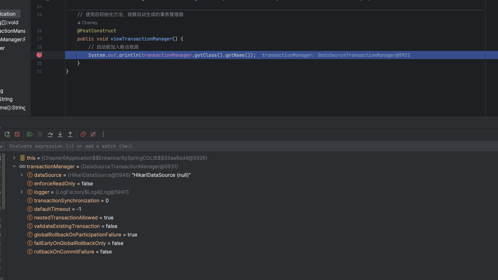

事务管理器其实就两条：

1. 当事务正常发生的时候，帮助commit事务

2. 当事务异常的时候，进行事务的回滚。

对于一个事务，事务管理器debug的log：

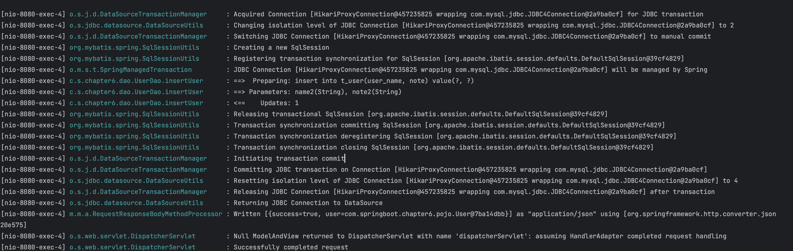

1. 获取连接，修改连接的隔离级别

2. 更改连接变为manual commit, 注意这边不是人来manual commit, 而是transactionManager帮我们commit

3. 创建新的 sqlSession

4. 准备语句，开始写入

5. commit之后进行关闭sqlSession

6. **将JdbcConnection 的隔离级别改回到4！ 你用完别人还得用呢！**

7. 释放并且归还 JdbcConnection

## 6.3 隔离级别

隔离级别其实是**数据库**的概念

其追根究底，还是不同事务之间无法互相感知，导致对同一个数据做操作时候结果和期望不同。

### 6.3.1 未提交读 (read uncommitted)

未提交读的典型例子，是两个事务同时读取一个数据为2且进行扣减，先读取数据的事务A扣减1变成1了，后读取数据的事务B基于1扣减成0，但是A回滚了，B提交了，最后变成0.

**这种就是脏读。**

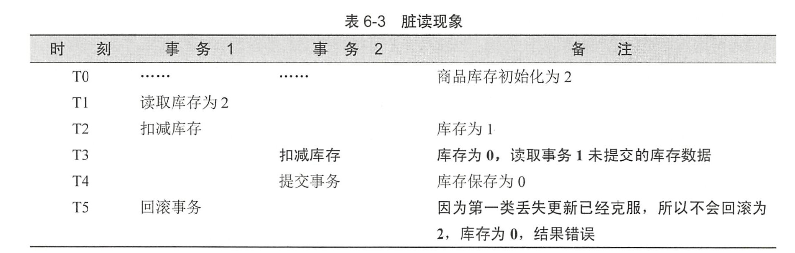

### 6.3.2 读写提交(read committed)

读写提交规定只有commit 了的事务才能被读取，那么主要问题会在于多个事务之间的操作不能简单合并，比如两个事务一开始都要扣减只有1的值，对于双方而言一开始都是能操作的，但是只有一个能成功，这就出现了不一致。

不可重读，意味着对于事务而言要操作的值在动态变化，每次读取都不同，因此不可重读。

**克服了脏读，但是不可重复读。**

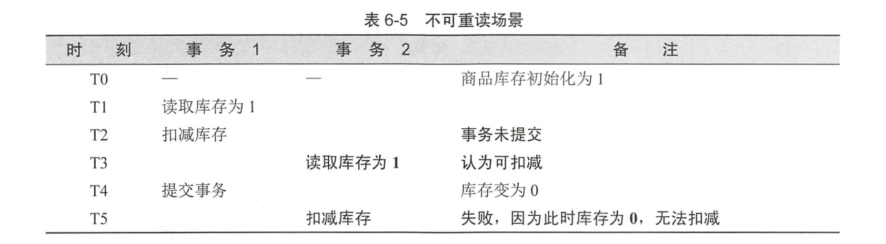

### 6.3.3 可重复读(repeatable read)

可重复读主要是对于同一条数据的读取进行阻塞，对于一条数据同时只允许一个事务读取。

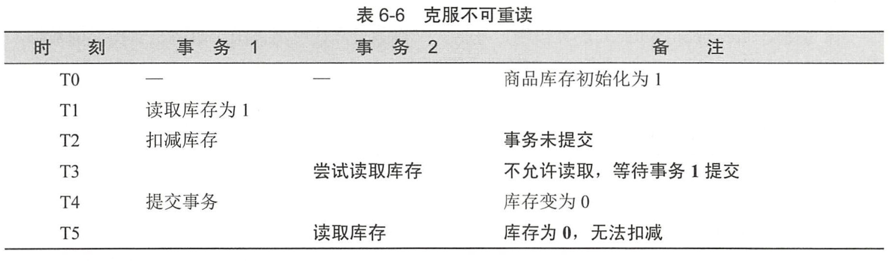

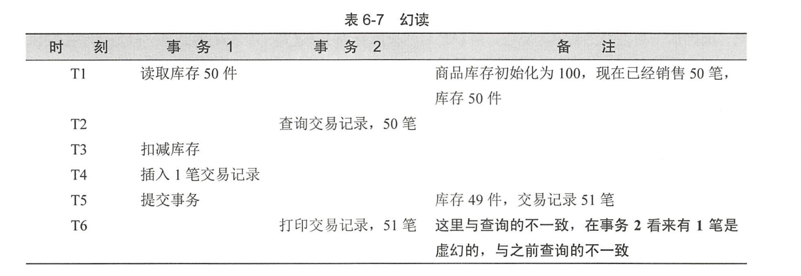

其可以克服不可重复读，但是无法克服幻读。幻读主要是**条数不一致**。根本原因是对于插入的情况没有上锁，所以查询的过程之中查询条数就会有这样的不一致问题

### 6.3.4 串行化 (serializable)

要求所有sql按照顺序执行，代价就是性能残缺

下面是隔离级别和可能现象

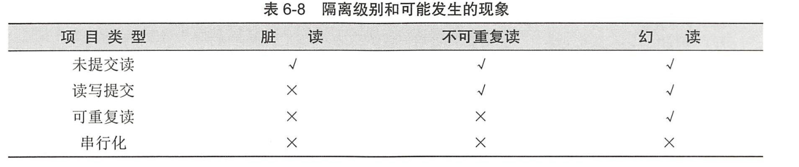

### 6.3.5 隔离级别配置和使用

可以直接在application.properities 之中加入默认配置，比如：

```yaml
#隔离级别数字配置的含义：
#-1 数据库默认隔离级别
#1  未提交读
#2  读写提交
#4  可重复读
#8  串行化
#tomcat数据源默认隔离级别
spring.datasource.tomcat.default-transaction-isolation=2
#dbcp2数据库连接池默认隔离级别
#spring.datasource.dbcp2.default-transaction-isolation=2
```

## 6.4 传播行为

传播行为主要针对的是在需要事务的方法之中调用其他方法时候事务是如何传播的。

### 6.4.1 Required 的测试结果

母方法`批量插入user`调用子方法`插入单一user`，母方法定义 `propagation = Propagation.REQUIRED`, 子方法使用默认传播 `propagation = Propagation.REQUIRED`

测试一个required 的 transaction,  得到结果如图：

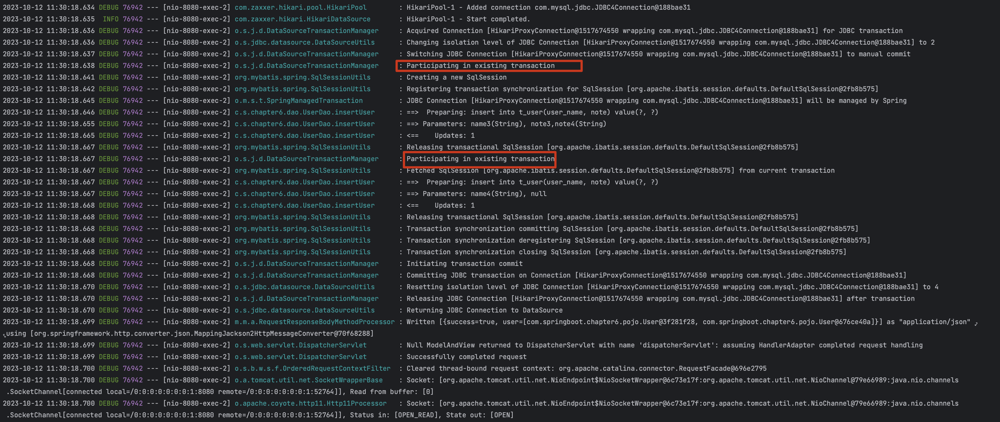

### 6.4.2 母方法 required, 子方法 required_new

下面是log

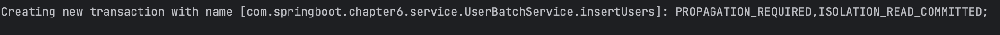

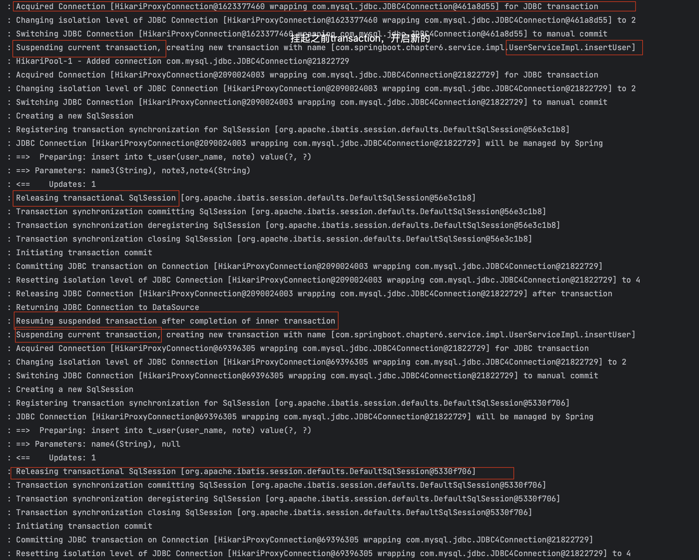

可以看到其会暂停当前的事务，开始新的事务，在新的子方法事务commit 之后才会commit自己。

### 6.4.3 母方法required， 子方法nested

其实现方法是子方法创建新的sqlSession, 同时打上savePoint

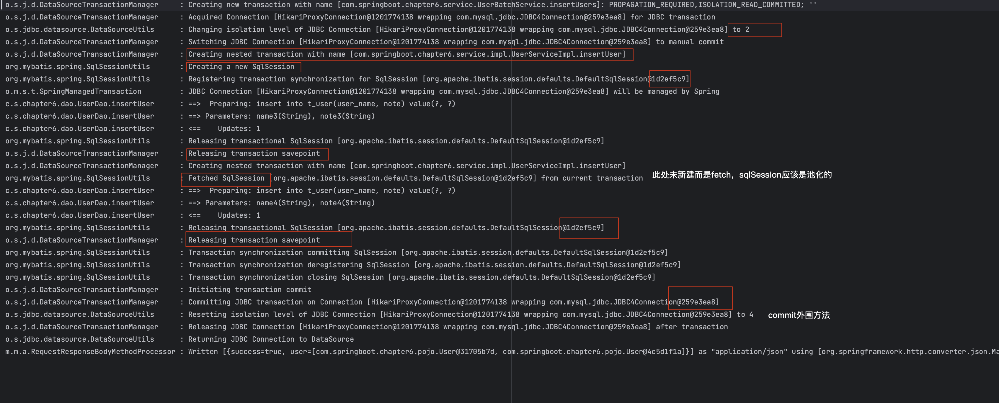

spring 对于nested 的处理为：如果数据库支持savePoint， 那么就启用；如果不支持，那么新建事务运行，对子方法而言等价于 required_new。

在nested 传播行为下面，会沿用**当前事务的隔离级别和锁特性**，而 requires_new 可以有自己**独立**的隔离级别和锁特性。

大部分数据库之中，一段sql都可以设置一个标志位，后面代码执行时候如果有异常，只是回滚到标志位的数据状态，不会让标志位之前的代码也回滚。这个标志位就是 savePoint。

下面是我自己做的savepoint的例子，可以看出来：

1. savepoint 就是将整个sql分成几个小的保存点，如果出问题了可以回滚到某一个点

2. savepoint可以往前覆盖，比如有sp1, sp2, sp3， 可以从sp3 再 rollback to sp2 再 rollback to sp1， 但是到了sp1 之后，sp2和sp3都不可追溯了。

```bash
mysql> begin;
Query OK, 0 rows affected (0.00 sec)

mysql> insert into t_user (user_name)  value ('name1');
Query OK, 1 row affected (0.00 sec)

mysql> savepoint sp1;
Query OK, 0 rows affected (0.00 sec)

mysql> select * from t_user;
+----+-----------+-----+------+
| id | user_name | sex | note |
+----+-----------+-----+------+
| 16 | name1     |   1 | NULL |
+----+-----------+-----+------+
1 row in set (0.00 sec)

mysql> insert into t_user (user_name)  value ('name2');
Query OK, 1 row affected (0.00 sec)

mysql> savepoint sp2;
Query OK, 0 rows affected (0.00 sec)

mysql> select * from t_user;
+----+-----------+-----+------+
| id | user_name | sex | note |
+----+-----------+-----+------+
| 16 | name1     |   1 | NULL |
| 17 | name2     |   1 | NULL |
+----+-----------+-----+------+
2 rows in set (0.00 sec)

mysql> insert into t_user (user_name)  value ('name3');
Query OK, 1 row affected (0.00 sec)

mysql> select * from t_user;
+----+-----------+-----+------+
| id | user_name | sex | note |
+----+-----------+-----+------+
| 16 | name1     |   1 | NULL |
| 17 | name2     |   1 | NULL |
| 18 | name3     |   1 | NULL |
+----+-----------+-----+------+
3 rows in set (0.01 sec)

mysql> savepoint sp3;
Query OK, 0 rows affected (0.00 sec)

mysql> rollback to sp2;
Query OK, 0 rows affected (0.00 sec)

mysql> select * from t_user;
+----+-----------+-----+------+
| id | user_name | sex | note |
+----+-----------+-----+------+
| 16 | name1     |   1 | NULL |
| 17 | name2     |   1 | NULL |
+----+-----------+-----+------+
2 rows in set (0.01 sec)

mysql> rollback to sp1;
Query OK, 0 rows affected (0.00 sec)

mysql> select * from t_user;
+----+-----------+-----+------+
| id | user_name | sex | note |
+----+-----------+-----+------+
| 16 | name1     |   1 | NULL |
+----+-----------+-----+------+
1 row in set (0.00 sec)

mysql> rollback to sp2;
ERROR 1305 (42000): SAVEPOINT sp2 does not exist
mysql> rollback to sp3;
ERROR 1305 (42000): SAVEPOINT sp3 does not exist
mysql> commit;
Query OK, 0 rows affected (0.00 sec)

mysql> select * from t_user;
+----+-----------+-----+------+
| id | user_name | sex | note |
+----+-----------+-----+------+
| 16 | name1     |   1 | NULL |
+----+-----------+-----+------+
1 row in set (0.00 sec)
```

## 6.5 @Transactional 自调用失效问题

自调用失效，是因为代理类本身生成的时候自己调用自己的方法是没有使用`@Transactional` 处理过的代码，相当于注解未生效。需要自己调用自己的话，可以显式指定使用代理生成对象的相应方法。

自调用的service 如下：

```java
@Service
public class UserServiceImpl implements UserService {

    @Autowired
    private UserDao userDao = null;

    @Override
    @Transactional(isolation = Isolation.READ_COMMITTED, timeout = 1, propagation = Propagation.REQUIRES_NEW)
    public int insertUser(User user) {
        return userDao.insertUser(user);
    }

    @Override
    @Transactional(isolation = Isolation.READ_COMMITTED, timeout = 1)
    public User getUser(Long id) {
        return userDao.getUser(id);
    }

    @Override
    @Transactional(isolation = Isolation.READ_COMMITTED, propagation = Propagation.REQUIRED)
    public int insertUsers(List<User> userList) {
        int cnt = 0;
        for (User user : userList) {
            cnt += insertUser(user);
        }
        return cnt;
    }
}
```

insertUsers(REQUIRED) 调用 insertUser(REQUIRES_NEW), 均为一个类。

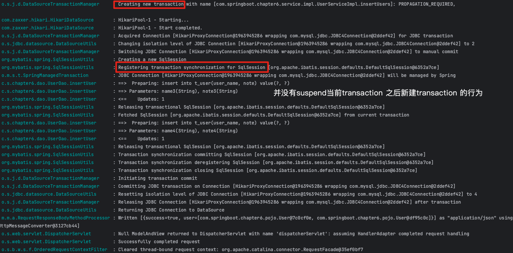

可见insertUsers的transaction生效，但是insertUser的没有。这是因为 insertUsers 是由外部类的引用，所以会直接引用已经AOP处理过的代理类，但是对insertUser方法，insertusers在调用的时候并不是调用了AOP处理过的代理类，因此不生效。

处理方式有两种：

1. 不把外层方法和内层方法放在一个类之中（和之前一样）

2. 引用时候去主动获取Spring AOP处理过的类，使用代理方法。

我们下面介绍第二种：

方法改为：

```java
    @Transactional(isolation = Isolation.READ_COMMITTED, propagation = Propagation.REQUIRED)
    public int insertUsers(List<User> userList) {
        int cnt = 0;
        UserService userServiceEnhanced = applicationContext.getBean(UserService.class);
        for (User user : userList) {
            cnt += userServiceEnhanced.insertUser(user);
        }
        return cnt;
    }
```

即可。 applicationContext 之中存在着所有处理好的代理bean

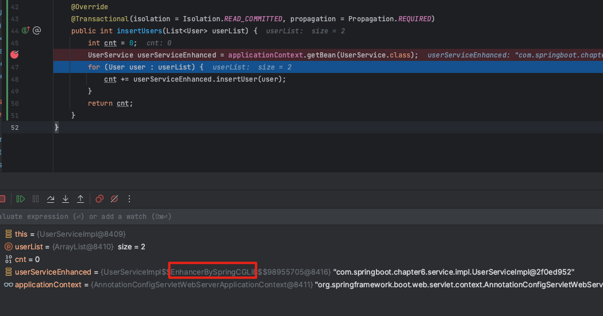

# 第7章 使用性能利器——redis

## 7.1 spring-data-redis 项目简介

spring 提供的是一个redisConnectionFactory， 这个工厂类可以产生 redisConnection, 这两个部分都是接口，所以jedis之中都是提供了相应的对象implement他们。

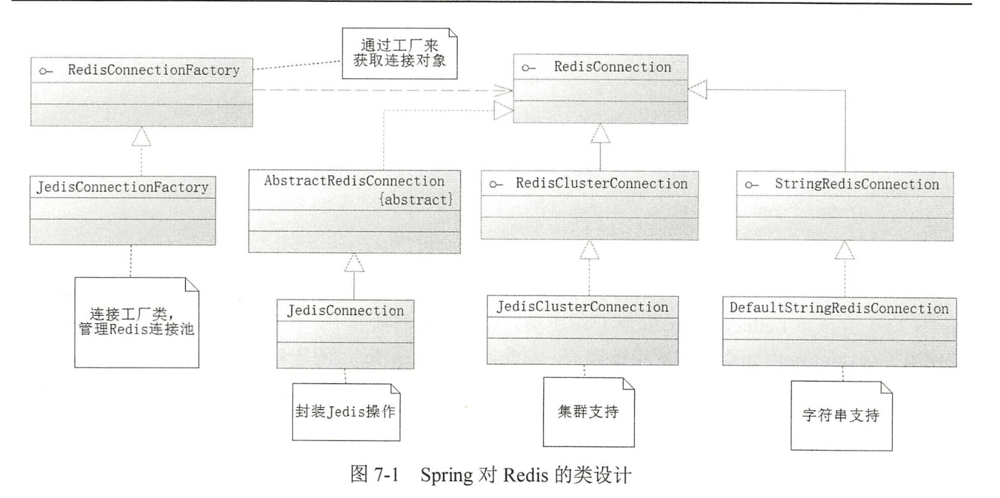

**对于一个redisConnectionFactory应该有什么**
