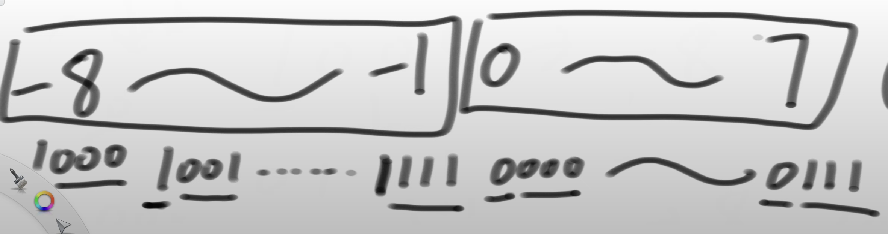
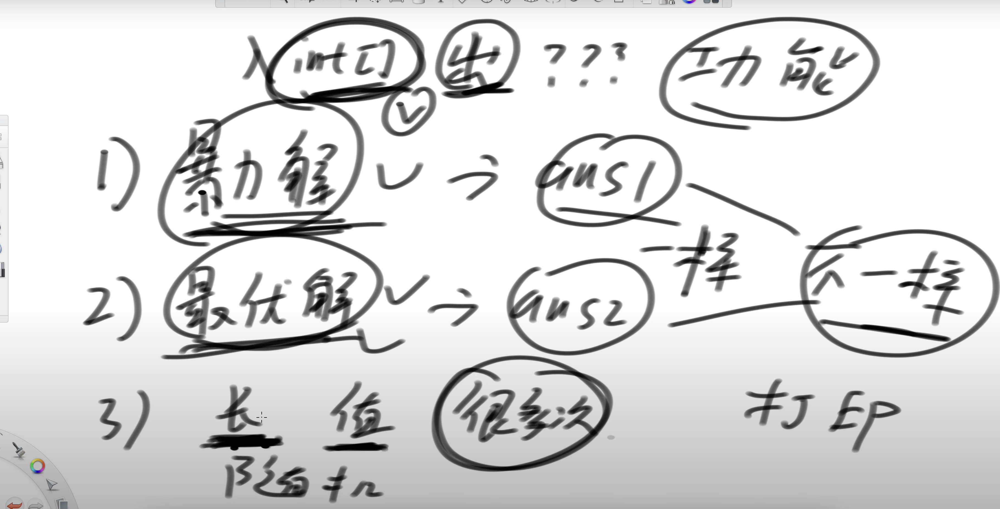

[左程云的算法通关课 - YouTube](https://www.youtube.com/playlist?list=PLvKfL6GtwDxwuyrpAJfU3HTnPZl4WnraE)

# 003 二进制和位运算

## 1. 一个简便的得到负数二进制位的方式

对应正数减1再按位取反：

比如-1, 就是( 0001 - 1 ) 再按位取反，变成 1111

当然，知道一个负数本身，想知道其十进制对应的是谁，就要先按位取反，然后再+1 就好了

## 2. 二进制的空间范围

对于一个n位的二进制数而言，其表达空间为 2^n, 非负数（0+所有正数）和负数的个数是相同的。



那么最小的值，比如-8， 相反数是没法得到的，其相反数会和自己相同。

同样的，对于一个整数来说，比如Integer的最小值，**其取绝对值也还是自己**。

得到一个数的相反数，等于这个数按位取反然后+1

下面两个式子等价：

```java
int a = (-b);
int a = (~b) + 1
```

### 3. `|` 的穿透性

`||` 只有一路是false，才会从左向右穿透，不然会直接从左往右返回第一个值

但是`|` 而言，如果是 `a|b` ，那么a和b都会进行验证之后再来判断

对于 `&` 而言是一样的，如果是 `&` ，那么会穿透左右两边都执行再判断，而  `&&`就不会，第一个是false那么就会短路

### 4. 为什么要这样设计二进制

原因在于对于负数，正数互相相加的时候，只要忽略溢出位，可以统一按照二进制的加法来做，这样就避免了在相加时候的条件转移（如果是正数+负数/正数+正数……）

那么也可以看出来，在计算的时候，是否溢出应该是程序员本身来保证，计算机只是按照二进制位运算的规律进行计算而已，不负责校验是否溢出

#### 为什么要让加法运算这么快

计算机内部本身并没有真正用来做加减乘除的单元，只有用来做位运算的单元，加减乘除本质实现都是优化之后的加法。

# 5 对数器

对数器的基本原理：

对于一个算法题目而言，暴力解好想，但是最优解可能出错。

那么构造一个对数器，其输入的长度和数值范围都是我们随机生成的（为了暴力解不超时，可以先构造范围小一些的），然后多次比较二者的输出，如果相同，那么就是没问题。不同的话就打印出来不同的数据集进行debug。

**前提条件：保证自己的暴力解正确**



