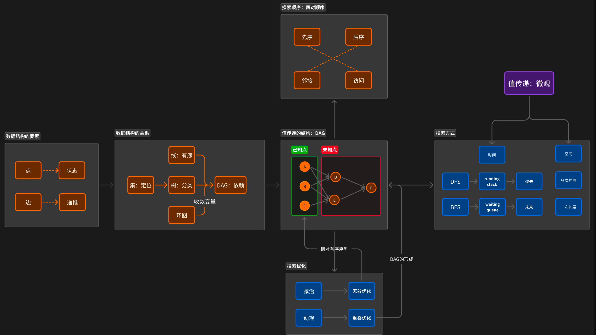
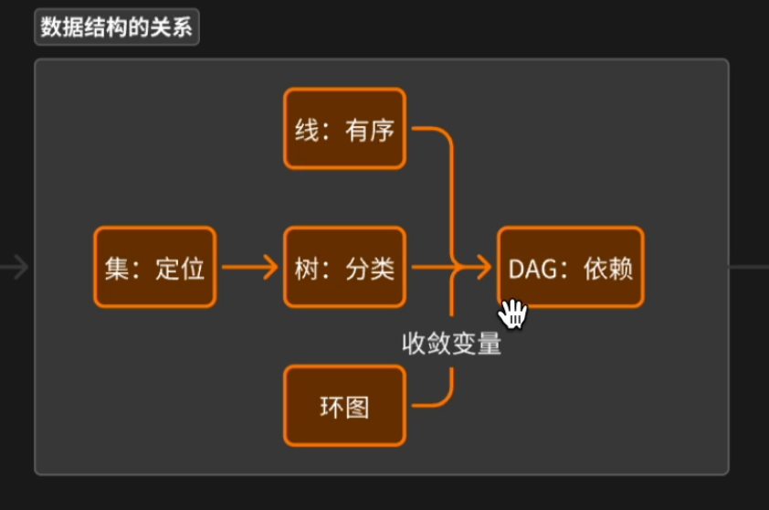
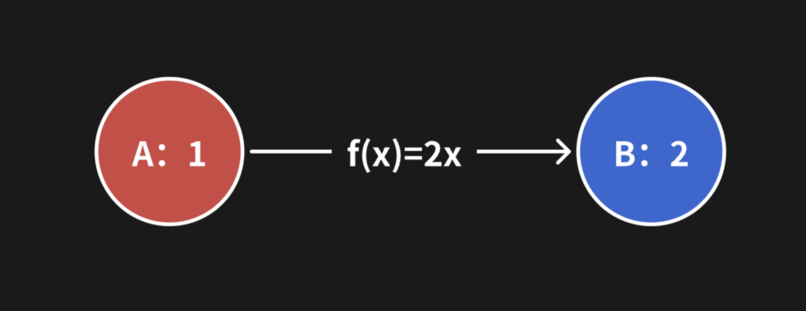

# D1 四大数据结构统一于DAG

## A1 数据传输三要素

1. 点： 状态，包括已知点和未知点

2. 线：点之间的函数关系，注意顶多两层（之前的点和之后的点），不用考虑过多

3. 序：先序就是从已知点到未知点，后续反过来

## A2 入度和出度划分的四大数据结构

1. 线：每个点的出度和入度都不超过1

2. 树：根节点入度0，其他所有节点入度1，出度不限制

3. 图：所有点的入度和出度都无限制

4. 集：不存在任何边，所有数据元素都是独立唯一的，每个点的出度和入度都是0 **没有数据传输的过程**

## A3 逻辑结构：四大数据结构统一于有向无环图（DAG）





集合依赖于树，线和树依赖于DAG，环图通过断开循环的边变成DAG有向无环图。

**所以我们只要研究清楚有向无环图的传递机制即可掌握其他结构的传递机制**

**集合依赖于树：**

1. 元素唯一性：集合之中每一个元素入度为1，证明每一个元素从根节点遍历，只有一种可能

2. 大规模元素存储：集合之中需要存储大量元素，树形结构可以用相对较浅的深度来容纳众多的节点

3. 快速查找：树的结构是有序的时候，可以很低的时间复杂度找到或者插入元素

四大算法：

| 传输方式 | 广搜：队列搜索 | 如何在 DAG 上进行先序的数据传输？    |
| ---- | ------- | ---------------------- |
|      | 深搜：栈式搜索 | 如何在 DAG 上进行先序和后序的数据传输？ |
| 传输优化 | 减治：无效优化 | 如何加速DAG中的一个节点向邻接节点取值？  |
|      | 动规：重叠优化 | 如何将树形结构优化成有向无环图结构？     |

减治：已知点比较有序可预测，通过对一些不符合条件的已知点的删除来优化效率

动归：优化树形结构的效率

## A4｜L1 存储结构：一对多关系的四种存储方式

**研究DAG的存储方式/存储结构**

两个核心问题：

1. 如何知道所有DAG的节点的值

2. 如何知道一个节点的相邻节点

归根结底，如何建立一对多的关系，这种关系实际上就是**高度为2**的树形结构，**局部的树形结构构成了整体的图!**

> 个人认为，所说的九种存储方式，就是索引的三种（顺序/链式/哈希) \* 值的三种 （顺序/链式/哈希)

### 顺序存储

优点：存储密度大，好查找，好修改

缺点：不好进行插入，删除

### 链式存储

优点：好进行插入，删除

缺点：不好进行遍历

### 哈希存储

优点：进行 O(1) 级别的存取

缺点：元素之间无关系，没法进行遍历或者查找

### 索引存储

## A1｜L1 拓扑排序序列上的先序数据传输

#### 用斐波那契数列举例：

1. 状态（点）：
   
   1. 边界状态: f[0] = 0, f[1] = 1
   
   2. 目标状态：f[n]

2. 递推（边）：f[n] = f[n-1] + f[n-2]

3. 顺序（序）：先序 FOR BFS DFS | 后续 DFS

#### DAG的拓扑排序

每个节点都排在依赖他的节点之后，这种方法形成了一个线性顺序。

可以用于在DAG形成的线性序列上进行递推。

```java
class Solution {
    public int fib(int n) {
        if( n == 0 || n == 1) return n;
        int[] dp = new int[n+1];
        dp[0] = 0;
        dp[1] = 1;
        for(int i = 2; i <= n; i++) dp[i] = dp[i-1] + dp[i-2];
        return dp[n];
    }
}
```

#### DAG 之中常见的递推公式类型：

1. 到达cur的最短路径： `dp[cur] = min(dp[pre] + len[pre][cur])`
   解释：要计算到达节点cur的最短路径，我们考虑从所有前驱节点pre到cur的路径中选择长度最小的路径。递推公式将dp[cur]设置为所有前驱节点pre中的最小路径长度加上从pre到cur的边的长度。

2. 到达cur的最长路径：`dp[cur] = max(dp[pre] + len[pre][cur])`
   解释：要计算到达节点cur的最长路径，我们考虑从所有前驱节点pre到cur的路径中选择长度最大的路径。递推公式将dp[cur]设置为所有前驱节点pre中的最大路径长度加上从pre到cur的边的长度。

3. 到达cur的路径个数： `dp[cur] = sum(dp[pre])`
   解释：要计算到达节点cur的路径个数，我们考虑从所有前驱节点pre到cur的路径个数的总和。递推公式将dp[cur]设置为所有前驱节点pre的路径个数之和。

**注意：都只考虑两层！ pre 和 cur，其他的不考虑！**

## A1｜L1 时间复杂度的六大类型

以下是一些常见的数量级：

1. **常数级别： O(1)，数量级为 1。**
   比如只打印数组的第一个元素，只按照下标随机取值

2. **线性级别： O(n)，数量级为 n。**
   
   一次遍历

3. **线性对数级别： O(nlog n)，数量级为 n log n。**
   二分法

4. **二次级别： O(n^2)，数量级为 n 的平方。**
   两个循环

5. **指数级别： O(2^n)，数量级为 2 的 n 次方。**
    每一个元素选择或者不选

6. **阶乘级别： O(n!)，数量级为 n 的阶乘** 
   全排列或者排列相关

## A2｜L1 时间复杂度与四大数据结构

时间复杂度，本质上是数据传输网络上面的**数据传输次数**相对于问题规模的大小。

| 数据结构 | 特点                      | 衡量指标 |
| ---- | ----------------------- | ---- |
| 线    | 每个点的出度和入度都不超过1          | 点或边  |
| 树    | 除了根节点外所有节点的入度为1，根节点入度为0 | 点或边  |
| 图    | 每个节点的出度和入度没有限制          | 边    |

实际因为点更方便统计，所以统计点的个数更加便捷一些。

## A3｜L1 时间复杂度与四大算法

P 问题：O(1), O(n), O(nlogn), O(n^2)
**NP 问题**： 指数级别和阶乘级别，基本上n到100的级别就已经不可解了

| 数据传输 | 算法      | 时间复杂度关系                                                                                        |
| ---- | ------- | ---------------------------------------------------------------------------------------------- |
| 传输方式 | 广搜：队列搜索 | 相同网络结构下，不同数据传输方式对时间复杂度并没有任何影响，本质上还是通过计算传输网络的传输次数来确定。<br>但是不同的传输方式可能会导致不同的传输网络的形成，我们后面会深刻接触到这点。 |
|      | 深搜：栈式搜索 |                                                                                                |
| 传输优化 | 减治：无效优化 | 对**P问题**的优化                                                                                    |
|      | 动规：重叠优化 | 对**NP问题**的优化                                                                                   |

> 对于同样一个数据集而言，深度搜索和广度搜索对搜索次数本身不会有任何影响，但是不同的传输方式可能生成的拓扑图不同

# DAY2：BFS的先序数据传输

## A1｜L1 队列（Queue）与先序数据传输

> ## 队列的顺序
> 
> 让我们回到第一天学到的例子。下图中有两个点，分别是 A 和 B，A 为已知点，值为 1，B 点为未知点，用a到b这条边来表示f(x)=2x，这样可以求得B的值为2。
> 
> 
> 
> 那么如何利用队列来进行数据的传输呢？
> 
> 首先让已知点 A 入队，A 出队后将值传递 B，B 接收到 A 传过来的值，B再入队，B 出队后数据传输的过程结束，上述过程从已知点出发，是典型的先序数据传输的过程。
> 
> 如果我们从未知点出发，让 B 入队，此时 B 出队后向A取值，但是如果A还依赖于其他点，则A的值是未知的，B无法获取值，故而**队列仅支持先序的数据传输**。

为什么队列只支持先序的数据传输？

假设先让B入队，然后B出队取值，这个时候A的值未定，那么就不知道B的值是多少，无法求取

## A2｜L1 广度优先搜索（BFS）实现先序数据传输

1. 有没有直接可以求解的特例，直接返回即可。

2. 起始节点：广度优先搜索的队列中的元素的值必须已经求解出。在最开始的时候，斐波那契的已知点为 F(0)和F(1)两个点。

3. 初始队列：创建一个队列（通常是先进先出的数据结构），将起始节点放入队列中，广度优先搜索的队列中的元素的值必须已经求解出，故而起始节点为 F(0)和F(1)两个点。

4. 传值过程：进入循环，每次从队列中取出一个已知点，然后将已知点的值传递给所有的邻接节点。当邻接节点收到所有节点传过来的值，即邻接节点的值已经求出，邻接节点可以加入队列。 
   此处注意！是已经完成接受**所有的值**的节点才能入队！

5. 重复步骤3和4，直到**队列为空**或**找到目标节点**。

### 下面我们用斐波那契数列为例

先看好斐波那契数列传递的三要素:

一般我们要考虑值的传递规则和其入度规则（决定对于一个值而言什么时候算传递结束，可以入结果的队列）

斐波那契数列的状态：f[n]表示为第n+1项的取值，indeg[n] 表示其入度，还能接受多少个项的值。

顺序的话，借助队列肯定是BFS。

| 点：状态                        | 边：递推                       | 序：先序   |
| --------------------------- | -------------------------- | ------ |
| f[n]为第 n+1 项的斐波那契数          | f[n] = f[n-1]+f[n-2]       | 先序：BFS |
| indeg[n]表示f[n]这个点还要接收多少个点的值 | 每次接收到前驱节点传过来的的值，indeg[n]-- | 先序：BFS |

**斐波那契数列的BFS写法**

```javascript
var fib = function(n) {
    //边界
    if(n == 0 || n == 1) return n;
    const dp = new Array(n+1).fill(0)
    dp[1] = 1 

    //入度：用来统计入度
    const indeg = new Array(n+1).fill(2)
    indeg[0] = 0
    indeg[1] = 0

    //已知点
    const queue = [0,1]
    while(queue.length){
        //出队
        const x = queue.shift()

        //目标
        if(x === n){
            return dp[x] 
        }
        //扩展：0的邻接节点为2，其他的点邻接节点为x+1
        const next = x === 0 ? [2] : [x+1,x+2] //next代表x的邻接节点
        for(let y of next){
            if(y > n) continue
            dp[y] += dp[x]  //y已经接收到x传来的值了，注意这里的递推公式是求和，你能想出什么递推公式呢？
            indeg[y]--      //y所依赖的点的个数-1   
            if(indeg[y] === 0) queue.push(y)  //y不依赖于任何点，y的值求出来了，可以入队
        }
    }
};
```

```java
class Solution {
    public int fib(int n) {
        if(n == 0) return 0;
        if(n == 1) return 1;
        int[] dp = new int[n+1];
        dp[0] = 0;
        dp[1] = 1;
        int[] indeg = new int[n+1];
        Arrays.fill(indeg, 2);
        indeg[0] = 0;
        indeg[1] = 0;
        Queue<Integer> queue = new LinkedList<>();
        queue.offer(0);
        queue.offer(1);
        while(!queue.isEmpty()){
            int x = queue.poll();
            if(x == n){
                return dp[x];
            }
            List<Integer> next = x == 0 ? Arrays.asList(2) : Arrays.asList(x+1,x+2);
            for(int y : next){
                if(y > n) continue;
                dp[y] += dp[x];
                indeg[y]--;
                if(indeg[y] == 0) queue.offer(y);
            }
        }
        return 0;
    }
}
```

## A3｜L1 BFS：线、树、图的对比

BFS 主要分为三个部分：

1. 建图

2. 找起点，也就是入度为0的点入队列

3. 遍历，只要队列还有值，就每次出队一个值，传递给其所有相邻节点，相邻节点入度-1， 如果入度为0则加入队列

> 环图如何变成非环图？加入一个单调递减的变量，比如入度indeg，或者是否访问过 VIS
> 


### BFS：DAG

```java
class Solution {
    public boolean canFinish(int numCourses, int[][] prerequisites) {
        // 1、建图 邻接表-有向图
        List<List<Integer>> next = new ArrayList<>();
        for (int i = 0; i < numCourses; i++) {
            next.add(new ArrayList<>());
        }
        int[] indeg = new int[numCourses];
        for (int[] edge : prerequisites) {
            int x = edge[0];
            int y = edge[1];
            next.get(x).add(y);
            indeg[y]++;
        }
        // 2、起点
        Queue<Integer> queue = new LinkedList<>();
        for (int i = 0; i < numCourses; i++) {
            if (indeg[i] == 0) {
                queue.offer(i);
            }
        }
        // 3、扩展
        while (!queue.isEmpty()) {
            // 1、出队
            int x = queue.poll();
            // 2、扩展
            for (int y : next.get(x)) {
                // 在这个位置可以将x的值传给y
                // 递推公式
                indeg[y]--;
                if (indeg[y] == 0) {
                    queue.offer(y);
                }
            }
        }
        // 4、检查
        for (int i = 0; i < numCourses; i++) {
            if (indeg[i] != 0) {
                return false;
            }
        }
        return true;
    }
}
```

### BFS 树

除了根节点之外，所有树的节点入度都为1，所以不用再检查某个点的入度值，而是可以直接遍历到就放到队列之中

```java
class Solution {
    public boolean canFinish(int numCourses, int[][] prerequisites) {
        // 1、建图 邻接表-有向图
        List<List<Integer>> next = new ArrayList<>();
        for (int i = 0; i < numCourses; i++) {
            next.add(new ArrayList<>());
        }
        int[] indeg = new int[numCourses];
        for (int[] edge : prerequisites) {
            int x = edge[0], y = edge[1];
            next.get(x).add(y);
            indeg[y]++;
        }

        // 2、起点：起点只有一个
        Queue<Integer> queue = new LinkedList<>();
        for (int i = 0; i < numCourses; i++) {
            if (indeg[i] == 0)
                queue.offer(i);
        }

        // 3、扩展
        while (!queue.isEmpty()) {
            // 1、出队
            int x = queue.poll();
            // 2、扩展
            for (int y : next.get(x)) {
                queue.offer(y);
            }
        }

        for (int i = 0; i < numCourses; i++) {
            if (indeg[i] != 0)
                return false;
        }
        return true;
    }
}
```

### BFS 线

在树的基础上，线上的每个点只有一个入度和一个出度，所以其邻接数组也不需要了，直接用一个数组就行；queue也不需要了，维护一个数字就行。

```java
class Solution {
    public void bfs(int n, int[][] edges) {
        int[] next = new int[n];
        int[] indeg = new int[n];
        for (int[] edge : edges) {
            next[edge[0]] = edge[1];
            indeg[edge[1]]++;
        }
        int x = 0;
        for (int i = 0; i < n; i++) {
            if (indeg[i] == 0) {
                x = i;
            }
        }
        while (next[x] != 0) {
            x = next[x];
        }
    }
}
```

# A4｜L1 递推顺序和结构顺序的区分

### 递推顺序

分为先序和后序。


# bilibili 评论区打卡

## D1

### 斐波那契：

#### for 循环写法：

```java
class Solution {
    public int fib(int n) {
        if(n==0 || n==1){
            return n;
        }

        int[] arr = new int[n+1];
        arr[0] = 0;
        arr[1] = 1;
        for(int i=2; i<=n; i++){
            arr[i] = arr[i-1]+ arr[i-2];
        }
        return arr[n];
    }
}
```

#### BFS 写法

```java
class Solution {
    public int fib(int n) {
        // BFS 版本代码
        // 需要传递的状态有两个，一个是点n的值本身，一个是每一个值的入度

        if (n == 0 || n == 1) {
            return n;
        }

        // 容器设置
        int[] val = new int[n + 1];
        val[0] = 0;
        val[1] = 1;
        int[] indeg = new int[n + 1];
        Arrays.fill(indeg, 2);
        indeg[0] = 0;
        indeg[1] = 0;
        Queue<Integer> dp = new LinkedList<>();
        dp.offer(0);
        dp.offer(1);

        // 循环中传递值
        while (!dp.isEmpty()) {
            int a = dp.poll();
            if (a == n) {
                return val[n];
            }

            int[] next = a == 0 ? new int[] { 2 } : new int[] { a + 1, a + 2 };
            for (int j : next) {
                if (j > n)
                    continue;
                val[j] += val[a];
                indeg[j]--;
                if (indeg[j] == 0)
                    dp.offer(j);
            }

        }
        return 0;
    }
}
```

### 爬梯子

```java
class Solution {
    public int climbStairs(int n) {
        if (n == 0 || n == 1) {
            return 1;
        }
        int[] dp = new int[n + 1];
        dp[0] = 1;
        dp[1] = 1;
        for (int i = 2; i <= n; i++) {
            // dp[cur] = sum(dp[pre])
            dp[i] = dp[i - 1] + dp[i - 2];
        }
        return dp[n];
    }
}
```

### 最小花费爬楼梯

```java
class Solution {
    public int minCostClimbingStairs(int[] cost) {
        int n = cost.length;
        int[] dp = new int[n + 1];
        dp[0] = 0;
        dp[1] = 0;
        for (int i = 2; i <= n; i++) {
            dp[i] = Math.min((dp[i - 1] + cost[i - 1]), (dp[i - 2] + cost[i - 2]));
        }
        return dp[n];

    }
```

### [第 N 个泰波那契数](https://leetcode.cn/problems/n-th-tribonacci-number/)

```java
class Solution {
    public int tribonacci(int n) {
        if(n==0) return 0;
        if(n==1 || n==2) return 1;
        int[] dp = new int[n+1];
        dp[0] = 0;
        dp[1] = 1;
        dp[2] = 1;
        for(int i=3;i<=n;i++){
            dp[i] = dp[i-1]+dp[i-2]+dp[i-3];
        }
        return dp[n];
    }
}
```

## Day 2

### 课程表

```java
class Solution {
    public boolean canFinish(int numCourses, int[][] prerequisites) {
        // 只有一门课或者所有课程没有依赖关系，直接true
        if (numCourses == 1 || prerequisites.length == 0) {
            return true;
        }

        // 1. 构图
        List<List<Integer>> map = new ArrayList<>();
        for (int i = 0; i < numCourses; i++) {
            map.add(new ArrayList<>());
        }
        int[] indeg = new int[numCourses];
        for (int[] edge : prerequisites) {
            int start = edge[1];
            int end = edge[0];
            map.get(start).add(end);
            indeg[end]++;
        }

        // 2. 找起点，构建queue
        Queue<Integer> queue = new LinkedList<>();
        for (int i = 0; i < numCourses; i++) {
            if (indeg[i] == 0)
                queue.offer(i);
        }

        // 3. 开始遍历，传递逻辑
        while (!queue.isEmpty()) {
            int x = queue.poll();
            for (int y : map.get(x)) {
                indeg[y]--;
                if (indeg[y] == 0)
                    queue.offer(y);
            }
        }

        for (int i = 0; i < numCourses; i++) {
            if (indeg[i] != 0)
                return false;
        }

        return true;

    }
}
```
